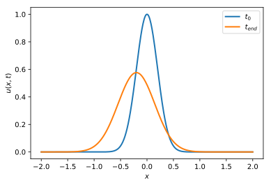
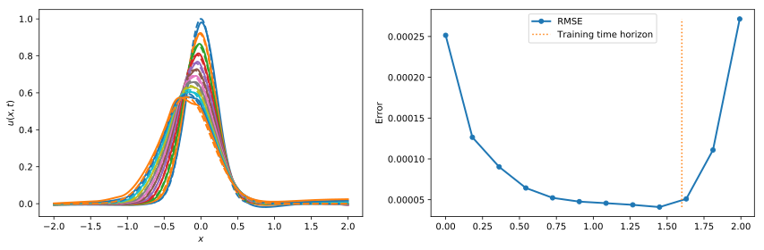
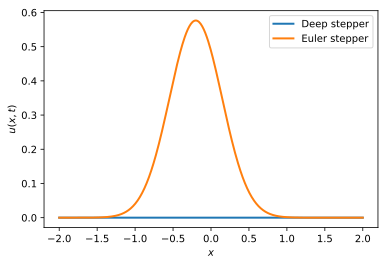
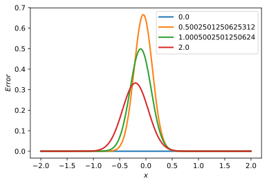

```python
import tensorflow as tf
import sklearn
import numpy as np
import matplotlib.pyplot as plt

from tensorflow import keras
from keras import layers
from sklearn.model_selection import train_test_split

```

This code will apply various techniques in Machine Learning on the advection-diffusion equation

$$\frac{\partial u}{\partial t} = v \frac{\partial u}{\partial x} + D \frac{\partial^2 u}{\partial x^2}$$

commonly found in many physics applications


```python
# Some functions
def gaussian(x, mu, sig, shift):
    return shift + np.exp(-np.power(x - mu, 2.) / (2 * np.power(sig, 2.)))

```


```python
x_left = -2
x_right = 2
t_end = 2

D = 0.02
v = 0.1
dx = 0.01
dt = 0.001

cfl = D*dt/dx**2
print('CFL = %.4f'%(cfl))
x_steps = int((x_right - x_left)/dx)
t_steps = int(t_end/dt)

xx = np.linspace(x_left, x_right, x_steps)
tt = np.linspace(0, t_end, t_steps)
uu = np.zeros((t_steps, x_steps))

```

    CFL = 0.2000


```python
# ICs
ic_mean = 0
ic_std = 0.2
ic_shift = 0 

uu[0, :] = gaussian(xx, ic_mean, ic_std, ic_shift)

# Stepper
def adv_diff_euler_step(ul, uc, ur, D, v, dx, dt):
    return uc + D * dt/dx**2 * (ul - 2 * uc + ur) + v * dt/(2*dx) * (ur - ul)

# Solve
inputs = []
outputs = []
for ti, t in enumerate(tt[:-1]):
    for xi, x in enumerate(xx[1:-1]):
        uu[ti+1, xi] = adv_diff_euler_step(uu[ti, xi-1], uu[ti, xi], uu[ti, xi+1], D, v, dx, dt)

        # Periodic BC
        uu[ti+1, 0] = uu[ti+1, 1]
        uu[ti+1, -1] = uu[ti+1, -2]

        # Save data
        inputs.append([t, x])
        outputs.append(uu[ti+1, xi])

```


```python
fig = plt.figure()
plt.plot(xx, uu[0, :], lw=2)
plt.plot(xx, uu[-1, :], lw=2)
plt.xlabel('$x$')
plt.ylabel('$u(x, t)$')
plt.legend(['$t_0$', '$t_{end}$'])

# TODO: Add true solution plot
# fig = plt.figure()
# plt.plot(xx, uu[0, :] - uu[-1, :], lw=2)
# plt.plot(xx, uu[-1, :], lw=2)
# plt.xlabel('$x$')
# plt.ylabel('$u(x, t)$')
# plt.legend(['$t_0$', '$t_{end}$'])


plt.show()
```


    

    


### Fit the function $u(x, t)$ to a neural network?


```python
test_ratio = 0.25
dev_ratio = 0.2

# Prepare data
inputs_array = np.asarray(inputs)
outputs_array = np.asarray(outputs)

# Split into train-dev-test sets
X_train, X_test, y_train, y_test = train_test_split(inputs_array, outputs_array, test_size=test_ratio, shuffle=False)
X_train, X_dev, y_train, y_dev = train_test_split(X_train, y_train, test_size=dev_ratio, shuffle=True)
```


```python

# Build model
deep_approx = keras.models.Sequential()
deep_approx.add(layers.Dense(10, input_dim=2, activation='elu'))
deep_approx.add(layers.Dense(10, activation='elu'))
deep_approx.add(layers.Dense(1, activation='linear'))

# Compile model
deep_approx.compile(loss='mse', optimizer='adam')

# Fit!
history = deep_approx.fit(X_train, y_train, epochs=10, batch_size=32, 
            validation_data=(X_dev, y_dev),
            callbacks=keras.callbacks.EarlyStopping(patience=5))

```

    Epoch 1/10
    15912/15912 [==============================] - 11s 683us/step - loss: 0.0118 - val_loss: 9.1383e-05
    Epoch 2/10
    15912/15912 [==============================] - 11s 667us/step - loss: 1.0077e-04 - val_loss: 5.6118e-05
    Epoch 3/10
    15912/15912 [==============================] - 11s 668us/step - loss: 7.1547e-05 - val_loss: 4.5288e-04
    Epoch 4/10
    15912/15912 [==============================] - 11s 677us/step - loss: 6.2795e-05 - val_loss: 4.7522e-05
    Epoch 5/10
    15912/15912 [==============================] - 11s 667us/step - loss: 5.3114e-05 - val_loss: 9.3504e-05
    Epoch 6/10
    15912/15912 [==============================] - 11s 669us/step - loss: 4.8180e-05 - val_loss: 2.4442e-05
    Epoch 7/10
    15912/15912 [==============================] - 11s 704us/step - loss: 4.4310e-05 - val_loss: 2.2165e-05
    Epoch 8/10
    15912/15912 [==============================] - 13s 839us/step - loss: 4.4220e-05 - val_loss: 2.3198e-05
    Epoch 9/10
    15912/15912 [==============================] - 11s 718us/step - loss: 3.8380e-05 - val_loss: 2.7588e-05
    Epoch 10/10
    15912/15912 [==============================] - 11s 670us/step - loss: 3.9513e-05 - val_loss: 1.8318e-05


#### Does it extrapolate in time?


```python
import seaborn as sns
c = sns.color_palette()

nplots = 11
rmin = 0
rmax = 1
idxes = np.arange(int(rmin*len(tt)), int(rmax*len(tt)), int((rmax-rmin)*len(tt)/nplots))
e_mean = []
tt_mean = []

fig = plt.figure(figsize=(12, 4))
ax0 = fig.add_subplot(121)
ax1 = fig.add_subplot(122)
for idx, i in enumerate(idxes):
    data_in = np.array([ [tt[i], x] for x in xx])
    u_approx = deep_approx.predict(data_in)
    ax0.plot(xx, u_approx, lw=2, color=c[idx%len(c)])
    ax0.plot(xx, uu[i, :], lw=2, linestyle='--')
    tt_mean.append(tt[i])
    e_mean.append( np.mean((u_approx[:, 0] - uu[i, :])**2) )

ax1.plot(tt_mean, e_mean, '.-', lw=2, color=c[0], markersize=10)
ax1.plot([(1-test_ratio)*t_end]*2, [min(e_mean), max(e_mean)], ':', color=c[1])
ax1.legend(['RMSE', 'Training time horizon'])

ax0.set_xlabel('$x$')
ax0.set_ylabel('$u(x, t)$')
# ax0.legend(['$t^*_{end}$'])
ax1.set_ylabel('Error')

fig.tight_layout()
plt.show()
```


    

    


### Approximate the integrator by a neural network?


```python
# Let's run the simulation and save the data at each step

inputs = []
outputs = []
for ti, t in enumerate(tt[:-1]):
    for xi, x in enumerate(xx[1:-1]):
        uu[ti+1, xi] = adv_diff_euler_step(uu[ti, xi-1], uu[ti, xi], uu[ti, xi+1], D, v, dx, dt)
        uu[ti+1, 0] = uu[ti+1, 1]
        uu[ti+1, -1] = uu[ti+1, -2]

        # Collect data
        inputs.append([uu[ti, xi-1], uu[ti, xi], uu[ti, xi+1]])
        outputs.append(uu[ti+1, xi])

inputs_array = np.asarray(inputs)
outputs_array = np.asarray(outputs)

X_train, X_test, y_train, y_test = train_test_split(inputs_array, outputs_array, test_size=test_ratio, shuffle=False)
X_train, X_dev, y_train, y_dev = train_test_split(X_train, y_train, test_size=dev_ratio, shuffle=True)
```


```python
## TODO: 
# - linear regression
# - Nonlinear 1 layer network
# - include variable D, v, dx, dt

# Build model
deep_stepper = keras.models.Sequential()
# deep_stepper.add(layers.Dense(2, input_dim=3, activation='elu'))
# deep_stepper.add(layers.Dense(10, activation='elu'))
deep_stepper.add(layers.Dense(1, activation='linear'))

# Compile model
deep_stepper.compile(loss='mse', optimizer='adam')

# Fit!
history = deep_stepper.fit(X_train, y_train, epochs=3, batch_size=32, 
            validation_data=(X_dev, y_dev),
            callbacks=keras.callbacks.EarlyStopping(patience=5))

```

    Epoch 1/3
    15912/15912 [==============================] - 9s 586us/step - loss: 0.0882 - val_loss: 8.2812e-07
    Epoch 2/3
    15912/15912 [==============================] - 9s 567us/step - loss: 1.0391e-07 - val_loss: 4.5861e-09
    Epoch 3/3
    15912/15912 [==============================] - 9s 589us/step - loss: 1.2495e-08 - val_loss: 3.1817e-09


```python
# Try it on the deep network
uu_deep = np.zeros(uu.shape)
uu_deep[0, :] = uu[0, :]

for ti, t in enumerate(tt[:-1]):
    print(ti/len(tt))
    for xi, x in enumerate(xx[1:-1]):
        input_stencil = np.array([[uu[ti, xi-1], uu[ti, xi], uu[ti, xi+1]]])
        ut = deep_stepper( input_stencil )[0][0].numpy()
        uu_deep[ti+1, 0] = uu_deep[ti+1, 1]
        uu_deep[ti+1, -1] = uu_deep[ti+1, -2]
```

    9374084472656
    8.106231689453125e-06 0.0008938312530517578 0.00024008750915527344
    6.9141387939453125e-06 0.001232147216796875 0.00023293495178222656
    9.059906005859375e-06 0.0008909702301025391 0.00021314620971679688
    6.9141387939453125e-06 0.0008389949798583984 0.00021791458129882812
    6.198883056640625e-06 0.0008509159088134766 0.00021195411682128906
    7.152557373046875e-06 0.0005497932434082031 0.0002129077911376953
    5.9604644775390625e-06 0.001074075698852539 0.00021409988403320312
    6.9141387939453125e-06 0.0008499622344970703 0.00022411346435546875
    7.867813110351562e-06 0.0010352134704589844 0.00023174285888671875
    8.821487426757812e-06 0.0008571147918701172 0.00020694732666015625
    5.9604644775390625e-06 0.0008487701416015625 0.00021409988403320312
    7.867813110351562e-06 0.0009510517120361328 0.00022602081298828125
    6.9141387939453125e-06 0.0008718967437744141 0.00021409988403320312
    7.152557373046875e-06 0.0005748271942138672 0.00021195411682128906
    6.198883056640625e-06 0.0011258125305175781 0.00023102760314941406
    6.9141387939453125e-06 0.0008559226989746094 0.0002071857452392578
    6.198883056640625e-06 0.000759124755859375 0.0002048015594482422
    7.152557373046875e-06 0.0007338523864746094 0.0002028942108154297
    6.9141387939453125e-06 0.000598907470703125 0.00020503997802734375
    7.3909759521484375e-06 0.0007867813110351562 0.00021600723266601562
    7.152557373046875e-06 0.0007836818695068359 0.0002052783966064453
    5.9604644775390625e-06 0.0008308887481689453 0.00029206275939941406
    6.9141387939453125e-06 0.0011820793151855469 0.0002391338348388672
    7.867813110351562e-06 0.0008859634399414062 0.00021719932556152344
    7.152557373046875e-06 0.0009407997131347656 0.00024509429931640625
    9.298324584960938e-06 0.0014400482177734375 0.0002486705780029297
    1.0967254638671875e-05 0.0011701583862304688 0.0002498626708984375
    8.821487426757812e-06 0.0015020370483398438 0.00037407875061035156
    1.0013580322265625e-05 0.0010476112365722656 0.00023221969604492188
    6.9141387939453125e-06 0.0009570121765136719 0.0002300739288330078
    7.867813110351562e-06 0.0009682178497314453 0.00022292137145996094
    7.867813110351562e-06 0.0008859634399414062 0.00022101402282714844
    6.9141387939453125e-06 0.0008680820465087891 0.00021791458129882812
    5.9604644775390625e-06 0.0009131431579589844 0.00022101402282714844
    7.152557373046875e-06 0.000988006591796875 0.00034999847412109375
    9.059906005859375e-06 0.0006809234619140625 0.00022125244140625
    5.9604644775390625e-06 0.0012500286102294922 0.00024700164794921875
    1.1920928955078125e-05 0.0011310577392578125 0.00024509429931640625
    7.867813110351562e-06 0.0006079673767089844 0.00022721290588378906
    6.9141387939453125e-06 0.0005810260772705078 0.0009698867797851562
    8.821487426757812e-06 0.0011050701141357422 0.00023889541625976562
    8.821487426757812e-06 0.0009160041809082031 0.00021910667419433594
    6.9141387939453125e-06 0.0008242130279541016 0.00021982192993164062
    6.9141387939453125e-06 0.0005650520324707031 0.00021696090698242188
    6.198883056640625e-06 0.001069784164428711 0.0002281665802001953
    7.152557373046875e-06 0.0007410049438476562 0.00020503997802734375
    1.1682510375976562e-05 0.0008230209350585938 0.0003311634063720703
    1.0013580322265625e-05 0.0010199546813964844 0.00022077560424804688
    8.344650268554688e-06 0.0008356571197509766 0.00021195411682128906
    5.9604644775390625e-06 0.0009851455688476562 0.00024580955505371094
    9.059906005859375e-06 0.0009799003601074219 0.000225067138671875
    7.867813110351562e-06 0.0009019374847412109 0.00022101402282714844
    6.9141387939453125e-06 0.0009770393371582031 0.00023889541625976562
    8.344650268554688e-06 0.0008976459503173828 0.00024127960205078125
    7.152557373046875e-06 0.0008070468902587891 0.00022482872009277344
    6.9141387939453125e-06 0.0008139610290527344 0.0002751350402832031
    7.152557373046875e-06 0.0008568763732910156 0.000209808349609375
    6.9141387939453125e-06 0.0008108615875244141 0.00020813941955566406
    6.9141387939453125e-06 0.0005319118499755859 0.0002110004425048828
    7.152557373046875e-06 0.001010894775390625 0.0002167224884033203
    6.9141387939453125e-06 0.0008409023284912109 0.00020813941955566406
    5.9604644775390625e-06 0.0007998943328857422 0.00020623207092285156
    6.9141387939453125e-06 0.0007960796356201172 0.00020694732666015625
    6.9141387939453125e-06 0.0010571479797363281 0.0002930164337158203
    8.821487426757812e-06 0.0011119842529296875 0.00023412704467773438
    8.821487426757812e-06 0.0008492469787597656 0.00020885467529296875
    5.9604644775390625e-06 0.0012090206146240234 0.0002319812774658203
    8.821487426757812e-06 0.0008273124694824219 0.00020575523376464844
    6.198883056640625e-06 0.0007429122924804688 0.0002028942108154297
    5.9604644775390625e-06 0.0007491111755371094 0.00021600723266601562
    6.9141387939453125e-06 0.0008881092071533203 0.00021409988403320312
    6.9141387939453125e-06 0.0008089542388916016 0.00020813941955566406
    6.9141387939453125e-06 0.0008471012115478516 0.00021600723266601562
    6.9141387939453125e-06 0.0009672641754150391 0.0002219676971435547
    7.152557373046875e-06 0.0008008480072021484 0.00020813941955566406
    5.9604644775390625e-06 0.0008029937744140625 0.00020694732666015625
    5.9604644775390625e-06 0.0012979507446289062 0.0003342628479003906
    1.0013580322265625e-05 0.0010018348693847656 0.0002219676971435547
    6.9141387939453125e-06 0.0008652210235595703 0.00029587745666503906
    7.867813110351562e-06 0.0008578300476074219 0.0006608963012695312
    1.0013580322265625e-05 0.0006511211395263672 0.00021600723266601562
    9.059906005859375e-06 0.0011909008026123047 0.00021409988403320312
    7.152557373046875e-06 0.0009508132934570312 0.00022292137145996094
    6.9141387939453125e-06 0.0008218288421630859 0.00020623207092285156
    6.9141387939453125e-06 0.0005471706390380859 0.00020575523376464844
    6.9141387939453125e-06 0.0008230209350585938 0.0002720355987548828
    8.344650268554688e-06 0.0009088516235351562 0.00021195411682128906
    7.3909759521484375e-06 0.0005428791046142578 0.00021195411682128906
    5.9604644775390625e-06 0.0010061264038085938 0.00021076202392578125
    6.9141387939453125e-06 0.0011601448059082031 0.0002999305725097656
    1.0013580322265625e-05 0.0009341239929199219 0.0002167224884033203
    6.9141387939453125e-06 0.0008101463317871094 0.00022792816162109375
    6.9141387939453125e-06 0.001157999038696289 0.00030994415283203125
    1.0013580322265625e-05 0.0009799003601074219 0.0002269744873046875
    6.9141387939453125e-06 0.0008590221405029297 0.00021195411682128906
    7.152557373046875e-06 0.0008258819580078125 0.00022792816162109375
    6.9141387939453125e-06 0.0010478496551513672 0.0002262592315673828
    6.9141387939453125e-06 0.0009701251983642578 0.00021195411682128906
    6.9141387939453125e-06 0.0013132095336914062 0.0003829002380371094
    1.4066696166992188e-05 0.0011577606201171875 0.0002372264862060547
    8.821487426757812e-06 0.0009350776672363281 0.0003008842468261719
    8.106231689453125e-06 0.0009670257568359375 0.0002300739288330078
    9.059906005859375e-06 0.0009260177612304688 0.00021696090698242188
    6.9141387939453125e-06 0.0008249282836914062 0.00023102760314941406
    6.9141387939453125e-06 0.0012040138244628906 0.0003192424774169922
    1.0013580322265625e-05 0.0010981559753417969 0.00023865699768066406
    8.344650268554688e-06 0.0009367465972900391 0.00021886825561523438
    8.106231689453125e-06 0.0013267993927001953 0.00045228004455566406
    1.1205673217773438e-05 0.001149892807006836 0.0002307891845703125
    7.867813110351562e-06 0.0009059906005859375 0.0002639293670654297
    9.059906005859375e-06 0.001074075698852539 0.00024080276489257812
    9.059906005859375e-06 0.001013040542602539 0.0002429485321044922
    1.0013580322265625e-05 0.0010139942169189453 0.00024127960205078125
    8.106231689453125e-06 0.0011560916900634766 0.00024700164794921875
    1.0013580322265625e-05 0.0009729862213134766 0.00022792816162109375
    6.9141387939453125e-06 0.0010559558868408203 0.00043702125549316406
    1.1920928955078125e-05 0.0009658336639404297 0.0002460479736328125
    8.821487426757812e-06 0.0009229183197021484 0.0002510547637939453
    7.867813110351562e-06 0.0013041496276855469 0.0002448558807373047
    9.059906005859375e-06 0.0009860992431640625 0.00023508071899414062
    8.821487426757812e-06 0.0010268688201904297 0.00030517578125
    6.9141387939453125e-06 0.0009889602661132812 0.00023508071899414062
    8.106231689453125e-06 0.0009050369262695312 0.0002300739288330078
    6.9141387939453125e-06 0.0008139610290527344 0.00022602081298828125
    6.198883056640625e-06 0.0008199214935302734 0.0002110004425048828
    6.9141387939453125e-06 0.0008308887481689453 0.0002071857452392578
    5.7220458984375e-06 0.0009121894836425781 0.00022602081298828125
    7.867813110351562e-06 0.0010161399841308594 0.0002586841583251953
    8.106231689453125e-06 0.0009827613830566406 0.0002281665802001953
    9.059906005859375e-06 0.0009760856628417969 0.00023293495178222656
    7.867813110351562e-06 0.0009019374847412109 0.00022482872009277344
    8.344650268554688e-06 0.000949859619140625 0.00023102760314941406
    6.9141387939453125e-06 0.0009171962738037109 0.0002357959747314453
    6.9141387939453125e-06 0.0008919239044189453 0.000247955322265625
    5.9604644775390625e-06 0.0009088516235351562 0.00021719932556152344
    7.152557373046875e-06 0.0008289813995361328 0.0002129077911376953
    5.7220458984375e-06 0.0008482933044433594 0.000209808349609375
    5.9604644775390625e-06 0.0009109973907470703 0.0002429485321044922
    6.9141387939453125e-06 0.0008370876312255859 0.0002079010009765625
    1.5974044799804688e-05 0.0009250640869140625 0.0002288818359375
    8.106231689453125e-06 0.00084686279296875 0.00027489662170410156
    1.0013580322265625e-05 0.0010631084442138672 0.00023698806762695312
    1.3113021850585938e-05 0.0009489059448242188 0.0002460479736328125
    7.867813110351562e-06 0.0008912086486816406 0.0003368854522705078
    9.775161743164062e-06 0.001112222671508789 0.00023484230041503906
    6.9141387939453125e-06 0.0008492469787597656 0.000213623046875
    6.9141387939453125e-06 0.0008420944213867188 0.00021696090698242188
    6.9141387939453125e-06 0.0009562969207763672 0.0002167224884033203
    6.9141387939453125e-06 0.0008440017700195312 0.00021600723266601562
    6.9141387939453125e-06 0.0007960796356201172 0.00021195411682128906
    5.9604644775390625e-06 0.0006241798400878906 0.0004909038543701172
    6.9141387939453125e-06 0.0008208751678466797 0.00021123886108398438
    6.198883056640625e-06 0.0008046627044677734 0.0002391338348388672
    7.152557373046875e-06 0.0009827613830566406 0.00034308433532714844
    1.0013580322265625e-05 0.0008597373962402344 0.00022912025451660156
    7.867813110351562e-06 0.0010480880737304688 0.0003688335418701172
    7.867813110351562e-06 0.0006258487701416016 0.00030994415283203125
    9.775161743164062e-06 0.0008482933044433594 0.0003781318664550781
    8.821487426757812e-06 0.0006201267242431641 0.0002219676971435547
    6.9141387939453125e-06 0.001132965087890625 0.00023102760314941406
    7.152557373046875e-06 0.0011060237884521484 0.0002269744873046875
    7.867813110351562e-06 0.0008370876312255859 0.0002040863037109375
    7.152557373046875e-06 0.0007948875427246094 0.00020384788513183594
    8.821487426757812e-06 0.0009121894836425781 0.0002148151397705078
    5.9604644775390625e-06 0.0007791519165039062 0.00020885467529296875
    6.9141387939453125e-06 0.0007650852203369141 0.00020503997802734375
    6.198883056640625e-06 0.000926971435546875 0.00026488304138183594
    9.059906005859375e-06 0.0010149478912353516 0.0002372264862060547
    8.821487426757812e-06 0.0008540153503417969 0.00020813941955566406
    7.152557373046875e-06 0.0010590553283691406 0.0003027915954589844
    1.1920928955078125e-05 0.001024007797241211 0.00022912025451660156
    7.867813110351562e-06 0.0008461475372314453 0.000209808349609375
    5.9604644775390625e-06 0.0008599758148193359 0.00021386146545410156
    7.152557373046875e-06 0.0009107589721679688 0.00022101402282714844
    6.9141387939453125e-06 0.0008287429809570312 0.0002262592315673828
    6.9141387939453125e-06 0.0005409717559814453 0.000308990478515625
    6.9141387939453125e-06 0.0009381771087646484 0.0002129077911376953
    6.9141387939453125e-06 0.0005271434783935547 0.0002079010009765625
    6.9141387939453125e-06 0.0008211135864257812 0.00020813941955566406
    5.7220458984375e-06 0.0008051395416259766 0.00020694732666015625
    5.9604644775390625e-06 0.001316070556640625 0.0002498626708984375
    0.0085
    9.059906005859375e-06 0.0010209083557128906 0.00021719932556152344
    7.152557373046875e-06 0.00096893310546875 0.0004410743713378906
    9.775161743164062e-06 0.0011229515075683594 0.00023102760314941406
    9.059906005859375e-06 0.0009129047393798828 0.0002181529998779297
    6.198883056640625e-06 0.0008378028869628906 0.00028014183044433594
    9.298324584960938e-06 0.0009028911590576172 0.00021386146545410156
    7.152557373046875e-06 0.0008387565612792969 0.00021505355834960938
    6.9141387939453125e-06 0.0008330345153808594 0.0002129077911376953
    6.9141387939453125e-06 0.0008490085601806641 0.00021123886108398438
    6.198883056640625e-06 0.0008249282836914062 0.0002300739288330078
    5.9604644775390625e-06 0.0007998943328857422 0.00020885467529296875
    6.198883056640625e-06 0.0008308887481689453 0.00030112266540527344
    6.9141387939453125e-06 0.0009760856628417969 0.0002999305725097656
    1.0013580322265625e-05 0.0006880760192871094 0.0002238750457763672
    6.9141387939453125e-06 0.0010292530059814453 0.0002338886260986328
    7.152557373046875e-06 0.0013129711151123047 0.0002429485321044922
    8.821487426757812e-06 0.0009171962738037109 0.00021696090698242188
    6.9141387939453125e-06 0.0009889602661132812 0.00023603439331054688
    8.106231689453125e-06 0.0009410381317138672 0.00021791458129882812
    7.152557373046875e-06 0.0009579658508300781 0.00022292137145996094
    7.152557373046875e-06 0.0008499622344970703 0.0002079010009765625
    5.9604644775390625e-06 0.0009489059448242188 0.00021505355834960938
    7.152557373046875e-06 0.0008080005645751953 0.00021886825561523438
    6.198883056640625e-06 0.0007870197296142578 0.0002067089080810547
    5.9604644775390625e-06 0.0007579326629638672 0.0003161430358886719
    8.821487426757812e-06 0.0012831687927246094 0.00024580955505371094
    8.821487426757812e-06 0.0009160041809082031 0.00020885467529296875
    6.9141387939453125e-06 0.0007669925689697266 0.0002071857452392578
    5.7220458984375e-06 0.0009360313415527344 0.00022292137145996094
    8.106231689453125e-06 0.0007948875427246094 0.000209808349609375
    6.9141387939453125e-06 0.0009140968322753906 0.0002219676971435547
    7.152557373046875e-06 0.0009059906005859375 0.00021600723266601562
    8.344650268554688e-06 0.0008368492126464844 0.00021076202392578125
    7.867813110351562e-06 0.0011930465698242188 0.0002548694610595703
    9.059906005859375e-06 0.0008890628814697266 0.0002110004425048828
    5.9604644775390625e-06 0.0008089542388916016 0.00020813941955566406
    5.9604644775390625e-06 0.0008020401000976562 0.00020599365234375
    5.9604644775390625e-06 0.0008089542388916016 0.00020813941955566406
    5.9604644775390625e-06 0.0008068084716796875 0.0002071857452392578
    5.9604644775390625e-06 0.0007998943328857422 0.00020813941955566406
    1.1205673217773438e-05 0.0011048316955566406 0.0002338886260986328
    9.059906005859375e-06 0.0006310939788818359 0.0002167224884033203
    5.9604644775390625e-06 0.0009799003601074219 0.00021123886108398438
    7.152557373046875e-06 0.0009181499481201172 0.0002257823944091797
    7.867813110351562e-06 0.0008273124694824219 0.000209808349609375
    6.9141387939453125e-06 0.0009379386901855469 0.00022101402282714844
    7.152557373046875e-06 0.0008578300476074219 0.0002789497375488281
    5.9604644775390625e-06 0.0009410381317138672 0.0002949237823486328
    6.9141387939453125e-06 0.0005550384521484375 0.00021076202392578125
    7.152557373046875e-06 0.0007140636444091797 0.00020313262939453125
    5.9604644775390625e-06 0.0007958412170410156 0.0002028942108154297
    6.198883056640625e-06 0.00078582763671875 0.00020313262939453125
    6.198883056640625e-06 0.0007889270782470703 0.00020194053649902344
    5.7220458984375e-06 0.0007901191711425781 0.00020194053649902344
    5.7220458984375e-06 0.0008502006530761719 0.0002219676971435547
    7.152557373046875e-06 0.0009038448333740234 0.0002200603485107422
    6.9141387939453125e-06 0.0008597373962402344 0.00021719932556152344
    6.9141387939453125e-06 0.0010869503021240234 0.00023984909057617188
    7.152557373046875e-06 0.0009458065032958984 0.00023412704467773438
    7.152557373046875e-06 0.0009160041809082031 0.0002429485321044922
    7.152557373046875e-06 0.0008771419525146484 0.0002257823944091797
    5.7220458984375e-06 0.0008451938629150391 0.00020694732666015625
    5.7220458984375e-06 0.0007071495056152344 0.00027179718017578125
    6.9141387939453125e-06 0.0007750988006591797 0.00021386146545410156
    6.9141387939453125e-06 0.0008032321929931641 0.0002048015594482422
    5.9604644775390625e-06 0.0008521080017089844 0.0002167224884033203
    5.9604644775390625e-06 0.0008361339569091797 0.000209808349609375
    6.198883056640625e-06 0.0008120536804199219 0.00020575523376464844
    5.7220458984375e-06 0.000797271728515625 0.00020575523376464844
    6.198883056640625e-06 0.0008389949798583984 0.00021910667419433594
    6.198883056640625e-06 0.0008158683776855469 0.00020813941955566406
    7.152557373046875e-06 0.0005409717559814453 0.00021505355834960938
    5.9604644775390625e-06 0.0009458065032958984 0.00020623207092285156
    5.9604644775390625e-06 0.0007331371307373047 0.00020885467529296875
    6.9141387939453125e-06 0.0006477832794189453 0.00020623207092285156
    5.9604644775390625e-06 0.0006029605865478516 0.00020599365234375
    7.152557373046875e-06 0.0005891323089599609 0.0002067089080810547
    5.7220458984375e-06 0.0006711483001708984 0.0002079010009765625
    5.9604644775390625e-06 0.0006709098815917969 0.0002219676971435547
    5.9604644775390625e-06 0.001177072525024414 0.00023603439331054688
    7.152557373046875e-06 0.0008699893951416016 0.00020694732666015625
    6.9141387939453125e-06 0.0011589527130126953 0.00023603439331054688
    1.0967254638671875e-05 0.0011451244354248047 0.0002617835998535156
    8.821487426757812e-06 0.001135110855102539 0.00023603439331054688
    9.059906005859375e-06 0.0006327629089355469 0.0002200603485107422
    7.152557373046875e-06 0.0011279582977294922 0.0002162456512451172
    6.9141387939453125e-06 0.0007810592651367188 0.00020885467529296875
    5.9604644775390625e-06 0.0005290508270263672 0.00021195411682128906
    5.9604644775390625e-06 0.0009551048278808594 0.00020503997802734375
    6.198883056640625e-06 0.0007319450378417969 0.00020384788513183594
    6.198883056640625e-06 0.0006299018859863281 0.0002048015594482422
    6.198883056640625e-06 0.0007338523864746094 0.00020503997802734375
    5.9604644775390625e-06 0.0006341934204101562 0.0002028942108154297
    6.198883056640625e-06 0.0006639957427978516 0.00020313262939453125
    7.152557373046875e-06 0.0006310939788818359 0.00020313262939453125
    7.152557373046875e-06 0.0005598068237304688 0.00020194053649902344
    6.198883056640625e-06 0.0007419586181640625 0.0002040863037109375
    5.9604644775390625e-06 0.0007290840148925781 0.0002040863037109375
    5.9604644775390625e-06 0.0005960464477539062 0.00020384788513183594
    5.9604644775390625e-06 0.0005118846893310547 0.0002040863037109375
    5.9604644775390625e-06 0.0009109973907470703 0.0002219676971435547
    6.9141387939453125e-06 0.0008151531219482422 0.0002040863037109375
    5.7220458984375e-06 0.0007879734039306641 0.00020503997802734375
    6.9141387939453125e-06 0.0009350776672363281 0.0004439353942871094
    1.2159347534179688e-05 0.0007500648498535156 0.00022912025451660156
    6.9141387939453125e-06 0.0008749961853027344 0.00021719932556152344
    7.152557373046875e-06 0.0010998249053955078 0.00022411346435546875
    8.106231689453125e-06 0.0009057521820068359 0.00023031234741210938
    1.0013580322265625e-05 0.0010020732879638672 0.00022292137145996094
    7.867813110351562e-06 0.0008802413940429688 0.0002167224884033203
    6.9141387939453125e-06 0.0008540153503417969 0.00021505355834960938
    7.152557373046875e-06 0.0009191036224365234 0.0002338886260986328
    7.867813110351562e-06 0.0010380744934082031 0.0002770423889160156
    1.0013580322265625e-05 0.0014030933380126953 0.0002689361572265625
    1.0013580322265625e-05 0.0011739730834960938 0.0002467632293701172
    7.867813110351562e-06 0.0009152889251708984 0.0002167224884033203
    7.152557373046875e-06 0.0008349418640136719 0.0002129077911376953
    6.9141387939453125e-06 0.0008590221405029297 0.00021505355834960938


    ---------------------------------------------------------------------------

    KeyboardInterrupt                         Traceback (most recent call last)

    <ipython-input-312-f87b6006dc5b> in <module>
         10         input_stencil = np.array([[uu[ti, xi-1], uu[ti, xi], uu[ti, xi+1]]])
         11         t1 = time.time() - t0
    ---> 12         ut = deep_stepper( input_stencil )
         13         t2 = time.time() - t0 - t1
         14         uu_deep[ti+1, xi] = ut[0][0].numpy()


    /Library/Frameworks/Python.framework/Versions/3.7/lib/python3.7/site-packages/tensorflow/python/keras/engine/base_layer.py in __call__(self, *args, **kwargs)
       1010         with autocast_variable.enable_auto_cast_variables(
       1011             self._compute_dtype_object):
    -> 1012           outputs = call_fn(inputs, *args, **kwargs)
       1013 
       1014         if self._activity_regularizer:


    /Library/Frameworks/Python.framework/Versions/3.7/lib/python3.7/site-packages/tensorflow/python/keras/engine/sequential.py in call(self, inputs, training, mask)
        373       if not self.built:
        374         self._init_graph_network(self.inputs, self.outputs)
    --> 375       return super(Sequential, self).call(inputs, training=training, mask=mask)
        376 
        377     outputs = inputs  # handle the corner case where self.layers is empty


    /Library/Frameworks/Python.framework/Versions/3.7/lib/python3.7/site-packages/tensorflow/python/keras/engine/functional.py in call(self, inputs, training, mask)
        423     """
        424     return self._run_internal_graph(
    --> 425         inputs, training=training, mask=mask)
        426 
        427   def compute_output_shape(self, input_shape):


    /Library/Frameworks/Python.framework/Versions/3.7/lib/python3.7/site-packages/tensorflow/python/keras/engine/functional.py in _run_internal_graph(self, inputs, training, mask)
        558 
        559         args, kwargs = node.map_arguments(tensor_dict)
    --> 560         outputs = node.layer(*args, **kwargs)
        561 
        562         # Update tensor_dict.


    /Library/Frameworks/Python.framework/Versions/3.7/lib/python3.7/site-packages/tensorflow/python/keras/engine/base_layer.py in __call__(self, *args, **kwargs)
       1010         with autocast_variable.enable_auto_cast_variables(
       1011             self._compute_dtype_object):
    -> 1012           outputs = call_fn(inputs, *args, **kwargs)
       1013 
       1014         if self._activity_regularizer:


    /Library/Frameworks/Python.framework/Versions/3.7/lib/python3.7/site-packages/tensorflow/python/keras/layers/core.py in call(self, inputs)
       1210         self.bias,
       1211         self.activation,
    -> 1212         dtype=self._compute_dtype_object)
       1213 
       1214   def compute_output_shape(self, input_shape):


    /Library/Frameworks/Python.framework/Versions/3.7/lib/python3.7/site-packages/tensorflow/python/keras/layers/ops/core.py in dense(inputs, kernel, bias, activation, dtype)
         51       outputs = sparse_ops.sparse_tensor_dense_matmul(inputs, kernel)
         52     else:
    ---> 53       outputs = gen_math_ops.mat_mul(inputs, kernel)
         54   # Broadcast kernel to inputs.
         55   else:


    /Library/Frameworks/Python.framework/Versions/3.7/lib/python3.7/site-packages/tensorflow/python/ops/gen_math_ops.py in mat_mul(a, b, transpose_a, transpose_b, name)
       5536       return mat_mul_eager_fallback(
       5537           a, b, transpose_a=transpose_a, transpose_b=transpose_b, name=name,
    -> 5538           ctx=_ctx)
       5539     except _core._SymbolicException:
       5540       pass  # Add nodes to the TensorFlow graph.


    /Library/Frameworks/Python.framework/Versions/3.7/lib/python3.7/site-packages/tensorflow/python/ops/gen_math_ops.py in mat_mul_eager_fallback(a, b, transpose_a, transpose_b, name, ctx)
       5575   _attr_T)
       5576   _result = _execute.execute(b"MatMul", 1, inputs=_inputs_flat, attrs=_attrs,
    -> 5577                              ctx=ctx, name=name)
       5578   if _execute.must_record_gradient():
       5579     _execute.record_gradient(


    /Library/Frameworks/Python.framework/Versions/3.7/lib/python3.7/site-packages/tensorflow/python/eager/execute.py in quick_execute(op_name, num_outputs, inputs, attrs, ctx, name)
         58     ctx.ensure_initialized()
         59     tensors = pywrap_tfe.TFE_Py_Execute(ctx._handle, device_name, op_name,
    ---> 60                                         inputs, attrs, num_outputs)
         61   except core._NotOkStatusException as e:
         62     if name is not None:


    KeyboardInterrupt: 


```python
fig = plt.figure()
plt.plot(xx, uu_deep[-1, :], lw=2)
plt.plot(xx, uu[-1, :], lw=2)
plt.xlabel('$x$')
plt.ylabel('$u(x, t)$')
plt.legend(['Deep stepper', 'Euler stepper'])

idx_list = [0, int(len(tt)/4), int(len(tt)/2), int(len(tt))-1]
leg = []
fig = plt.figure()
for idx in idx_list:
    plt.plot(xx, (uu_deep[idx, :] - uu[idx, :])**2, lw=2)
    leg.append(str(tt[idx]))
plt.xlabel('$x$')
plt.ylabel('$Error$')
plt.legend(leg)

```


    <matplotlib.legend.Legend at 0x14f7de390>


    

    


    

    


### Generalize over $D$, $v$, $dx$, $dt$?


```python
# Let's run the simulation and save the data at each step

inputs = []
outputs = []
D_list = np.random.uniform(0.1, .5, 5)
v_list = np.random.uniform(0.1, .5, 5)
dx_list = np.random.uniform(0.001, 0.01, 5)
dt_list = np.random.uniform(0.001, 0.01, 5)
CFLmax = ...

for Di, D in enumerate(D_list):
    for vi, v in enumerate(v_list):
        for dxi, dx in enumerate(dx_list):
            for dti, dt in enumerate(dt_list):
                for ti, t in enumerate(tt[:-1]):
                    for xi, x in enumerate(xx[1:-1]):
                        uu[ti+1, xi] = adv_diff_euler_step(uu[ti, xi-1], uu[ti, xi], uu[ti, xi+1], D, v, dx, dt)
                        uu[ti+1, 0] = uu[ti+1, 1]
                        uu[ti+1, -1] = uu[ti+1, -2]

            # Collect data
            inputs.append([uu[ti, xi-1], uu[ti, xi], uu[ti, xi+1], D, v, dx, dt])
            outputs.append(uu[ti+1, xi])


# Tensorflow models take numpy arrays as inputs
inputs_array = np.asarray(inputs)
outputs_array = np.asarray(outputs)

X_train, X_test, y_train, y_test = train_test_split(inputs_array, outputs_array, test_size=0.2, shuffle=False)
X_train, X_dev, y_train, y_dev = train_test_split(X_train, y_train, test_size=0.2, shuffle=True)

# Build model
deep_stepper_param = keras.models.Sequential()
deep_stepper_param.add(layers.Dense(10, input_dim=7, activation='elu'))
deep_stepper_param.add(layers.Dense(10, activation='elu'))
deep_stepper_param.add(layers.Dense(1, activation='linear'))

# Compile model
deep_stepper_param.compile(loss='mse', optimizer='adam')

# Fit!
history = deep_stepper_param.fit(X_train, y_train, epochs=10, batch_size=32, 
            validation_data=(X_dev, y_dev),
            callbacks=keras.callbacks.EarlyStopping(patience=5))

```


```python
import random
np.random.uniform(0, 1, 5)
```


