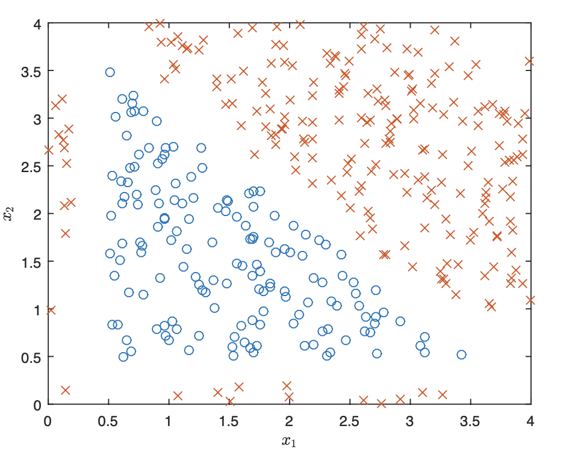
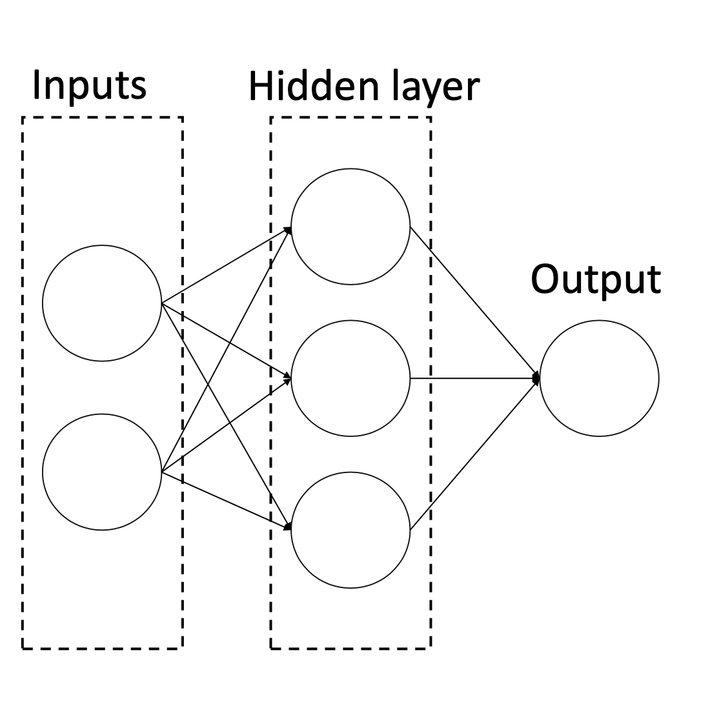

## Problem 1:  Neural Networks (30 points) 
Let $$X = \{ x^{(1)}, \ldots, x^{(m)} \}$$ be a dataset of $$m$$ samples with 2 features, i.e. $$x^{(i)} \in \mathbb R^2$$. The samples are classified into 2 categories with labels $$y^{(i)} \in \{0, 1\}$$. A scatter plot of the dataset is shown in Figure 1:

{:width="40%"}

The examples in class 1 are marked as $$\times$$ and examples in class 0 are marked as $$\circ$$. We want to perform a binary classification using a neural network with the architecture shown in Figure 2

{:width="40%"}

Denote the two features $$x_1$$ and $$x_2$$, the three neurons in the hidden layer $$a_1$$, $$a_2$$, and $$a_3$$, and the output neuron as $$\hat y$$. Let the weight from $$x_i$$ to $$a_j$$ be $$w_{ij}^{(1)}$$ for $$i \in \{1, 2\}$$, $$j \in \{1, 2, 3\}$$, and the weight from $$a_j$$ to $$\hat y$$ be $$w_j^{(2)}$$. Finally, denote the intercept weight (i.e. bias) for $$a_j$$ as $$w_{0j}^{(1)}$$, and the intercept weight for $$\hat y$$ as $$w_0^{(2)}$$. For the loss function, we'll use average squared loss:

$$
\begin{equation}
L(y, \hat y) = \frac{1}{m} \sum_{i=1}^{m} \left( \hat y^{(i)} - y^{(i)} \right)^2
\end{equation}
$$

where $$\hat y^{(i)}$$ is the result of the output neuron for example $$i$$.

a) Suppose we use the sigmoid function as the activation function for $$a_1$$, $$a_2$$, $$a_3$$ and $$\hat y$$. What is the gradient descent update to $$w_{12}^{(1)}$$, assuming we use a learning rate of $$\eta$$? Your answer should be written in terms of $$x^{(i)}$$, $$\hat y^{(i)}$$, $$y^{(i)}$$. and the weights. (Hint: remember that $$\sigma'(x) = \sigma(x) (1 - \sigma(x))$$).

b) Now, suppose instead of using the sigmoid function for the activation function $$a_1$$, $$a_2$$, $$a_3$$, and $$\hat y$$, we instead use the step function $$f(x)$$, defined as

$$
f(x) = 
\begin{cases}
    1, & x\geq 0\\
    0,  & x < 0
\end{cases}
$$


What is one set of weights that would allow the neural network to classify this dataset with 100\% accuracy? Please specify a value for the weights in the following order and explain your reasoning: 

$$w_{01}^{(1)}, w_{11}^{(1)}, w_{21}^{(1)}, w_{02}^{(1)}, w_{12}^{(1)}, w_{22}^{(1)}, w_{03}^{(1)}, w_{13}^{(1)}, w_{23}^{(1)}, w_0^{(2)}, w_1^{(2)}, w_2^{(2)}, w_3^{(2)}$$

Hint: There are three sides to a triangle, and there are three neurons in the hidden layer.

c) Let the activation functions for $$a_1$$, $$a_2$$, $$a_3$$ be the linear function $$f(x) = x$$ and the activation for $$\hat y$$ be the same step function as before. Is there a specific set of weights that will make the loss $$0$$? If yes, please explicitly state a value for every weight. If not, please explain your reasoning.


## Problem 2: Reduced Order Modeling (50 points)

In chapter 12 of Data-Driven Science and Engineering, the authors discuss the concept of reduced order modeling (ROM). The idea is to approximate the solution of a high-dimensional system of equations by projecting the solution onto a low-dimensional subspace. This is particularly useful when the high-dimensional system is computationally expensive to solve.

In systems where the variable depends on space and time $$(x, t)$$, the basic idea is to decompose the solution into a sum of spatial and temporal modes:

$$
u(x, t) \approx \sum_{k=1}^{n} a_k(t) \psi_k(x)
$$

where $$\psi_k(x)$$ are the spatial modes and $$a_k(t)$$ are the temporal modes. This eigenfunction expansion is the basic assumption behind the Proper Orthogonal Decomposition (POD). One possibility for choosing the spatial modes is to use the Fourier basis, i.e. $$\psi_k(x) = \exp(i 2\pi k x/L)$$. This is reminiscent of the analytical solution of the heat equation, where the solution can be written as a sum of sines and cosines.

When solution data for $$u(x, t)$$ are given, the spatial modes can be obtained by performing a Singular Value Decomposition (SVD) of the data matrix (where each column is a snapshot of the solution at a given time): $$X = U \Sigma V^T$$. The spatial modes are then given by the left singular vectors $$U$$, and the temporal modes are given by the right singular vectors $$\Sigma V^T$$ (see section 12.6).

In this exercise, we will explore a few approaches described in the section 12.6, and apply them to the problem of spring oscillation we started in class.

The question we want to answer is: given the first $$m$$ frames of the video of a spring oscillation, can we predict the next $$n$$ frames?

a) Read the "spring-oscillation-video" with the provided OpenCV python code. The code makes the frames black and white, and decreases the resolution. Feel free to crop the frames and decrease the resolution of the video even further to decrease computational cost.

b) Stack the frames into a data matrix $$X$$ where each column is a snapshot of the solution at a given time. Perform a Singular Value Decomposition (SVD) of the data matrix $$X = U \Sigma V^T$$. The spatial modes are then given by the left singular vectors $$U$$, and the temporal modes are given by the right singular vectors $$\Sigma V^T$$. Plot the first 5 spatial modes, and the first 5 temporal modes. Note that

$$
\Sigma V^T = \begin{bmatrix}
\vert & \vert & & \vert \\
\mathbf a_1 & \mathbf a_2 & \ldots & \mathbf a_m \\
\vert & \vert & & \vert \\
\end{bmatrix}
$$

where $$\mathbf a_i$$ is the $$i$$-th snapshot of the original data over which the simplified model will be constructed.

c) How many modes do you need to capture 95\% of the energy (variance) of the system? Plot the cumulative energy of the system as a function of the number of modes.

d) Use the number of modes ($$p$$) discovered in the previous question to fit a neural network time-stepper that maps $$\mathbf a^{(p)}_k$$ to $$\mathbf a^{(p)}_{k+1}$$, where $$
\mathbf a^{(p)}$$ indicates the first $$p$$ time-modes. For this question, use a fully connected neural network $$f_\mathbf{w}$$ to fit the model:

$$
\mathbf a^{(p)}_{k+1} = f_\mathbf{w}(\mathbf a^{(p)}_k)
$$

Use the first 60% of the frames as training data, the next 20% as validation data, and the last 20% as test data. Be careful to maintain the temporal structure of the data if you shuffle it. 

e) Having obtained the weights $$\mathbf{w}$$ of the neural network, evaluate your model on the validation data. Start with the last time step of your training data, and use the $p$ dominant singular vectors that you obtained in from the training set $$U_p$$. Use the neural network to predict the frames for all the time steps in the validation data, by iterating through $$f_\mathbf{w}()$$. Once you obtain the predictions $$[\mathbf a_{r+1}, \mathbf a_{r+2}, \ldots, \mathbf a_{r+n}]$$, use the spatial modes to reconstruct the predicted frames. 
* Plot the absolute difference between predicted frames and the actual frames for the last 5 frames of your validation set. 
* Does your loss improve if you use more modes? 
* Adjust your hyperparameters (network architecture, number of epochs etc.) to improve your results, and finally evaluate your model on the test data. 
* Plot the mean square error between the predicted frames and the actual frames as a function of time for your test set, where the first frame of the test set is given.

f) Extra credit: Repeat the same exercise using an LSTM network. Compare the results with the previous question.


## Bonus Problem 3: Dynamical systems with Neural Networks (20 points)
The Lorenz system is a system of ordinary differential equations (ODEs) that was developed by Edward Lorenz in the 1960s to describe the behavior of a simple climate model. The system is often used as an example of chaotic systems, or what is known in popular media as the ``butterfly effect''. It is given by the following set of ODEs:

$$
\begin{align*}
\frac{dx}{dt} &= \sigma(y-x) \\
\frac{dy}{dt} &= x(\rho-z) - y \\
\frac{dz}{dt} &= xy - \beta z
\end{align*}
$$

where $$x$$, $$y$$, and $$z$$ are the state variables, and $$\sigma$$, $$\rho$$, and $$\beta$$ are parameters. For $$\rho = 28$$, $$\sigma = 10$$, $$\beta = 8/3$$, the state variable $$\mathbf x = [x, y, z]$$ is known to be chaotic. 

**NOTE:** If you've had enough of the Lorenz system, feel free to use any other system of ODEs or even PDEs that you find interesting.


a) Solve the differential equation numerically using the initial conditions $$\mathbf x = [1, 1, 1]$$, a simulation time of $$t_{end}=100$$ seconds and $$dt = 0.01$$. 

b) Given the simulated time series above, and assuming that we don't know the underlying differential equation, we would like to fit a model that predicts the state $$\mathbf x \equiv \mathbf x(t_i)$$ at a given time $$t_i$$ based on the previous time-steps: 

$$\mathbf x_i = f_\mathbf{w}(\mathbf x_{i-1}, \mathbf x_{i-2}, \ldots, \mathbf x_{i-n})$$

where $$f_\mathbf{w}$$ is a neural network. Define the input (feature vector) and output for $$n>1$$.

c) Assume $$n=1$$. Use a fully connected neural network architecture to train your input-output model. Take the first 80\% of the time series as a training data, and the last 20\% as a test data. Plot your results. How does your solution compare with the previous question?

d) Repeat the same exercise for $$n>1$$. How does your solution compare with the previous question? (Hint: in the first layer, use ```Flatten()``` to transform your $$n \times 3$$ input to a $$3n$$ dimensional input. You have to integrate the solution in a for loop: given the initial condition $$[\mathbf x_1, \mathbf x_2, \mathbf x_3, \mathbf x_4, \mathbf x_5]$$, predict $$\mathbf x_6$$, then given $$[\mathbf x_2, \mathbf x_3, \mathbf x_4, \mathbf x_5, \mathbf x_6]$$, predict $$\mathbf x_7$$, etc.).

e) Solve the above problem with an LSTM network. You might find [this helpful](https://www.tensorflow.org/tutorials/structured_data/time_series)
