# Solution to Homework 1

## Problem 0: Stochastic Gradient Descent for Hooke's Law (10 points)

In 1676, Robert Hooke discovered the law of elasticity, which states that the extension of a spring is proportional to the force applied to it. In class, we measured the extension of the spring for different weights and plotted the data. 

(a) Read the data from the file $$\texttt{spring-data.csv}$$ and plot it.


```python
import pandas as pd
import matplotlib.pyplot as plt
import numpy as np


# Read the data from the CSV file
df = pd.read_csv('spring-data.csv')
display(df)

# Plot the data
plt.plot(df['mass'], df['length'], '.', ms=10)
plt.xlabel('Mass')
plt.ylabel('Length')
plt.title('Spring Data')
plt.show()

```


<div>
<style scoped>
    .dataframe tbody tr th:only-of-type {
        vertical-align: middle;
    }

    .dataframe tbody tr th {
        vertical-align: top;
    }

    .dataframe thead th {
        text-align: right;
    }
</style>
<table border="1" class="dataframe">
  <thead>
    <tr style="text-align: right;">
      <th></th>
      <th>mass</th>
      <th>length</th>
    </tr>
  </thead>
  <tbody>
    <tr>
      <th>0</th>
      <td>1.0</td>
      <td>55.0</td>
    </tr>
    <tr>
      <th>1</th>
      <td>0.5</td>
      <td>37.5</td>
    </tr>
    <tr>
      <th>2</th>
      <td>2.0</td>
      <td>89.8</td>
    </tr>
    <tr>
      <th>3</th>
      <td>0.3</td>
      <td>31.8</td>
    </tr>
    <tr>
      <th>4</th>
      <td>0.2</td>
      <td>31.0</td>
    </tr>
  </tbody>
</table>
</div>


    
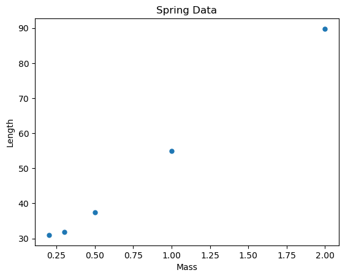
    


(b) Build the design matrix $$\mathbf X$$, the output vector $$\mathbf y$$ from your data, and compute the least squares solution $$\mathbf w^*$$ using the normal equation.


```python

# Read the data from the CSV file
df = pd.read_csv('spring-data.csv')

# Build the design matrix X
X = np.column_stack((np.ones(len(df)), df['mass']))

# Build the output vector y
y = df['length']

# Compute the least squares solution w*
w_star = np.linalg.inv(X.T @ X) @ X.T @ y

print(w_star)

```

    [22.22733945 33.49082569]


(c) Plot the model $$f_{\mathbf w^*}(x)$$ on top of the data. What is the total loss of the model?


```python
# Plot the data
plt.plot(df['mass'], df['length'], '.', ms=10, label='Data')

# Plot the model
x = np.linspace(0, df['mass'].max(), 10)
y_pred = w_star[0] + w_star[1] * x
plt.plot(x, y_pred, label='Model')

# Calculate the total loss
y_actual = df['length']
loss = np.sum((y_actual - (w_star[0] + w_star[1] * df['mass'])) ** 2)
print("Total loss:", loss)

# Add labels and legend
plt.xlabel('Mass')
plt.ylabel('Length')
plt.title('Model vs Data')
plt.legend()

# Show the plot
plt.show()

```

    Total loss: 7.562816513761479


    
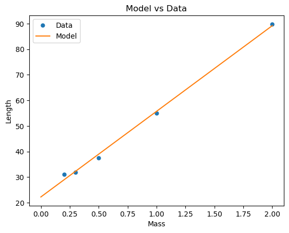
    


Note the mismatch between the y-intercept of the model and the value that was measured in class for the length of the spring in the absence of a force. This could either be due to the fact that the spring is already stretch in its 'unloaded' state, or that the measurements are not accurate. It's probably a combination of the two.

(d) Repeat the same exercise using stochastic gradient descent. Start with $$\mathbf w = [0, 0]$$, and use a learning rate of $$\eta = 0.01$$. Plot the model $$f_{\mathbf w}(x)$$ on top of the data. 

(e) Plot the evolution of the loss as a function of the number of epochs.


```python
# Initialize the weight vector w
w = np.array([0, 0])

# Set the learning rate and number of iterations
eta = 0.01
num_iterations = 300

# Perform stochastic gradient descent
## NOTE: here's we're using a slighty different strategy that that presented in class, but the idea is the same
# Instead of iterating over the data points in the order they appear in the list, we're picking a random data point at each iteration.
# Either way, the algorithm should converge to the same solution.

loss_history = []  
weight_history = []  

for j in range(num_iterations):
    for i in range(len(df)):
        # Pick a random data point
        x_i = np.array([1, df['mass'].iloc[i]])
        y_i = df['length'].iloc[i]
        
        # Compute the gradient
        gradient = 2 * (w @ x_i - y_i) * x_i
        
        # Update the weight vector
        w = w - eta * gradient

        weight_history.append(w)  # Append the weight vector to the weight_history list
    
    # Calculate the total loss at each epoch
    y_actual = df['length']
    loss = np.sum((y_actual - (w[0] + w[1] * df['mass'])) ** 2)
    loss_history.append(loss)  # Append the loss to the loss_history list
    


# d) Plot the model
fig = plt.figure(figsize=(12, 5))
ax = fig.add_subplot(121)
x = np.linspace(0, df['mass'].max(), 10)
y_pred = w[0] + w[1] * x
ax.plot(x, y_pred, label='Model')
ax.plot(df['mass'], df['length'], '.', ms=10, label='Data')
ax.set_xlabel('Mass')
ax.set_ylabel('Length')
ax.set_title('d) Stochastic Gradient Descent')
ax.legend()

# e) Plot the evolution of the loss
ax2 = fig.add_subplot(122)
ax2.plot(range(num_iterations), loss_history)
ax2.set_xlabel('Epoch')
ax2.set_ylabel('Loss')
ax2.set_title('e) Evolution of Loss')
plt.show()

# f) Plot the evolution of the weights
weight_history = np.array(weight_history)
plt.plot(weight_history[:, 0], weight_history[:, 1], '.-', ms=1)
plt.plot(w_star[0], w_star[1], 'ro')
plt.xlabel(r'$$w_0$$')
plt.ylabel(r'$$w_1$$')
plt.title('f) Evolution of Weights')
plt.show()

```


    
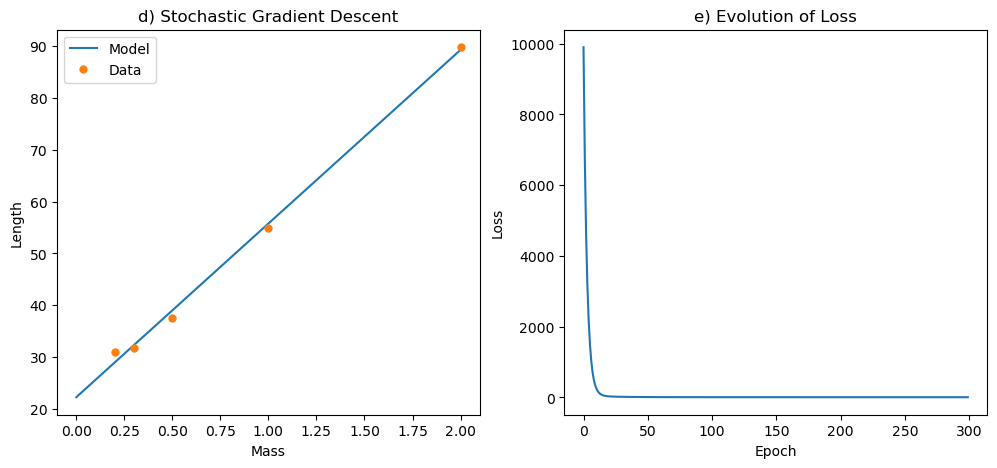
    


    
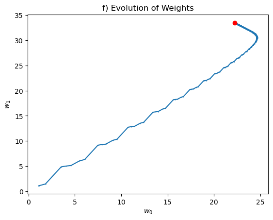
    


Notice that you have to run the algorithm for a large number of epochs to get a good approximation of the least squares solution. This is because the learning rate is small, and the algorithm takes a long time to converge. For that reason, some people use a learning rate that decreases with the number of epochs, because the algorithm will require smaller steps as it gets closer to the minimum.

## Problem 1: The normal equation (5 points):

Given the least mean square expression in matrix form: $$ \mathcal L(\mathbf w) = \| \mathbf X \mathbf w - \mathbf y \|_2^2$$, derive the normal equation using the following linear algebra properties:

To derive the normal equation for the least squares problem, we start with the loss function given as:

$$
\mathcal L(\mathbf w) = \| \mathbf X \mathbf w - \mathbf y \|_2^2
$$

We can expand this expression using matrix notation:

$$
\mathcal L(\mathbf w) = (\mathbf X \mathbf w - \mathbf y)^T(\mathbf X \mathbf w - \mathbf y)
$$

Expanding this expression:

$$
\mathcal L(\mathbf w) = (\mathbf w^T \mathbf X^T - \mathbf y^T)(\mathbf X \mathbf w - \mathbf y) = \mathbf w^T \mathbf X^T \mathbf X \mathbf w - \mathbf w^T \mathbf X^T \mathbf y - \mathbf y^T \mathbf X \mathbf w + \mathbf y^T \mathbf y
$$

The derivative of this expression with respect to $$\mathbf w$$ needs to be computed and set to zero to find the optimal $$\mathbf w$$. We use the given linear algebra properties to compute this derivative.

When we differentiate $$\mathcal L(\mathbf w)$$ with respect to $$\mathbf w$$, we treat each term separately using the given properties:

- The derivative of the first term, $$\mathbf w^T \mathbf X^T \mathbf X \mathbf w$$, with respect to $$\mathbf w$$ is computed using the property $$\nabla_A tr(ABA^TC) = CAB + C^TAB^T$$ where we identify $$A = \mathbf w$$, $$B = \mathbf X^T \mathbf X$$ and $$C = I$$ (the identity matrix):

$$
\nabla_{\mathbf w} (\mathbf w^T \mathbf X^T \mathbf X \mathbf w) = \mathbf X^T \mathbf X \mathbf w + (\mathbf X^T \mathbf X)^T \mathbf w = 2\mathbf X^T \mathbf X \mathbf w
$$

since $$\mathbf X^T \mathbf X$$ is symmetric.

- The derivative of the second term, $$-\mathbf w^T \mathbf X^T \mathbf y$$, is straightforward since it is linear in $$\mathbf w$$:

$$
\nabla_{\mathbf w} (- \mathbf w^T \mathbf X^T \mathbf y) = -\mathbf X^T \mathbf y
$$

Note that the third term $$-\mathbf y^T \mathbf X \mathbf w$$ is equivalent to the second term in its contribution to the gradient due to the properties of trace and transpose operations (it does not directly depend on $$\mathbf w$$ when differentiated in this form).

- The derivative of the constant term $$\mathbf y^T \mathbf y$$ with respect to $$\mathbf w$$ is zero because it does not depend on $$\mathbf w$$.

Combining these results, the gradient of $$\mathcal L(\mathbf w)$$ with respect to $$\mathbf w$$ is:

$$
\nabla_{\mathbf w} \mathcal L(\mathbf w) = 2\mathbf X^T \mathbf X \mathbf w - 2\mathbf X^T \mathbf y
$$

Setting this gradient to zero for minimization:

$$
2\mathbf X^T \mathbf X \mathbf w - 2\mathbf X^T \mathbf y = 0
$$

Dividing through by 2:

$$
\mathbf X^T \mathbf X \mathbf w = \mathbf X^T \mathbf y
$$

This equation is known as the normal equation in the context of linear regression:

$$
\mathbf w = (\mathbf X^T \mathbf X)^{-1} \mathbf X^T \mathbf y
$$

This result provides the optimal weights $$\mathbf w$$ that minimize the least squares error.

## Problem 2: Logistic Regression (10 points)

Given a dataset $$\{ (x^{(i)}, y^{(i)}) \}_{i=1}^{n}$$ with $$x^{(i)} \in \mathbb R$$ and $$y^{(i)} \in \mathbb [0, 1]$$, we would like to fit a logistic classifier with fitting parameters $$\mathbf w$$, and predictor 

$$f_\mathbf{w}(x) = g(\phi(x) \cdot \mathbf w) = \frac{1}{1 + e^{-\phi(x) \cdot \mathbf w}}$$

(a) Find the derivative $$g'(z) = dg/dz$$ as a function of $$g(z)$$. Here $$z \equiv \phi(x) \cdot \mathbf w$$. 

To find the derivative $$ g'(z) = \frac{dg}{dz} $$ as a function of $$ g(z) $$, where $$ g(z) = \frac{1}{1 + e^{-z}} $$, you can apply the chain rule. Here, $$ g(z) $$ is the logistic function or sigmoid function, which is commonly used in logistic regression for binary classification. We start by differentiating $$ g(z) $$ with respect to $$ z $$:

$$
g'(z) = \frac{d}{dz} \left( \frac{1}{1 + e^{-z}} \right)
$$

Applying the chain rule, we get:

$$
g'(z) = \frac{d}{dz} \left( 1 + e^{-z} \right)^{-1} = \left( 1 + e^{-z} \right)^{-2} \cdot e^{-z} \cdot (-1)
$$

Since $$ g(z) = \frac{1}{1 + e^{-z}} $$, we can express $$ e^{-z} $$ in terms of $$ g(z) $$:

$$
e^{-z} = \frac{1}{g(z)} - 1
$$

Substituting this back into the expression for $$ g'(z) $$:

$$
g'(z) = g(z)^{2} \cdot \left( \frac{1}{g(z)} - 1 \right) (-1) = g(z) \cdot (1 - g(z))
$$

(b) Find the log-likelihood $$l(\mathbf w)$$ from the likelihood $$p(y^{(i)} \vert x^{(i)}; \mathbf w)$$ in terms of $$\mathbf w$$, $$x^{(i)}$$, and $$y^{(i)}$$.

Derive the equation for the gradient of the log-likelihood $$\nabla_\mathbf{w} l(\mathbf w)$$ (you can use vector identities or get the derivative with respect to one parameter ($$w_j$$) at a time, i.e. $$\partial l(\mathbf w) / \partial w_j$$, where $$w_j$$ is the $$j^{th}$$ element of the vector $$\mathbf w$$.

**Solution:**

To find the log-likelihood $$ l(\mathbf{w}) $$ for the logistic regression, we start with the likelihood $$ p(y^{(i)} | x^{(i)}; \mathbf{w}) $$. Given the logistic regression model, this probability is defined as:

$$
p(y^{(i)} | x^{(i)}; \mathbf{w}) = (f_{\mathbf{w}}(x^{(i)}))^{y^{(i)}}(1 - f_{\mathbf{w}}(x^{(i)}))^{1 - y^{(i)}}
$$

where $$ f_{\mathbf{w}}(x^{(i)}) = \frac{1}{1 + e^{-\phi(x^{(i)}) \cdot \mathbf{w}}} $$ is the predicted probability that $$ y^{(i)} = 1 $$ given $$ x^{(i)} $$ and $$ \mathbf{w} $$.

The log-likelihood $$ l(\mathbf{w}) $$ is the sum of the logarithm of these probabilities across all observations:

$$
l(\mathbf{w}) = \sum_{i=1}^{n} \left( y^{(i)} \log(f_{\mathbf{w}}(x^{(i)})) + (1 - y^{(i)}) \log(1 - f_{\mathbf{w}}(x^{(i)})) \right)
$$

To derive the gradient of the log-likelihood with respect to $$ \mathbf{w} $$, we compute the derivative of $$ l(\mathbf{w}) $$ with respect to each component $$ w_j $$ of $$ \mathbf{w} $$. We use the result from part (a), $$ g'(z) = g(z)(1 - g(z)) $$, to facilitate this differentiation:

$$
\frac{\partial l(\mathbf{w})}{\partial w_j} = \sum_{i=1}^{n} \left( y^{(i)} \frac{1}{f_{\mathbf{w}}(x^{(i)})} - (1 - y^{(i)}) \frac{1}{1 - f_{\mathbf{w}}(x^{(i)})} \right) \frac{\partial}{\partial w_j} f_{\mathbf{w}}(x^{(i)})
$$

The derivative of $$ f_{\mathbf{w}}(x^{(i)}) $$ with respect to $$ w_j $$ can be expressed using the chain rule, recognizing that $$ f_{\mathbf{w}}(x^{(i)}) = g(\phi(x^{(i)}) \cdot \mathbf{w}) $$:

$$
\frac{\partial}{\partial w_j} f_{\mathbf{w}}(x^{(i)}) = f_{\mathbf{w}}(x^{(i)})(1 - f_{\mathbf{w}}(x^{(i)})) \phi_j(x^{(i)})
$$

where $$ \phi_j(x^{(i)}) $$ is the $$ j $$th component of $$ \phi(x^{(i)}) $$. Substituting this derivative back into the gradient of the log-likelihood:

$$
\frac{\partial l(\mathbf{w})}{\partial w_j} = \sum_{i=1}^{n} \left( y^{(i)} - f_{\mathbf{w}}(x^{(i)}) \right) \phi_j(x^{(i)})
$$

In vector form, the gradient of the log-likelihood $$ \nabla_{\mathbf{w}} l(\mathbf{w}) $$ is given by:

$$
\nabla_{\mathbf{w}} l(\mathbf{w}) = \sum_{i=1}^{n} \left( y^{(i)} - f_{\mathbf{w}}(x^{(i)}) \right) \phi(x^{(i)})
$$

This equation represents the direction in which we should adjust $$ \mathbf{w} $$ to increase the log-likelihood. 

(c) What is the least mean squares (LMS) update rule to maximize the log-likelihood?

**Solution:**

Given the gradient of the log-likelihood that we derived:

$$
\nabla_{\mathbf{w}} l(\mathbf{w}) = \sum_{i=1}^{n} (y^{(i)} - f_{\mathbf{w}}(x^{(i)})) \phi(x^{(i)})
$$

The update rule for $$\mathbf{w}$$ in an iterative algorithm:

$$
\mathbf{w} \leftarrow \mathbf{w} + \eta (y^{(i)} - f_{\mathbf{w}}(x^{(i)})) \phi(x^{(i)})
$$

This update rule incrementally adjusts $$\mathbf{w}$$ based on each observation, moving $$\mathbf{w}$$ in the direction that most steeply increases the log-likelihood. 

## Problem 3: True or False (10 points)
Determine if the following statements are True or False and provide a brief explanation:

(a) If the linear predictor is overfitting on the training set, the training set error is much larger than the test set error.

False. Overfitting on the training set typically means the model has learned the training data too well, including its noise and outliers, which results in a low training set error. However, this over-specialization leads to poor generalization on unseen data, so the test set error would be higher, not lower, compared to the training set error.

(b) The purpose of cross-validation is to prevent overfitting on the test set.

True. The primary purpose of cross-validation is to estimate how well the model will generalize to an independent dataset (i.e., an unseen test set). It is a technique to **assess** the model's predictive performance and can help in tuning hyperparameters to prevent overfitting on the training set, which indirectly aims to ensure robust performance on the test set.

(c) A development set (or dev set) is used to prevent overfitting on the test set.

True. A development set, or validation set, is indeed used to tune the hyperparameters of a model without using the test set. This helps in preventing overfitting on the test set because it allows the model to be optimized and validated independently of the test data, ensuring the test set remains a reliable indicator of generalization performance.

(d) Increasing the amount of data will prevent the algorithm from overfitting. 

True. Increasing the amount of training data can help prevent overfitting because with more data, the model has a better chance to learn the true underlying patterns instead of just memorizing the noise or the specific patterns in a smaller dataset. A larger dataset provides more examples and variability, which typically improves the model's generalization capabilities.

(e) Adding a regularization term will decrease the likelihood of underfitting.

False. Adding a regularization term is a technique used to decrease the complexity of the model and prevent overfitting, not underfitting. By penalizing larger values of the parameters, regularization helps to ensure that the model does not become too complex and overfit the training data. If anything, too strong a regularization can increase the risk of underfitting because it might overly simplify the model, preventing it from capturing the underlying structure in the data.

(f) Stochastic gradient descent requires less updates on $$\mathbf w$$ to converge to the optimal solution.

False. Stochastic gradient descent (SGD) typically requires more updates to converge to the optimal solution compared to batch or normal gradient descent because it updates the weights using only one (or a small batch of) example(s) at a time. This can make the path to convergence noisy and potentially longer in terms of the number of updates, especially in comparison to methods that use the entire dataset to compute the gradient at each step. However, it's worth noting that each update is generally faster with SGD since it is based on less data.

## Problem 4: Classification with Scikit-Learn (30 points)

I have provided two files "p2_x.txt" and "p2_y.txt". These files contain inputs $$x^{(i)} \in \mathbb R^2$$ and outputs $$y^{(i)} \in \{ -1, 1 \}$$, respectively, with one training example per row. This is a binary classification problem.

(a) Read the data (you can use [Pandas](https://pandas.pydata.org/)) from the files, and split it into training and test sets. Make sure to shuffle the data before splitting it.


```python
import pandas as pd
from sklearn.model_selection import train_test_split

# Read the data from files
x_data = pd.read_csv("p2_x.txt", header=None, delimiter="\s+")
y_data = pd.read_csv("p2_y.txt", header=None, delimiter="\s+")

# Split the data into training and test sets
x_train, x_test, y_train, y_test = train_test_split(x_data, y_data, test_size=0.2, shuffle=True)

# Print the shapes of the training and test sets
print("Training set shape:", x_train.shape, y_train.shape)
print("Test set shape:", x_test.shape, y_test.shape)

```

    Training set shape: (79, 2) (79, 1)
    Test set shape: (20, 2) (20, 1)


(b) Plot the training data (your axes should be $$x_1$$ and $$x_2$$, corresponding to the two coordinates of the inputs, and you should use a different symbol for each point plotted to indicate whether that example had label 1 or -1, and whether it is a training or test data point). 


```python
# Initialize the plot
fig, ax = plt.subplots()

# Plot training data points with label 1
ax.scatter(x_train[y_train[0] == 1][0], x_train[y_train[0] == 1][1], c='blue', marker='o', label='Training (Label 1)')
ax.scatter(x_train[y_train[0] == -1][0], x_train[y_train[0] == -1][1], c='red', marker='x', label='Training (Label -1)')
ax.scatter(x_test[y_test[0] == 1][0], x_test[y_test[0] == 1][1], c='blue', marker='s', label='Test (Label 1)')
ax.scatter(x_test[y_test[0] == -1][0], x_test[y_test[0] == -1][1], c='red', marker='+', label='Test (Label -1)')

# Add legend and labels for clarity
ax.legend()
ax.set_xlabel('$$x_1$$')
ax.set_ylabel('$$x_2$$')
ax.set_title('Training and Test Data Distribution')
plt.show()


```


    
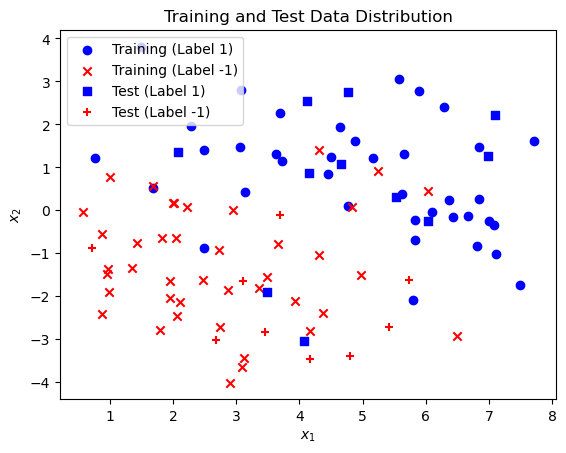
    


(c) Use [scikit-learn](https://scikit-learn.org/stable/modules/generated/sklearn.linear_model.LogisticRegression.html) to fit a logistic regression model to the data. (Extra credit (5 points): use the stochastic gradient descent algorithm we wrote in class and make sure you get a similar result).


```python
from sklearn.linear_model import LogisticRegression

logistic_model = LogisticRegression()
logistic_model.fit(x_train, y_train.values.ravel())
logistic_model.coef_, logistic_model.intercept_

print('coefficient w_1:', logistic_model.coef_[0][0])
print('coefficient w_2:', logistic_model.coef_[0][1])
print('coefficient w_0 (intercept):', logistic_model.intercept_[0])
```

    coefficient w_1: 0.770454343842921
    coefficient w_2: 1.2089702237028555
    coefficient w_0 (intercept): -2.8320817393194804


(d) Plot the decision boundary. This should be a straight line showing the boundary separating the region where $$f_\mathbf{w}(\mathbf x) > 0.5$$ from where $$f_\mathbf{w}(\mathbf x) \le 0.5$$.). What is the test score of the model?

The equation of the decision boundary line in the context of logistic regression can be derived from the model's coefficients and intercept. The decision boundary for a logistic regression model is where the model's output is 0.5, which corresponds to the linear combination of inputs being equal to 0. In mathematical terms, this is when:

$$
\mathbf{w}^T \mathbf{x} + b = 0
$$

For our 2D case, where $$\mathbf{w} = [w_1, w_2]$$ and $$\mathbf{x} = [x_1, x_2]$$, the equation simplifies to:

$$
w_1 x_1 + w_2 x_2 + b = 0
$$

Solving for $$x_2$$ to get the decision boundary line equation:

$$
x_2 = -\frac{w_1}{w_2} x_1 - \frac{b}{w_2}
$$


```python
import numpy as np

# Create a mesh to plot the decision boundary
x_min, x_max = x_data[0].min() - 1, x_data[0].max() + 1
y_min, y_max = x_data[1].min() - 1, x_data[1].max() + 1

# Coefficients and intercept from the logistic model
w_1, w_2 = logistic_model.coef_[0]
b = logistic_model.intercept_[0]

# Define x_1 values for plotting the decision boundary line
x_1_values = np.array([x_min, x_max])

# Calculate corresponding x_2 values based on the line equation
x_2_values = -(w_1 / w_2) * x_1_values - b / w_2

# Initialize the plot for the decision boundary line
fig, ax = plt.subplots()

# Plot the decision boundary line
ax.plot(x_1_values, x_2_values, 'k--', label='Decision Boundary')

# Plot training data points with label 1
ax.scatter(x_train[y_train[0] == 1][0], x_train[y_train[0] == 1][1], c='blue', marker='o', label='Training (Label 1)')
ax.scatter(x_train[y_train[0] == -1][0], x_train[y_train[0] == -1][1], c='red', marker='x', label='Training (Label -1)')
ax.scatter(x_test[y_test[0] == 1][0], x_test[y_test[0] == 1][1], c='blue', marker='s', label='Test (Label 1)')
ax.scatter(x_test[y_test[0] == -1][0], x_test[y_test[0] == -1][1], c='red', marker='+', label='Test (Label -1)')

# Add legend and labels for clarity
ax.set_xlabel('$$x_1$$')
ax.set_ylabel('$$x_2$$')
ax.legend()

# Show the plot
plt.show()

# Evaluate and print the test score of the model
test_score = logistic_model.score(x_test, y_test)
print('test score: ', test_score)

```


    
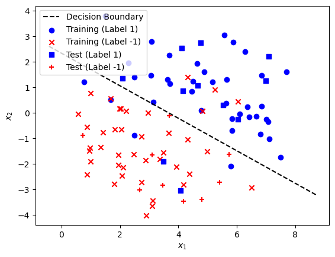
    


    test score:  0.9


(e) What is the purpose of the penalty argument in the LogisticRegression classifier? Try the $$L_1$$, $$L_2$$ and $$ElasticNet$$ penalties and compare their decision boundaries as well as their test scores.


The `penalty` argument in the `LogisticRegression` classifier specifies the norm used in the penalization, which is an integral part of regularization. Regularization is a technique used to prevent overfitting by discouraging overly complex models in several ways:

- **`L1` penalty (Lasso regression)**: Encourages sparsity in the coefficients, effectively serving as a method for feature selection by driving some coefficients to zero.
- **`L2` penalty (Ridge regression)**: Encourages smaller, more diffuse coefficients, helping to reduce model variance without significantly increasing bias.
- **`ElasticNet` penalty**: Combines both `L1` and `L2` penalties, balancing between feature selection and coefficient shrinkage, controlled by the `l1_ratio` parameter.

I will now fit logistic regression models using each of these penalty types and compare their decision boundaries and test scores. For `ElasticNet`, we need to specify an `l1_ratio` between 0 and 1, where `l1_ratio=1` is equivalent to L1 regularization and `l1_ratio=0` is equivalent to L2 regularization. Let's choose `l1_ratio=0.5` for an equal balance between L1 and L2.

The plot shows the decision boundaries for logistic regression models with L1, L2, and ElasticNet penalties. All three models have produced a test score of 1.0, indicating perfect accuracy on the test set for this particular dataset. Despite this, the actual decision boundaries might vary slightly depending on the penalty and dataset complexity:

- The **L1 penalty** may result in some features being entirely ignored, leading to a potentially simpler decision boundary that focuses on fewer features.
- The **L2 penalty** tends to distribute the weight adjustments across all features, often resulting in more stable and generalized models.
- The **ElasticNet penalty** combines these approaches and can adapt between them based on the data and the specified `l1_ratio`.

In this case, since all models achieved the same high accuracy and the dataset is likely not complex enough to differentiate their regularization impacts significantly, the decision boundaries appear quite similar and effective for classification. However, in practice, especially with more complex or higher-dimensional datasets, the choice of penalty can have a significant impact on the model's performance and interpretability.


```python
from sklearn.svm import SVC


# Initialize logistic regression models with different penalties
models = {
    'L1': LogisticRegression(solver='liblinear', penalty='l1', C=1.0, random_state=0),
    'L2': LogisticRegression(solver='liblinear', penalty='l2', C=1.0, random_state=0),
    'ElasticNet': LogisticRegression(solver='saga', penalty='elasticnet', l1_ratio=0.5, C=1.0, max_iter=5000),
    'SVM': SVC(kernel='linear')
}

# Dictionary to store test scores and decision boundary lines
test_scores = {}
decision_boundaries = {}

# Fit models and calculate decision boundaries and test scores
for penalty, model in models.items():
    model.fit(x_train, y_train.values.ravel())
    w_1, w_2 = model.coef_[0]
    b = model.intercept_[0]
    x_2_values = -(w_1 / w_2) * x_1_values - b / w_2
    decision_boundaries[penalty] = x_2_values
    test_scores[penalty] = model.score(x_test, y_test)

# Initialize the plot for decision boundaries comparison
fig, ax = plt.subplots()

# Plot decision boundaries for each penalty
for penalty, x_2_values in decision_boundaries.items():
    ax.plot(x_1_values, x_2_values, label=f'{penalty} Penalty')

# Plot training data points with label 1
ax.scatter(x_train[y_train[0] == 1][0], x_train[y_train[0] == 1][1], c='blue', marker='o', label='Training (Label 1)')
ax.scatter(x_train[y_train[0] == -1][0], x_train[y_train[0] == -1][1], c='red', marker='x', label='Training (Label -1)')

# Add labels and legend to the plot
ax.set_xlabel('$$x_1$$')
ax.set_ylabel('$$x_2$$')
ax.set_title('Decision Boundaries with Different Penalties')
ax.legend()

plt.show()

test_scores

```


    
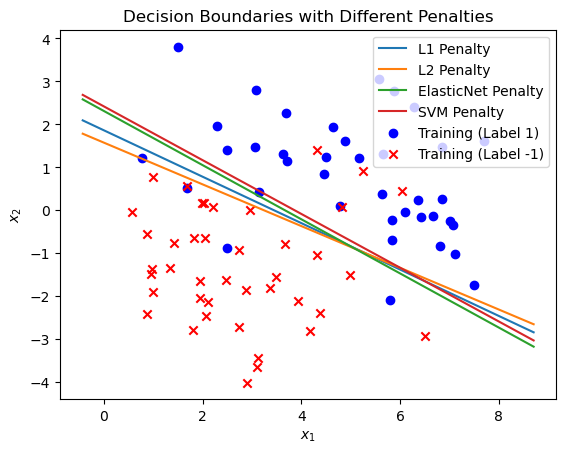
    


    {'L1': 0.85, 'L2': 0.85, 'ElasticNet': 0.9, 'SVM': 0.9}


SVM seems to be slightly better than ElasticNet at creating a supported line that separates the two classes.

(g) Open ended, extra credit (5 points): search for 3 other classification algorithms that you can use on this data-set and state their advantages over logistic regression?

Here are three other classification algorithms that you can use on this dataset, along with their advantages over logistic regression:

1. **Decision Trees:**
   - **Advantage**: Decision trees can model non-linear relationships and interactions between features without requiring feature engineering or transformation. They are also interpretable, providing a clear visualization of how decisions are made.
   - **Context**: While logistic regression is a linear classifier and may struggle with complex boundaries unless feature engineering is applied, decision trees can naturally handle this complexity and provide intuitive decision rules.

2. **k-Nearest Neighbors (k-NN):**
   - **Advantage**: k-NN is a non-parametric method, making no underlying assumptions about the distribution of data. It can capture complex decision boundaries based on the local similarity of data points.
   - **Context**: Unlike logistic regression, which relies on a global model to determine the decision boundary, k-NN makes predictions based on a localized averaging of neighbors, which can be more flexible in adapting to data structure.

3. **Random Forest:**
   - **Advantage**: As an ensemble method that aggregates multiple decision trees, random forests can reduce the variance and avoid overfitting, which might be a risk with individual decision trees. They also handle feature interactions and non-linearities effectively.
   - **Context**: Logistic regression might underperform if the relationship between features and the target variable is complex and non-linear. Random forests can provide better performance and robustness in such scenarios by aggregating diverse trees and reducing the risk of overfitting through randomness in feature selection and bootstrapping.

Each of these algorithms can provide superior performance over logistic regression in scenarios where the data are non-linear, have complex interactions, or when a more flexible or non-parametric approach is beneficial. Additionally, these methods can offer better interpretability (decision trees, random forests) or flexibility (k-NN) depending on the specific requirements of the analysis.


## Problem 5: Galileo Galil-AI (40 points)
In 1602, Galileo started conducting experiments on the pendulum that ultimately led to his discovery of the relationship between its period and length:

$$T = 2 \pi \sqrt{ \frac{L}{g} }$$

Imagine being in his shoes, except with and smart and machine learning at your disposal. This is an open-ended problem whose purpose is to get you familiar with data collection, pre-processing and linear regression.

Download an app on your phone that allows you to save sensor data. I recommend the physics toolbox sensors suite app which seems to be available on both \href[iPhone](https://apps.apple.com/us/app/physics-toolbox-sensor-suite/id1128914250) and [Android](https://play.google.com/store/apps/details?id=com.chrystianvieyra.physicstoolboxsuite&gl=US) platforms. Hang your phone at the end of a string and use it as a pendulum. You can use your charger cable as the string but you might want to put a cushiony surface under it in case the phone falls off the cable. Perform pendulum free oscillation experiments (as Galileo probably did) with different string lengths. Let $$x^{(i)}(t)$$ be the sensor measurement for every experiment $$i$$ with string length $$L^{(i)}$$. $$x^{(i)}(t)$$ can be the angular acceleration if you are using the gyroscope, or the linear acceleration if you are using the accelerometer. We are interested in predicting the period of oscillation $$T$$ from the length of the string $$L$$.

(b) Data cleaning: remove pre- and post- oscillation measurements from your sensor data and plot the time series for each experiment $$i$$ (you can do so on the same plot or on separate [subplots](https://matplotlib.org/stable/api/_as_gen/matplotlib.pyplot.subplots.html)). If you are using a gyroscope that truncates values between $$0$$ and $$2 \pi$$, process the data to get a sinusoidal looking time series.


```python
# Read and print data features
df = pd.read_csv('gyro-data3.csv', sep=',') 
df.keys()
```


    Index(['time', 'wx', 'wy', 'wz'], dtype='object')


```python
# Time step
dt = np.mean(np.diff(df['time']))

# My iphone's length (in cm)
iphone_length = 14.4

# String lengths for which I recorded the data (in cm)
lengths = [10*(i+1)+iphone_length/2 for i in range(8)]

# [Start, End] indexes for which pendulum (phone) was swinging
# Found by inspection.
idxes = [[150, 950],
         [1600, 2400],
         [3200, 4100],
         [5100, 5900],
         [6650, 7750],
         [9200, 10300],
         [11200, 12600],
         [13950, 15200]]

# Time vector
time = np.linspace(0, dt*len(df['wz']), len(df['wz']), endpoint=False)

# Plot the gyroscope data
fig = plt.figure(figsize=(12, 5))
plt.plot(time, df['wz'], '--')
wz_segments = []
for idx in range(len(idxes)):
    idx0 = idxes[idx][0]
    idxend = idxes[idx][1]
    wz_segments.append(df['wz'][idx0: idxend])
    plt.plot(time[idx0: idxend], wz_segments[-1], label='L = '+str(lengths[idx])+' cm')

plt.xlabel('Time (s)')
plt.ylabel('Angular velocity (rad/s)')
plt.legend(loc='upper right')
plt.show()
    
```


    
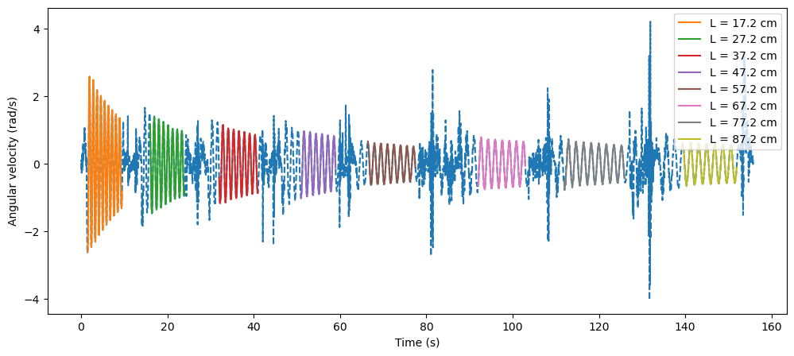
    


(b) Transform (algorithmically, not by hand) the time series data $$z^{(i)}(t)$$ to the an average period of oscillation $$T^{(i)}$$ for each experiment $$i$$. Briefly describe the method you used. (hint: what's the best way to find the frequencies in a time-series data?)


```python
from scipy.fft import rfft, rfftfreq

# Recompute the average periods by converting each pandas Series to a numpy array
average_periods_corrected = []

number_freq = len(wz_segments[0])*15

fig = plt.figure(figsize=(12, 5))

for segment in wz_segments:
    # Convert the pandas Series segment to a numpy array
    segment_array = segment.to_numpy()
    
    # Apply FFT on the numpy array
    yf = rfft(segment_array, n=number_freq)
    xf = rfftfreq(number_freq, dt)

    # Plot the spectrum
    plt.plot(xf, np.abs(yf))
    plt.xlabel('Frequency (Hz)')
    plt.ylabel('Amplitude')
    plt.xlim(0, 5)
    plt.title('Spectrum for Length = ' + str(lengths[i]) + ' cm')

    # Find the dominant frequency
    idx_max = np.argmax(np.abs(yf))
    f_dominant = xf[idx_max]

    # Calculate the corresponding period
    T = 1 / f_dominant
    average_periods_corrected.append(T)

# Output the corrected average periods for each experiment
average_periods_corrected
```


    [0.8753952888403057,
     1.0707960229564453,
     1.2363830368156894,
     1.378496029553125,
     1.5180905641914162,
     1.6428651311112585,
     1.7636640378106159,
     1.8738930401737792]


    
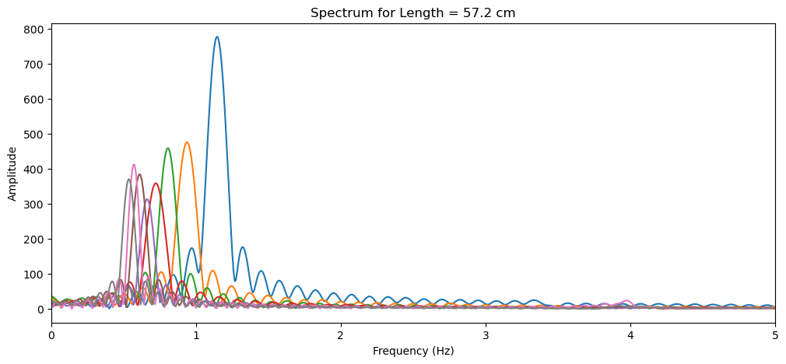
    


(c) Split your data into a training and test sets, and plot $$T^{(i)}$$ as a function of $$L^{(i)}$$ for all data points $$i$$. 


```python
# Split the data into training and test sets
from sklearn.model_selection import train_test_split

# Prepare the input (string lengths) and output (periods) data
X = np.array(lengths).reshape(-1, 1)  # Reshape lengths for sklearn compatibility
y = np.array(average_periods_corrected)

# Split the data: 80% training and 20% test
X_train, X_test, y_train, y_test = train_test_split(X, y, test_size=0.2, random_state=42)

# Plot T^i as a function of L^i for all data points i
fig, ax = plt.subplots()

# Scatter plot for training data
ax.scatter(X_train, y_train, color='blue', label='Training Data')

# Scatter plot for test data
ax.scatter(X_test, y_test, color='red', label='Test Data')

ax.set_xlabel('String Length $$L^{(i)}$$ (cm)')
ax.set_ylabel('Period of Oscillation $$T^{(i)}$$ (s)')
ax.legend()

plt.show()

```


    
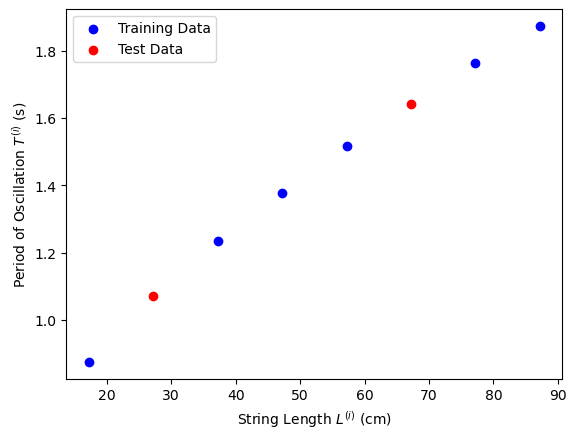
    


For this experiment, the goal is to predict the period of oscillation $$ T $$ from the length of the string $$ L $$, hence:

Given the physical relationship $$ T = 2 \pi \sqrt{ \frac{L}{g} } $$, we can design feature extractors $$ \phi(x) $$ that reflect this relationship and are conducive to linear regression modeling. Here are a few choices for $$ \phi(x) $$ and the corresponding formulations of $$ f_\mathbf{w}(x) = \phi(x) \cdot \mathbf w $$:

1. **Logarithmic Transformation**: Considering the relationship involves a square root, applying a logarithm could linearize this relationship:
   - $$ \phi(x) = \log(x) $$
   - $$ f_\mathbf{w}(x) = w_0 + w_1 \log(x) $$
   
   If a square root relationship exists between the period and length, taking the logarithm of both sides would yield a linear relationship between $$ \log(T) $$ and $$ \log(L) $$, which could be more amenable to linear modeling. 

2. **Polynomial Feature Extractor**: A polynomial transformation can capture more complex relationships:
   - $$ \phi(x) = [1, x, x^2] $$ for a quadratic model as an example.
   - $$ f_\mathbf{w}(x) = w_0 + w_1 x + w_2 x^2 $$
   
   Polynomial features allow the model to fit a wider range of curvilinear relationships, which might more closely represent the underlying physics when the exact model isn't known. However, here the input has to be chosen to be the period, and the output the length.

3. **Inverse and Square Root Transformation**: Inspired by the physical formula, we might directly model the inverse or square root relationship:
   - $$ \phi(x) = [1, \frac{1}{x}, \sqrt{x}] $$
   - $$ f_\mathbf{w}(x) = w_0 + w_1 \frac{1}{x} + w_2 \sqrt{x} $$
   
   This directly leverages the known physical relationship, where the period's square scales linearly with the length. Modeling inverse or square root relationships directly could improve model accuracy and interpretability relating to the physical laws governing the pendulum.


(e) Depending on your choice of $$\phi()$$, $$x$$ and $$y$$, use linear regression, ridge regression (with $$L_2$$ regularization) or Lasso (with $$L_1$$ regularization) with scikit-learn and compare your results to the theory. What did you obtain for $$g$$?

To compare the results of linear regression, ridge regression, and Lasso regression to the theoretical relationship $$ T = 2 \pi \sqrt{ \frac{L}{g} } $$, we should choose transformations that allow the linear model to approximate this non-linear relationship. Given the suggestions:

1. **Linear Regression**: You might use the transformation $$ \phi(x) = [\log(L)] $$, expecting to linearize the relationship based on the square root in the period formula. The linear regression would then model $$ \log(T) $$ against $$ \log(L) $$, enabling you to back-calculate $$ g $$ from the coefficients.

2. **Ridge Regression (L2 Regularization)**: This method will be useful if we suspect high multicollinearity among our transformed features or wish to prevent overfitting, especially if a higher-degree polynomial is used. For example, if we decide to model directly on transformed features like $$ \sqrt{L} $$, ridge regression can stabilize the estimation.

3. **Lasso Regression (L1 Regularization)**: If we use a set of polynomial features and suspect that only some of them are relevant, Lasso can help by performing feature selection, effectively shrinking some coefficients to zero.

For the feature $$ \phi(x) = \sqrt{L} $$, the regression function $$ f_\mathbf{w}(x) = \phi(x) \cdot \mathbf w $$ would simply try to align with the theoretical model directly, enabling a straightforward estimation of $$ g $$.

Now, let's implement these models to estimate $$ g $$ based on the transformation $$ T^2 = \frac{4\pi^2}{g} L $$. After finding the relationship between $$ T^2 $$ and $$ L $$, the slope of this line should give an estimate of $$ \frac{4\pi^2}{g} $$, from which $$ g $$ can be calculated. We'll use the transformed target $$ y = T^2 $$ and $$ x = L $$ directly for simplicity and clarity in this context. Let's compute these models and extract $$ g $$:


```python
from sklearn.linear_model import LassoCV

periods = np.array(average_periods_corrected)
lengths_m = np.array([l/100 for l in lengths])
g = 9.8

X = np.vstack([np.ones(len(periods)), periods, periods**2, periods**3]).T
y = lengths_m

Las = LassoCV(cv=5, random_state=0)
Las.fit(X, y)
print('features: ', ['1', 'x', 'x^2', 'x^3'])
print('coeffs: ', Las.coef_)
print('score: ', Las.score(X, y))
print('true coefficient = ', g/(4*np.pi**2), 'in L = g/4*pi^2 * T^2')
print('coefficient percentage error = ', (Las.coef_[2]-g/(4*np.pi**2))/(g/(4*np.pi**2))*100, '%')
print('g computed from discovered coefficient = ', 4*np.pi**2*Las.coef_[2])

```

    features:  ['1', 'x', 'x^2', 'x^3']
    coeffs:  [0.         0.         0.25430807 0.        ]
    score:  0.9997408724239764
    true coefficient =  0.24823689992372758 in L = g/4*pi^2 * T^2
    coefficient percentage error =  2.4457174905989985 %
    g computed from discovered coefficient =  10.039680314078703


Note that the difference in the answer is due to two main factors: 
- The small angle approximation assumed in the expression for the period is not valid
- Quite a lot of noise and inaccuracy with the problem setup!


```python
import matplotlib.pyplot as plt

# Predict the lengths using the trained model
y_pred = Las.predict(X)

# Plot the model fit vs data
plt.scatter(periods, lengths_m, color='blue', label='Data')
plt.plot(periods, y_pred, color='red', label='Model Fit')
plt.xlabel('Period of Oscillation (s)')
plt.ylabel('Length of String (m)')
plt.legend()
plt.show()

```


    
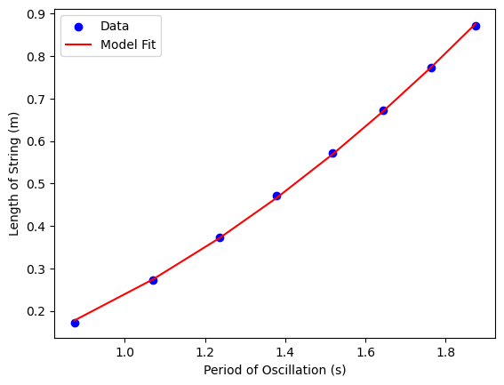
    

