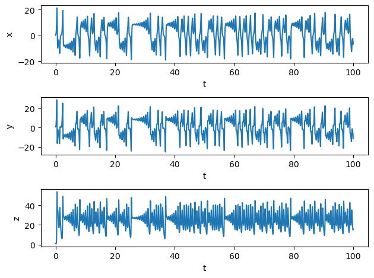
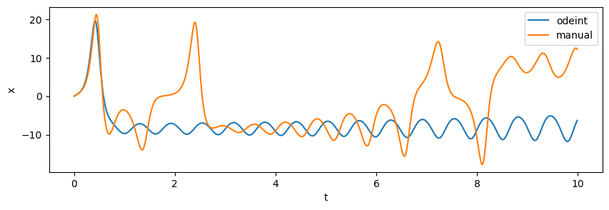
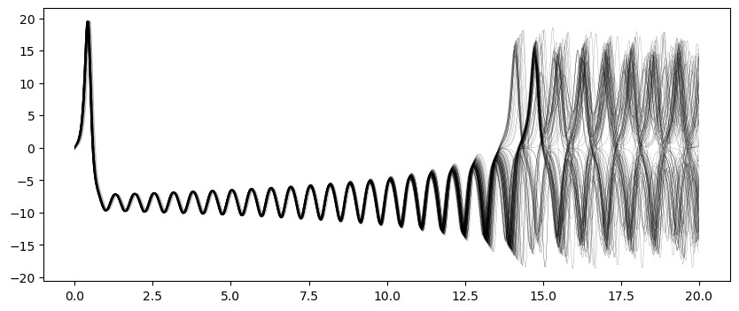
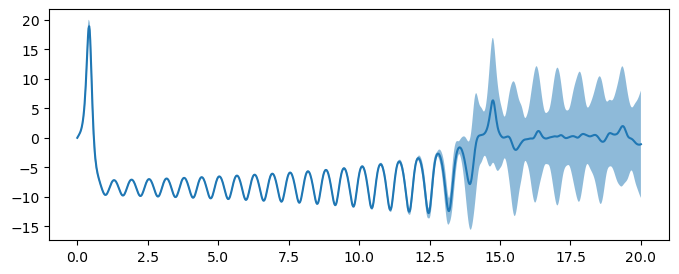
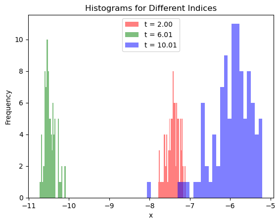
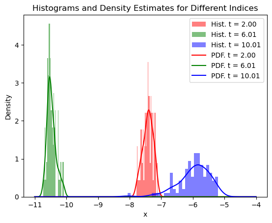

[](https://colab.research.google.com/drive/136TAjKKxtBCUHof50bJQEYc9IjpQsoRT?usp=sharing)

#### References:
- Engineering Math: [Differential Equations and Dynamical Systems by Steven Brunton](https://www.youtube.com/playlist?list=PLMrJAkhIeNNTYaOnVI3QpH7jgULnAmvPA).
- Motivation to chaos and the butterfly effect: [Chaos Theory and the Lorenz Attractor](https://www.youtube.com/watch?v=fDek6cYijxI&ab_channel=Veritasium).
- 

## Nonlinear Systems and Uncertainty Quantification

Nonlinear systems are everywhere. Whenever you need to model real complex systems, you will most probably run into non-linearities; and non-linearities present many mathematical challenges. For one, nonlinear differential equations can rarely be solved analytically. We mostly rely on numerical methods to study their solutions. In addition, if a differential equation admits two solutions, their superposition is not necessarily a solution. 

In some cases, nonlinear systems exhibit complex unpredictable behavior; increasing the challenge to control them or characterize them. Moreover, uncertainties in the initial conditions and model parameters further contribute to the difficulty in understanding and analyzing them.

One of the most fascinating characteristics of nonlinear systems is chaos. Chaos refers to the phenomenon where small changes in the initial conditions can lead to significant differences in the system's behavior over time. This sensitivity to initial conditions makes it inherently difficult to make precise predictions about their long-term evolution. For a motivation, watch this [video](https://www.youtube.com/watch?v=fDek6cYijxI&ab_channel=Veritasium).

The Lorenz system is a classic example of a nonlinear system that exhibits chaotic behavior. It was introduced by Edward Lorenz in 1963 while studying atmospheric convection. The Lorenz system consists of three coupled ordinary differential equations that describe the evolution of three variables: x, y, and z. These variables represent the state of the system and are related to the convection currents in the atmosphere.

The Lorenz system equations are as follows:

$$\frac{dx}{dt} = \sigma (y - x) $$

$$\frac{dy}{dt} = x (\rho - z) - y $$

$$\frac{dy}{dt}= x y - \beta z $$

In these equations, $$\sigma$$, $$\rho$$, and $$\beta$$ are parameters that control the behavior of the system. The parameter $$\sigma$$ represents the Prandtl number, which characterizes the fluid's viscosity. The parameter $$\rho$$ represents the Rayleigh number, which measures the temperature difference across the fluid layer. The parameter $$\beta$$ represents the aspect ratio of the convection cell.

The Lorenz system is known for its chaotic behavior, where small changes in the initial conditions or parameter values can lead to drastically different trajectories. This sensitivity to initial conditions and parameter uncertainties highlights the need for uncertainty quantification techniques in analyzing and predicting the behavior of nonlinear systems.

By quantifying uncertainties and understanding their impact on the system's behavior, researchers and engineers can gain insights into the robustness and reliability of their models. Uncertainty quantification techniques, such as sensitivity analysis and probabilistic methods, can help identify critical parameters and assess the reliability of predictions in the presence of uncertainties.

In this notebook, we will explore the Lorenz system, analyze its chaotic behavior, and demonstrate the importance of uncertainty quantification in understanding and predicting the dynamics of nonlinear systems.


```python
import numpy as np
import matplotlib.pyplot as plt

## If you're using Google Colab, uncomment the following lines to use interactive plots
# !pip install ipywidgets
# !pip install ipympl

# from google.colab import output
# output.enable_custom_widget_manager()
```

First let's define the function that takes the inputs $$X = [x, y, z]$$ and returns the derivative of the input such that $$\frac{dX}{dt} = f(X; \sigma, \rho, \beta)$$


```python
# Lorenz system equations
def lorenz_system(X, t, sigma, rho, beta):
    x, y, z = X
    dx_dt = sigma * (y - x)
    dy_dt = x * (rho - z) - y
    dz_dt = x * y - beta * z
    return dx_dt, dy_dt, dz_dt
```

Then let's define some system parameters and initial conditions: 


```python
# Lorenz system parameters
sigma = 10.0
rho = 28.0
beta = 8.0 / 3.0

# Time parameters
dt = 0.01  # Time step
num_steps = 10000  # Number of steps
t = np.linspace(0, num_steps*dt, num_steps)

# Initialize arrays to hold x, y, z values
xs = np.zeros(num_steps)
ys = np.zeros(num_steps)
zs = np.zeros(num_steps)
```

Finally, we will integrate the equations using a simple Euler method to start with. Will will then print the final value of the state variables:


```python
%matplotlib inline 

# Set initial values
initial_state = (0., 1., 1.06)
xs[0], ys[0], zs[0] = initial_state

# Step through the system
for i in range(num_steps-1):
    dx_dt, dy_dt, dz_dt = lorenz_system([xs[i], ys[i], zs[i]], t[i], sigma, rho, beta)
    xs[i + 1] = xs[i] + dx_dt * dt
    ys[i + 1] = ys[i] + dy_dt * dt
    zs[i + 1] = zs[i] + dz_dt * dt

# Print the final values of x, y, z
print(xs[-1], ys[-1], zs[-1])

# plot x, y, z, separately as a function of time 
fig = plt.figure()

ax1 = fig.add_subplot(311)
ax1.plot(t, xs)
ax1.set_xlabel('t')
ax1.set_ylabel('x')

ax2 = fig.add_subplot(312)
ax2.plot(t, ys)
ax2.set_xlabel('t')
ax2.set_ylabel('y')

ax3 = fig.add_subplot(313)
ax3.plot(t, zs)
ax3.set_xlabel('t')
ax3.set_ylabel('z')

plt.tight_layout()
plt.show()

```

    -6.816019207014936 -11.333988612197253 15.57439747671968


    

    


Let's do that in 3D:


```python
# Plot
fig = plt.figure(figsize=(5, 5))
ax = fig.add_subplot(111, projection='3d')
ax.plot(xs, ys, zs, lw=0.5)
ax.set_xlabel("X Axis")
ax.set_ylabel("Y Axis")
ax.set_zlabel("Z Axis")
ax.set_title("Lorenz Attractor")
plt.show()
```


    

    


Since chaotic systems are very sensitive to initial conditions and integration schemes, we will use the `odeint` function from the `scipy.integrate` module to integrate the Lorenz system. This function uses a more sophisticated integration scheme than the simple Euler method and is better suited for solving differential equations:


```python
# Solve the system
from scipy.integrate import odeint
solution = odeint(lorenz_system, initial_state, t, args=(sigma, rho, beta))

# Extract solutions
x, y, z = solution.T

# Plot
fig = plt.figure(figsize=(4, 4))
ax = fig.add_subplot(111, projection='3d')
ax.plot(x, y, z, lw=0.5)
ax.set_xlabel("X Axis")
ax.set_ylabel("Y Axis")
ax.set_zlabel("Z Axis")
ax.set_title("Lorenz Attractor")
plt.show()

```


    

    


This plot compares the solutions of the first variable solution $$x$$ for the different solvers and how they diverge from each other, even when the initial conditions are exactly the same.


```python
# Compare x and xs
idx_end = 1000
fig = plt.figure(figsize=(10, 3))
ax = fig.add_subplot(111)
ax.plot(t[:idx_end], x[:idx_end], label='odeint')
ax.plot(t[:idx_end], xs[:idx_end], label='manual')
ax.set_xlabel('t')
ax.set_ylabel('x')
ax.legend()
plt.show()

```


    

    


Now let's look at the solution when we change the initial conditions slightly. To do that, we will add a small perturbation (sampled from a normal distribution) to the initial conditions and see how the all evolve over time. 


```python
# Using python's scipy
from scipy.integrate import odeint
from tqdm import tqdm

trials = 100
solution_list = []
t = np.linspace(0, 20, 1000) 
for i in tqdm(range(trials)):
    perturbation = np.random.normal(0.0, scale=0.15, size=3)
    solution = odeint(lorenz_system, initial_state + perturbation, t, args=(sigma, rho, beta))
    solution_list.append( solution.T )


x_list = []
fig = plt.figure(figsize=(10, 4))
ax = fig.add_subplot(111)
for i in range(len(solution_list)):
    x, y, z = solution_list[i]
    x_list.append(x)
    # ax.plot(t, x, marker='o', markersize=2, lw=0)
    ax.plot(t, x, lw=.1, color='black')

plt.show()
```

      0%|          | 0/100 [00:00<?, ?it/s]100%|██████████| 100/100 [00:00<00:00, 135.03it/s]


    

    


What does that mean about predictability? If we can't measure the initial conditions precisely - which is almost always the case - then we can't claim to predict the state of the system at all if it's chaotic. Other nonlinear systems will not completely go crazy after a few seconds, but their uncertainty will increase. It's important to quantify this uncertainty whenever possible; and to at least think about it or make reasonable assumptions about it, when measuring it is not possible.

Another characteristic about chaotic attractors is that their oscillations have a wide range of frequencies. Let's look at the power spectrum of the $$x$$ variable to see how it looks like. We will use the `scipy.fft` module to compute the power spectrum of the $$x$$ variable.


```python
# prompt: show the fourier spectrum of the x time series

import numpy as np
import matplotlib.pyplot as plt
from scipy.fft import fft

# Take the Fourier transform of the x time series
fft_x = fft(xs)

# Calculate the frequency range
dt = 0.01
num_steps = 10000
freq = np.linspace(0, 1/dt, num_steps)
flen = len(freq)//2
# Plot the Fourier spectrum
plt.figure(figsize=(5, 5))
plt.plot(freq[:flen], np.log(np.abs(fft_x)[:flen]))
plt.xlabel("Frequency (Hz)")
plt.ylabel("Log of Amplitude")
plt.title("Fourier Spectrum of X Time Series")
plt.show()

```


    

    


Here, we're plotting the log of the amplitude on the y-axis and it is decaying linearly. That means that the power spectrum is a power law, which is a characteristic of chaotic systems. In other words, it's hard to represent the system's behavior with a sum of a few sines and cosines. 

A common way of modeling a time series is to simply look at the average behavior. That's natural if you assume that the observations are close enough to the mean and any uncertainty can be neglected. If we do that in this case, you will see that the average behavior looks nothing like the actual behavior (it looks like noise), and the variance evolves to span the whole range of the variable. 


```python
x_arr = np.array(x_list)
x_std = np.std(x_arr, axis=0)
x_mean = np.mean(x_arr, axis=0)

fig = plt.figure(figsize=(8, 3))
ax = fig.add_subplot(111)
ax.plot(t, x_mean, label='Mean')
ax.fill_between(t, x_mean-x_std, x_mean+x_std, alpha=0.5)
plt.show()

```


    

    


In other cases, where uncertainty is accounted for to a certain extent, the distribution is assumed to be Gaussian, and the mean and variance are enough to describe the system's behavior. This is not the case for chaotic systems. A more accurate measure of the uncertainty is often to look at the whole probability distribution. To do that, we have to introduce a few mathematical concepts and tools.

Let's look at the first variable $$x(t)$$ for simplicity. We saw that if we have some uncertainty in the initial condition, that uncertainty will evolve with time. If we're only concerned with the initial condition $$x(t=0) = x_0$$, we can consider it a **random variable** that can take any value between $$-\infty$$ and $$+\infty$$, and we can quantify its uncertainty with a distribution function defined as the probability of it taking a value less than or equal to a **sample space variable** $$X$$:

$$F_{x_0}(X) = \text{Prob}(x_0 \le X)$$

This is called a cumulative distribution function (CDF) it goes from $$0$$ to $$1$$ as $$X$$ goes from $$-\infty$$ to $$+\infty$$.

The probability density function (PDF) is the derivative of the CDF, and it gives the probability that $$x_0$$ is in the interval $$[X, X + dX]$$. Thus, it can be defined as

$$f_{x_0}(X) = \frac{dF_{x_0}(X)}{dX}$$

The PDF is normalized such that the integral over the whole sample space is equal to $$1$$. So far, we only defined the uncertainties in the initial condition, which we already know. How do we quantify the uncertainties in the solution $$x(t)$$? 

Given that $$x(t)$$ is a function of a dependent variable, it's called a random field. We define the PDF of a random field in a similar way as we did with a random variable, but the PDF is now a function of time as well $$f_x(X; t)$$.

The easiest way to see what the PDF looks like at a given time $$t$$ is to look at the histogram of the solution at $$t$$. Let's do that for the first variable $$x(t)$$.


```python
# Define the indices
indices = [100, 300, 500]

# Define the colors
colors = ['red', 'green', 'blue']

# Plot the histograms
fig, ax = plt.subplots()
for i, index in enumerate(indices):
    ax.hist(x_arr[:, index], bins=30, alpha=0.5, color=colors[i], label=f't = {t[index]:.2f}')

ax.set_xlabel('x')
ax.set_ylabel('Frequency')
ax.set_title('Histograms for Different Indices')
ax.legend()
plt.show()


```


    

    


But wouldn't be nice if we can have a nice smooth distribution instead of a histogram? We can do that by fitting a kernel density estimator (KDE) to the histogram. The kernel density estimator is a non-parametric way to estimate the PDF of a random variable. It works by placing a kernel (often a Gaussian) at each data point and summing them up to get the PDF. The approximated PDF $$\hat f_x(X; t)$$ can be written as:

$$ \hat f_x(X; t) = \frac{1}{n} \sum_{i=1}^{n} K\left(\frac{X - x(t, \omega_i)}{h}\right)$$

where $$K$$ is the kernel, and $$h$$ the bandwidth of the kernel which determines the smoothness of the PDF, $$n$$ the number of data points, and $$x(t, \omega_i)$$ the solution of the first variable at time $$t$$ for the $$i$$-th sample.

The KDE can be computed using the `scipy.stats.gaussian_kde` function. Let's compute the KDE of the first variable $$x(t)$$ for all time steps:


```python
from scipy.stats import gaussian_kde

x_vals = np.linspace(-11, -4, 400)
x_kde_vals = np.zeros((len(t), len(x_vals)))
for i in range(len(t)):
    kde = gaussian_kde(x_arr[:, i])
    x_kde_vals[i, :] = kde(x_vals)
```


```python
# Create a figure and axis
fig, ax = plt.subplots()

# Plot the histograms
for i, index in enumerate(indices):
    ax.hist(x_arr[:, index], bins=30, alpha=0.5, density=True, color=colors[i], label=f'Hist. t = {t[index]:.2f}')

# Plot the density estimates
for i, index in enumerate(indices):
    ax.plot(x_vals, x_kde_vals[index, :], color=colors[i], label=f'PDF. t = {t[index]:.2f}')

# Set the labels and title
ax.set_xlabel('x')
ax.set_ylabel('Density')
ax.set_title('Histograms and Density Estimates for Different Indices')

# Add a legend
ax.legend()

# Show the plot
plt.show()

```


    

    


Sometimes, it's possible to find partial differential equation (PDE) for the PDF of the state variable $$\mathbf x(t)$$. There is a class of these PDEs called Fokker-Planck equations; commonly found in science and engineering. Would it be possible to find the PDF equation from the Monte Carlo simulation we just did? That's the topic of the next section.


