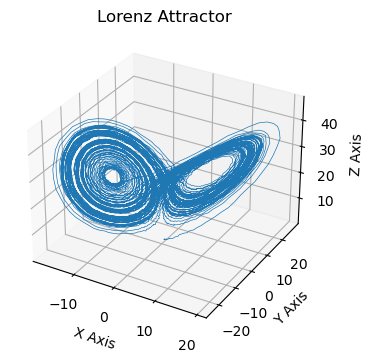
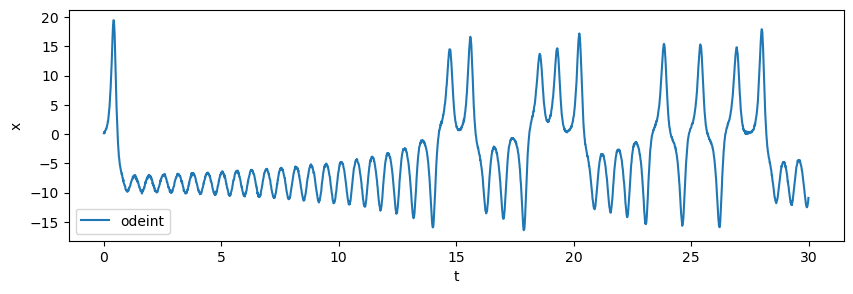
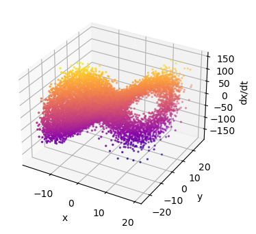
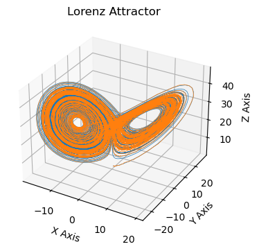
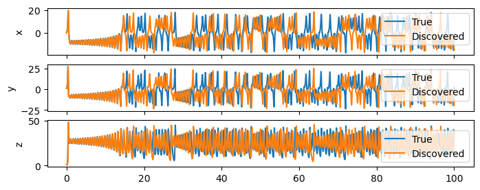

[](https://colab.research.google.com/drive/1qb7e-KgSwbdt4W4Udry_mL7W3BwWPOM3?usp=sharing)

Everything changes in time. This is why we often have to deal with time series data. In this notebook, we will look into the problem of discovering differential equations that describe the dynamics of a time series. This task has been a subject of research for millenia, and has changed faces throughout the years. In recent years, the rise of machine learning has opened many opportunities for tackling this problem using deep learning. Before we get there, in this article, we will look at the linear approach.

Given discrete measurements $$\mathbf x = [x_1, x_2, x_3, \ldots, x_N]$$ with an associated vector of time stamps $$[t_1, t_2, t_3, \ldots, t_N]$$, the task at hand is to find $$\mathbf f$$ in the equation:

$$ \frac{d \mathbf x}{dt} = \mathbf f(\mathbf x, t) $$

where $$\mathbf x(t)$$ is a time series, and $$\mathbf f$$ is a function that we want to discover. For example, in the Lorenz system case we saw in the last notebook, $$\mathbf f$$ is a set of three differential equations:

$$\frac{dx}{dt} = \sigma (y - x) $$

$$\frac{dy}{dt} = x (\rho - z) - y $$

$$\frac{dy}{dt}= x y - \beta z $$

In some cases, we can define $$\mathbf f$$ to be a linear combination of basis functions that we get to define (a feature vector $$\phi()$$), and the task becomes a regression problem. In other cases, we can define $$\mathbf f$$ to be a neural network, and the task becomes a deep learning problem. In this notebook, we will look into the first case, and we will use scikit-learn for that task. For a package that implements the ideas in this notebook efficiently, check out [PySINDy](https://pysindy.readthedocs.io/en/latest/examples/index.html).


```python
import numpy as np
import matplotlib.pyplot as plt

## If you're using Google Colab, uncomment the following lines to use interactive plots
# !pip install ipywidgets
# !pip install ipympl

# from google.colab import output
# output.enable_custom_widget_manager()
```

First let's define the function that takes the inputs $$X = [x, y, z]$$ and returns the derivative of the input such that $$\frac{dX}{dt} = f(X; \sigma, \rho, \beta)$$


```python
# Lorenz system equations
def lorenz_system(X, t, sigma, rho, beta):
    x, y, z = X
    dx_dt = sigma * (y - x)
    dy_dt = x * (rho - z) - y
    dz_dt = x * y - beta * z
    return dx_dt, dy_dt, dz_dt
```

Then let's define some system parameters and initial conditions: 


```python
# Lorenz system parameters
sigma = 10.0
rho = 28.0
beta = 8.0 / 3.0

# Time parameters
dt = 0.01  # Time step
num_steps = 10000  # Number of steps
t = np.linspace(0, num_steps*dt, num_steps)

# Initialize arrays to hold x, y, z values
xs = np.zeros(num_steps)
ys = np.zeros(num_steps)
zs = np.zeros(num_steps)
```

Finally, we will integrate the equations using a simple Euler method to start with. Will will then print the final value of the state variables:

Since chaotic systems are very sensitive to initial conditions and integration schemes, we will use the `odeint` function from the `scipy.integrate` module to integrate the Lorenz system. This function uses a more sophisticated integration scheme than the simple Euler method and is better suited for solving differential equations:


```python
# Solve the system
from scipy.integrate import odeint

# Set initial values
initial_state = (0., 1., 1.06)
solution = odeint(lorenz_system, initial_state, t, args=(sigma, rho, beta))

# Extract solutions
x, y, z = solution.T

# Add noise
noise_amp = 0.1
x += np.random.normal(0, noise_amp, num_steps)
y += np.random.normal(0, noise_amp, num_steps)
z += np.random.normal(0, noise_amp, num_steps)


# Plot
fig = plt.figure(figsize=(4, 4))
ax = fig.add_subplot(111, projection='3d')
ax.plot(x, y, z, lw=0.5)
ax.set_xlabel("X Axis")
ax.set_ylabel("Y Axis")
ax.set_zlabel("Z Axis")
ax.set_title("Lorenz Attractor")
plt.show()

```


    

    


This plot compares the solutions of the first variable solution $$x$$ for the different solvers and how they diverge from each other, even when the initial conditions are exactly the same.


```python
# Compare x and xs
idx_end = 3000
fig = plt.figure(figsize=(10, 3))
ax = fig.add_subplot(111)
ax.plot(t[:idx_end], x[:idx_end], label='odeint')
ax.set_xlabel('t')
ax.set_ylabel('x')
ax.legend()
plt.show()

```


    

    


## Defining the Input


```python
# Let's build the design matrix X, consisting of the library terms for the first variable (x, y)

# Define the library function for variable x
def library_x(x, y, z):
    return np.array([x, y])

# Define the library function for variable y
def library_y(x, y, z):
    return np.array([x, y, x*z])

# Define the library function for variable z
def library_z(x, y, z):
    return np.array([x*y, z])


# Create design matrix for x
X = np.zeros((num_steps, 2))
for i in range(num_steps):
    X[i, :] = library_x(x[i], y[i], z[i])

# Create design matrix for y
Y = np.zeros((num_steps, 3))
for i in range(num_steps):
    Y[i, :] = library_y(x[i], y[i], z[i])

# Create design matrix for z
Z = np.zeros((num_steps, 2))
for i in range(num_steps):
    Z[i, :] = library_z(x[i], y[i], z[i])

```

## Define the Output


```python
# The time derivative of the first variable (x) is given by the Lorenz system 

## The Cheating Way
dx_dt_c = np.zeros(num_steps)
for i in range(num_steps):
    dx_dt_c[i] = lorenz_system((x[i], y[i], z[i]), 0, sigma, rho, beta)[0]

## The Honest Way
dx_dt_h = np.zeros(num_steps)
for i in range(num_steps-1):
    dx_dt_h[i] = (x[i+1] - x[i]) / dt
```


```python
# %matplotlib widget

# Plot dx_dt_h as a function of x and y (the library terms)
fig = plt.figure(figsize=(4, 4))
ax = fig.add_subplot(111, projection='3d')
ax.scatter(X[:, 0], X[:, 1], dx_dt_h, c=dx_dt_h, cmap='plasma', s=2)
ax.set_xlabel('x')
ax.set_ylabel('y')
ax.set_zlabel('dx/dt')
plt.show()

```


    

    


Use ```%matplotlib widget``` to inspect the 3D plot. Notice anything strange? The solution lies on a plane! This is the plane we want to identify in the first equation. Let's solve a linear regression problem to find that plane:


```python
# Solve the optimization problem using sklearn

from sklearn.linear_model import LinearRegression
from sklearn.model_selection import train_test_split
from sklearn.metrics import mean_squared_error

# Split the data into training and test sets
X_train, X_test, dx_dt_train, dx_dt_test = train_test_split(X, dx_dt_h, test_size=0.2, random_state=42)

# Train the Lasso model
lr = LinearRegression()
lr.fit(X_train, dx_dt_train)
print('coefs : ', lr.coef_)
print('Test score: ', lr.score(X_test, dx_dt_test))
print('Train score: ', lr.score(X_train, dx_dt_train))

```

    coefs :  [-10.20110301  10.04426351]
    Test score:  0.9061590369481458
    Train score:  0.9090096406068173


Ideally, we would like to find these hyperplanes for all the variables, provided the axes can contain terms like $$x^2, y^2, z^2, xy, xz, yz$$ etc. To do that, we want our optimizer to find a function that fits the data with the fewest terms possible. The most brute force way to do that is to try all possible combinations of terms and see which one fits the best. If there are 10 possible terms in the equation, that would boil down to $$2^{10}-1$$ optimization problems. Minimizing the number of non-zero terms is more technically known as minimizing the $$L_0$$ norm of the weights $$\mathbf w$$. In other words, we would be minimizing the loss

$$\mathcal L(\mathbf w) = \frac{1}{2} \sum_{i=1}^N \left( \mathbf{\dot x}^{(i)} - \phi(\mathbf x^{(i)}) \cdot \mathbf w \right)^2 + \lambda \| \mathbf w \|_0$$

where $$\| \mathbf w \|_0$$ is simply the number of non-zero elements in $$\mathbf w$$. The parameter $$\lambda$$ is a hyperparameter that controls the tradeoff between the fit and the number of non-zero terms. In matrix form, the least squares problem is written as 

$$\min_{\mathbf W} \left\| \dot X - \phi(X) \cdot \mathbf W \right\|_2^2 + \lambda \| \mathbf W \|_0$$

where $$\mathbf W \in \mathbb R^{N \times M}$$ is a matrix of weights, $$\phi(X) \in \mathbb R^{N \times K}$$ is a matrix of library terms that depend on the state variables, and $$\dot X \in \mathbb R^{K \times M}$$ is the derivative of the state variables. $$N$$ is the number of data points taken into account, $$M$$ is the number of states (3 for the Lorenz system), and $$K$$ is the number of terms in the library.
The derivative of the time-series $$\mathbf{\dot x}^{(i)}$$ is computed numerically for each time step. In the simplest (forward Euler approximation) case,

$$\mathbf{\dot x}^{(i)} = \frac{\mathbf x^{(i+1)} - \mathbf x^{(i)}}{t_{i+1} - t_i}$$

To avoid trying all possible combinations of terms to find the optimal set of terms that fit the data, the $$L_0$$ norm is often replaced by the $$L_1$$ norm, which is the sum of the absolute values of the weights. This is known as the LASSO (Least Absolute Shrinkage and Selection Operator) problem. 


```python
from sklearn.linear_model import Lasso

# Define library for x with all quadratic terms
def library(x, y, z):
    return np.array([1, x, y, z, x**2, y**2, x*y, x*z, y*z, z**2])

# Create design matrix for x
X = np.zeros((num_steps, len(library(x[0], y[0], z[0]))))
for i in range(num_steps):
    X[i, :] = library(x[i], y[i], z[i])

# Split the data into training and test sets
X_train, X_test, dx_dt_train, dx_dt_test = train_test_split(X, dx_dt_h, test_size=0.2, random_state=42)

# Train the Lasso model
alpha = 0.01
lasso = Lasso(alpha=alpha)
lasso.fit(X_train, dx_dt_train)

print('coefs : ', lasso.coef_)
print('Test score: ', lasso.score(X_test, dx_dt_test))
print('Train score: ', lasso.score(X_train, dx_dt_train))

```

    coefs :  [ 0.00000000e+00 -8.83287886e+00  9.91579488e+00  3.29002031e-01
      5.31848272e-02  5.23852284e-03 -4.02364343e-02 -3.06872122e-02
     -1.19460598e-02 -1.04626338e-02]
    Test score:  0.9070187567115623
    Train score:  0.9110150051113849


    /opt/anaconda3/lib/python3.9/site-packages/sklearn/linear_model/_coordinate_descent.py:647: ConvergenceWarning: Objective did not converge. You might want to increase the number of iterations, check the scale of the features or consider increasing regularisation. Duality gap: 6.953e+05, tolerance: 1.620e+03
      model = cd_fast.enet_coordinate_descent(


Hyperparameters are often chosen by trial and error, but a more systematic way to do that is to use a grid search. This is a brute force way to find the best hyperparameters, but sometimes there are no alternatives. Since LASSO doesn't set small terms exactly to zero, it is always possible to define a threshold and set all terms below that threshold to zero. 


```python
from sklearn.linear_model import LinearRegression
from sklearn.feature_selection import SequentialFeatureSelector


# Define the output derivative matrix
X_dot = np.gradient(solution, dt, axis=0) 

# Create the linear regression model
lr = LinearRegression()

# Fit the sequential feature selector to the data
lr.fit(X, X_dot)

# threshold coefficients that are smaller than 1e-3
coefs = lr.coef_
threshold = 1e-1
coefs_sparse = coefs * (np.abs(coefs) > threshold)

# Print the non-zero coefficients
library_names = ['1', 'x', 'y', 'z', 'x^2', 'y^2', 'x*y', 'x*z', 'y*z', 'z^2']
var_names = ['x', 'y', 'z'] 
for i in range(len(var_names)):
    eqn = [f'{var_names[i]}_dot = ']
    for j in range(coefs.shape[1]):
        if coefs_sparse[i, j] != 0:
            eqn.append(f'+ {coefs_sparse[i, j]} {library_names[j]} ')
    print(''.join(eqn))


```

    x_dot = + -9.934156339825464 x + 9.966304453763241 y 
    y_dot = + 27.59817777681353 x + -0.8509178015441927 y + -0.9888279539875391 x*z 
    z_dot = + -2.656024693357873 z + 0.9768092037932088 x*y 


Having tweaked the hyperparameters (say the threshold value) and decided on a model, we can now compare it with the solution of the original Lorenz system. 


```python
def lorenz_system_discovered(X, t, coefs):
    x, y, z = X
    library = [1, x, y, z, x**2, y**2, x*y, x*z, y*z, z**2]
    dX_dt = []
    for i in range(len(var_names)):
        eqn = 0
        for j in range(coefs.shape[1]):
            if coefs[i, j] != 0:
                eqn += coefs[i, j] * library[j]
        dX_dt.append(eqn)
    return dX_dt

# Set initial values
initial_state = (0., 1., 1.06)
solution_discovered = odeint(lorenz_system_discovered, initial_state, t, args=(coefs,))
x_discovered, y_discovered, z_discovered = solution_discovered.T

# Plot
fig = plt.figure(figsize=(4, 4))
ax = fig.add_subplot(111, projection='3d')
ax.plot(x_discovered, y_discovered, z_discovered, lw=0.5)
ax.plot(x, y, z, lw=0.5)
ax.set_xlabel("X Axis")
ax.set_ylabel("Y Axis")
ax.set_zlabel("Z Axis")
ax.set_title("Lorenz Attractor")
plt.show()

            
```


    

    


```python
# plot x, y, z on separate plots as a funciton of time

fig, ax = plt.subplots(3, 1, figsize=(8, 3), sharex=True)
ax[0].plot(t, x, label='True')
ax[0].plot(t, x_discovered, label='Discovered')
ax[0].set_ylabel('x')
ax[0].legend()

ax[1].plot(t, y, label='True')
ax[1].plot(t, y_discovered, label='Discovered')
ax[1].set_ylabel('y')
ax[1].legend()

ax[2].plot(t, z, label='True')
ax[2].plot(t, z_discovered, label='Discovered')
ax[2].set_ylabel('z')
ax[2].legend()

plt.show()

```

    

    


The results don't match perfectly. But that's to be expected. Part of the reason is that the Lorenz system is chaotic, and the other part is that the data is noisy and there is the error associated with the numerical approximation of the derivatives (which is related to $$\Delta t$$). 
