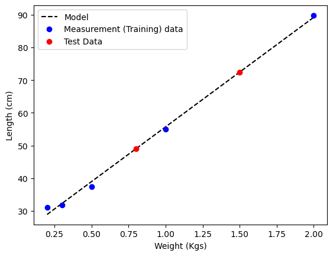
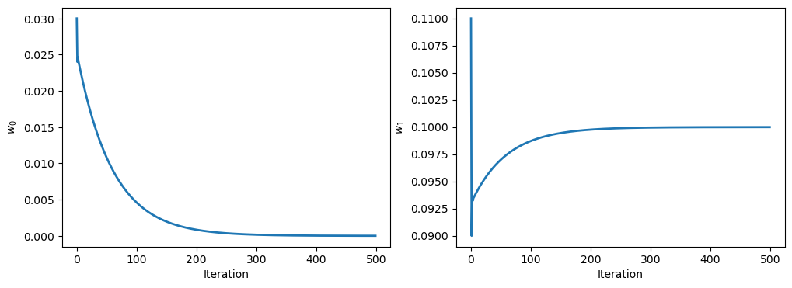

The notes in this page use the following (free) references (see the [references](/references) section for links):
- Chapters 2 and 3 of *The Elements of Statistical Learning* (Hastie, Tibshirani, and Friedman).
- Chapter 1 of Stanford's *CS229* course notes.
- Slightly more advanced overview: Chapter 4 of *Data-Driven Science and Engineering* (Brunton and Kutz).
- A probabilistic perspective: Chapter 11 of *Probabilistic Machine Learning* (Murphy).

## Introduction to Supervised Learning: Linear Regression 

Imagine being a 17th century scientist. You have discovered a way to design an experimental setup, where you can control and measure some input quantity $$x$$ that affects some output quantity $$y$$ that you can also measure. For example, $$x$$ could be the force applied to a spring, and $$y$$ the amount that the spring is being stretched. In this case, you'd be 17th-century British physicist Robert Hooke, and the year is circa 1660. You want to understand the relationship between $$x$$ and $$y$$. How would you do it?

First you will have to measure a few input-output pairs: 


| $$x$$ (Weights) || $$y$$ (Length)   
|---------------||----------------  \ 
| 1             || 55            | 
| .5             || 37.5            |
| 2             || 89.8            |
| .3             || 31.8            |
| .2             || 31            |
|---------------||----------------  \ 


You can plot these input-output pairs on a Cartesian coordinate system.



You notice that the points seem to lie on a straight line. You can use this line to predict the length of the spring for other weights. The line you're looking for is called a **model**, or sometimes a **hypothesis**. You can write it as:

$$y = f(x) = kx + c$$

where $$k$$ and $$c$$ are unknown parameters that will depend on the measurements you're making. In this case, $$k$$ is the spring constant, and $$c$$ is the length of the spring when no force is applied. To make notation a little more general, we can write this model as:

$$y = f_\mathbf{w}(x) = w_0 + w_1 x = [w_0, w_1] \cdot [1, x]$$

where $$\mathbf w = [w_0, w_1]$$ is a vector of *fitting parameters* that we want to find from the data; in this case, $$w_0 = c$$ and $$w_1 = k$$. Let's say, you're interested in predicting the length of the spring for a force of 1.5 Kg. If you know $$\mathbf w$$, you can use the model for **inferring** the length of the spring for this force: $$f(1.5) = 72.5$$.


In the early days of science, empirical laws tended to be linear, and the mathematical approach for fitting them might have come down to drawing a straight line with a straight ruler that passes through all the measurement data laid out on a piece of paper. In modern times, where the amount of data much greater, and models are much more complex than Hooke's law, scientists solve **optimization** problems on computers to find the best set of weights $$\mathbf w$$ that fit a model $$y = f(x)$$. 

## Linear Regression

Here, we assumed that the model is linear in $$x$$, but in general, you can define any function $$f(x)$$ that you want. As long as the model is linear in $$\mathbf w$$, it is called a *linear model*. But the model doesn't have to be linear in $$x$$. For example, you can define a polynomial model as

$$ y = f_{\mathbf w}(x) = w_0 + w_1 x + w_2 x^2 + w_3 x^3 + \dots $$

which would still be linear in $$\mathbf w$$, but nonlinear in $$x$$. We can define the **feature vector** $$\phi(x)$$ as:

$$ \phi(x) = [1, x, x^2, x^3, \dots] $$

and write the model as:

$$ y = f_{\mathbf w}(x) = \mathbf w \cdot \phi(x) = \sum_{i=0}^{d-1} w_i \phi_i(x) = x_0 \phi_0 + x_1 \phi_1 + \ldots $$

where $$\mathbf x = [x_0, x_1, \dots, x_{d-1}]$$ is a vector of *features* (or *inputs*), and $$\mathbf w = [w_0, w_1, \dots, w_{d-1}]$$ is a vector of *weights* (or *parameters*). The goal of *linear regression* is to find the best set of weights $$\mathbf w$$ that fit the data.

## The Least Squares Method

Given the data, we want to find the best set of weights $$\mathbf w$$ that fit the model to the data. One way to do this is to minimize the sum of squared errors between the model and the data:

$$ \min_{\mathbf w} \sum_{i=1}^N (y_i - f_{\mathbf w}(x_i))^2$$

where $$N$$ is the number of data points. This is called the **least squares** method, and it was first proposed by Carl Friedrich Gauss in 1795. The function we're minimizing, $$\mathcal L(x, y, \mathbf w) = \sum_{i=1}^N (y_i - f_{\mathbf w}(x_i))^2$$ is called a **loss function** (minimizing our loss is a universal desire). $$\mathcal L$$ a function of the input-output pairs $$(x, y)$$, and the weights $$\mathbf w$$. We can write this minimization problem in matrix form as:

$$ \mathcal L(\mathbf x, \mathbf y, \mathbf w) = \|\mathbf y - \mathbf X \mathbf w\|_2^2 $$

where $$\mathbf y = [y_1, y_2, \dots, y_N]^T$$ is a vector of the output data (often called **labels** in machine learning applications where the output consists of categorical values), and $$\mathbf X$$ is a matrix of the input features, often called a **design matrix**:

$$ \mathbf X = \begin{bmatrix} \phi_0(x_1) & \phi_1(x_1) & \dots & \phi_{d-1}(x_1) \\ \phi_0(x_2) & \phi_1(x_2) & \dots & \phi_{d-1}(x_2) \\ \vdots & \vdots & \ddots & \vdots \\ \phi_0(x_N) & \phi_1(x_N) & \dots & \phi_{d-1}(x_N) \end{bmatrix} $$

This problem has a closed-form solution, called the **normal equation**:

$$ \mathbf w = (\mathbf X^T \mathbf X)^{-1} \mathbf X^T \mathbf y $$

where $$\mathbf X^T$$ is the transpose of $$\mathbf X$$, and $$(\mathbf X^T \mathbf X)^{-1}$$ is the inverse of $$\mathbf X^T \mathbf X$$. This is the solution that minimizes the sum of squared errors. Can you guess how we found it? (Hint: keep reading). Most problems in machine learning don't have such a simple solution, and we have to use numerical methods to find the optimal weights. Also, if $$\mathbf X$$ is large (you have a lot of measurements or examples), then computing the inverse of $$\mathbf X^T \mathbf X$$ can be computationally expensive. 

For those reasons, the best way to get to the solutions will often be a numerical optimization technique: **gradient descent**. 


## Gradient Descent

Gradient descent is an iterative optimization algorithm that can be used to find the minimum of a function. It is based on the observation that if the multi-variable function $$G(\mathbf w)$$ is defined and differentiable in a neighborhood of a point $$\mathbf a$$, then $$G(\mathbf w)$$ decreases fastest if one goes from $$\mathbf w$$ in the direction of the negative gradient of $$G$$ at $$\mathbf w$$, $$-\nabla G(\mathbf w)$$.

Using this idea, we can write an iterative algorithm for finding the minimum of $$G(\mathbf w)$$, starting from an initial guess $$\mathbf w^{(0)}$$, and using this update rule:

$$ \mathbf w^{(n+1)} = \mathbf w^{(n)} - \eta \nabla G(\mathbf w^{(n)}) $$

where $$\eta$$ is called the **learning rate**. The learning rate is a hyperparameter that controls how far $$\mathbf w^{(n+1)} $$ is being estimated away from $$\mathbf w^{(n)} $$. If the learning rate is too large, we might overshoot the minimum. If it is too small, we might need too many iterations to converge to the best values of the weights.

For linear regression, we can write the sum of squared errors as:

$$ G(\mathbf w) = ||\mathbf y - \mathbf X \mathbf w||_2^2 $$

and the gradient of $$G$$ with respect to $$\mathbf w$$ is:

$$ \nabla G(\mathbf w) = -2 \mathbf X^T (\mathbf y - \mathbf X \mathbf w) $$

You can get the normal equation above by setting this gradient to zero. Otherwise, using the gradient descent update rule, we can write the iterative algorithm for finding the best weights as:

$$ \mathbf w^{(n+1)} = \mathbf w^{(n)} + 2 \eta \mathbf X^T (\mathbf y - \mathbf X \mathbf w^{(n)}) $$

## Implementation in Python

Here's a simple example for implementing gradient descent:

```python
import numpy as np

# Measurement data 
inputs = [1, .5, 2, .3, .2]  # Weight in Kgs
outputs = [55, 37.5, 89.8, 31.8, 31]  # Length in cm 

# Learning rate
eta = 0.01

# Initial guess for the weights
w = np.array([0, 0])

# Number of iterations
n_iterations = 500

# Gradient descent
for i in range(n_iterations):
    X = np.array([np.ones(len(inputs)), inputs]).T
    gradients = -2 * X.T.dot(outputs - X.dot(w))
    w = w - eta * gradients

# Predicted lengths for new weights
test_weights = [1.5, .8]
inputs_query = np.array([np.ones(len(test_weights)), test_weights])
predicted_lengths = inputs_query.T.dot(w)

print("Predicted Lengths:", predicted_lengths)
```

The every update the weights change, until they settle to a minimum value. Here's a plot of the weights as a function of the number of iterations:



## Feature engineering

We've assumed that the model is linear in $$x$$, but it could have been quadratic or higher order. How do choose $$\phi(x)$$? This is a deep question in machine learning, and it will eventually lead us to deep learning (pun intended). For now, we'll just say that it depends on the problem. In the case of Hooke's law, we know that the model is linear in $$x$$, so we can just use $$\phi(x) = [1, x]$$. In other cases, we might have to try different features, and see which ones work best. This is called **feature engineering**.

Let's say we didn't know that the law is linear in $$\mathbf w$$ and $$x$$, and we tried a quadratic model: $$ y = f_{\mathbf w}(x) = w_0 + w_1 x + w_2 x^2 $$. Wouldn't it fit better?

In fact, if you think about it, isn't there a way to fit all the data perfectly? You can always find a polynomial of degree $$N-1$$ that passes through $$N$$ points by solving a linear system of equations.

What does that system look like? Try to write it down for a 3-rd order polynomial.


