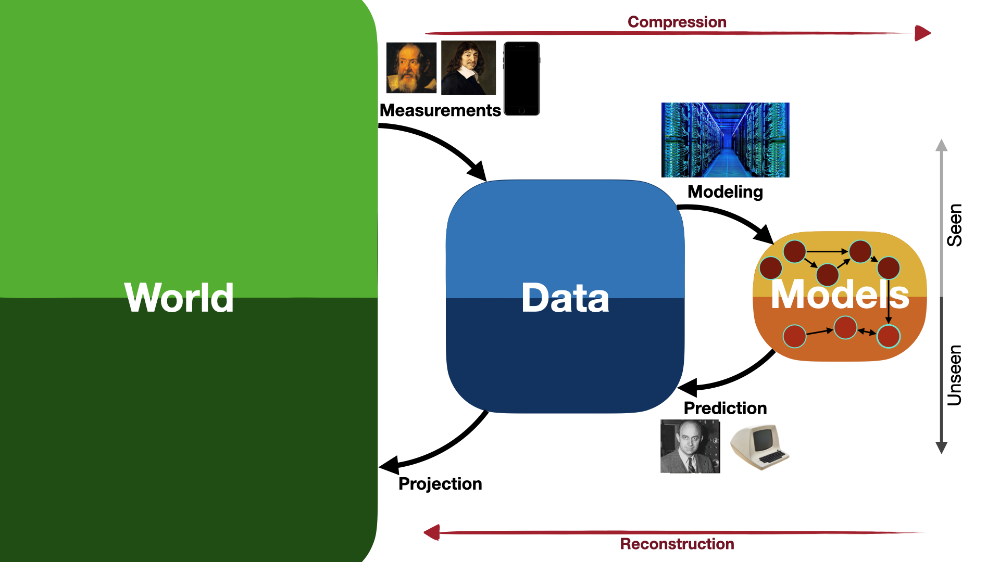

*"The most incomprehensible thing about the world is that it is comprehensible. The fact that it is comprehensible is a miracle." -- Albert Einstein*

## Introduction
Our understanding of how the world works has evolved with the means by which we shape it. Once upon a time, it was language that first opened our eyes to the infinitely vast universe of abstract representations. But it wasn’t until the Renaissance that society was radically transformed by the idea that space and time can be quantified and modeled by simple mathematical forms that predict their behavior with surprising accuracy.

Galileo Galilei, one of the earliest pioneers of this revolution, dropped objects from the leaning tower of Pisa to deduce relationships between time and displacement. Then Isaac Newton formalized the relationship between force, mass and acceleration. The empirical laws of the 17th and 18th century emerged from cleverly designed experiments whose controllable input measurements linearly affect their output behavior. As the measurement devices and the mathematical tools evolved, our paradigms of how the world works - and how we exist in it - evolved with them.

The last century saw many such paradigm shifts, from the relativity of time to the quantum nature of matter. Yet, the most revolutionary shift in how we do science happened thanks to the advent of computers. 

Until the mid-1950’s, scientists discovered the mathematical rules that animated the universe on paper. Modeling the universe heavily relied on developing analytical techniques to formalize and use those rules for prediction. But the limits of our methods (using pens, papers and a vivid imagination) meant that we have a strong bias towards simpler representations. 

In the absence of sophisticated computational tools, we favor well-posed linear equations that involve as few variables as possible. We also tend to think in terms of simple building blocks (like atoms, cells, agents etc.) that can be put together in simple input-output relationships. Additionally, we prefer working with systems where superposition applies, avoiding models where putting things together gives rise to unpredictable behavior. These are understandable practical considerations if we are to achieve generalization beyond objects of our observations with analytical tools alone. 

But these assumptions come with great limitations. Particularly, they cannot capture the true complexity of important systems we’re interested in understanding like: living things, ecosystems, self-organizing systems, turbulent flows etc... Almost everything that matters!

With computers becoming faster and easier to acquire, scientists were now able to crunch numbers at very high speeds to solve complicated nonlinear systems of equations they never thought possible. The ability to perform these so-called numerical "experiments" or simulations opened the door to the study of complex, nonlinear, high-dimensional, multi-scale systems. Our bias towards linear models can now be relaxed; at least in part.

{: .center-image }

Over time, studying complex physical systems has slowly transformed into an iterative process of deriving a system of equations, designing numerical solvers for them, simulating them, analyzing their predictions, and finally changing the model until observations match predictions. It was now possible to completely automate the process of making forward predictions given the underlying models are well-posed. Those were derived by human brains doing the good-old effort to put together a set of equations from first principles. But just as human brains are too slow for computing millions of algebraic operations in seconds, the optimization process of modeling the world by hand can benefit from the revolutionary automation that followed in the 20th century.

Recently, in the past decade or so, a number of factors has been tranforming how we do science. Instead of deriving equations by hand, we are increasingly relying on algorithms that find those equations for us. And this is thanks to three factors:
- The speed of [floating point operations](https://en.wikipedia.org/wiki/Floating-point_arithmetic) increased exponentially thanks to a doubling of the number of transistors in integrated circuit boards every two years, i.e. [Moore’s law](https://en.wikipedia.org/wiki/Moore%27s_law).
- The amount of available data exploded thanks to the internet. Some estimates also show that the amount of data generated and stored online doubles every two years.
- Algorithmic advancements that made certain machine learning algorithms very efficient to train and scale. 

These three factors combined made ML algorithms more appealing to tackle real-world problems. And the biggest beneficiary was deep learning, which performs much better than existing algorithms at complex tasks - like image recognition, language translation and generation - when trained on large amounts of data.

Was it finally possible to automate the process of modeling complex systems?

### Empirical Laws

At some point in history, humans learned how to quantify the world: to transform the nuanced and high-dimensional world we experience into numbers. Anthropological accounts for earliest instance for humans counting objects come from the Paleolithic age, when each tally mark stood for a "one" and each fifth mark scored through to keep track of the number. At the time not much was counted and thus larger number were probably not needed; or their power was probably not appreciated. Much later, Egyptians were known to develop symbols for numbers; for example, a coiled rope represented 100 and a water lily represented a thousand. This made it easier for larger numbers to be counted.

It's hard to say when humans realized that certain ways of quantifying the world give rise to very predictable patterns, and there isn't a unique way of telling the story. Indeed, non-uniqueness doesn't only show up in how we tell the human story of intelligence and evolution, but also in science, and machine learning. Here's one way of telling the story:

Only a few centuries ago, we discovered that some physical systems that we quantify follow simple mathematical patterns. In 1581, it is said that Galileo was attending Mass in Pisa and noticed a chandelier swinging over his head in the Cathedral. As the air currents coming from window grew stronger, the amplitudes of the swings became larger. Being a curious scientist who enjoys finding patterns, Galileo noticed that the period it took for the chandelier to swing back and forth is independent of the amplitude.

The idea of quantifying different aspects of a physical system and then finding the relationship between them started a revolution in how we understand the physical world and spread throughout Europe. Discovering physical laws was a combination of a well-designed experiment where a controlled measurable quantity 'causes' another measurable quantity to change, and a simple linear fit of those quantities where the proportionality constant is given a physical meaning. Here are just a few examples:

- Pascal's Law (1653): $\Delta p = \rho g \Delta h$
- Hooke's law (1678): $F = - k x$
- Newton's law of viscosity (1701): $ \tau = \mu \frac{du}{dy}$
- Ohm's law (1781): $I = V/R$
- Fourier's law (1822): $q = -k \frac{dT}{dx}$
- Fick's law (1855): $J = -D \frac{dC}{dx}$
- Darcy's law (1856): $q = -\frac{k}{\mu L} \Delta p$

The origins of the ideal gas law, $PV = k_B NT$, (1834) is particularly interesting since it is the result of a combination of linear laws discovered over 2 centuries:

- Boyle's law (1662): $P \sim V$
- Charles' law (1787): $T \sim V$
- Amonton's law (1808): $P \sim T$
- Avogadro's law (1811): $N \sim V$

The linear relationship between the input and output measurements was probably inferred geometrically, with a ruler. It wasn't until the beginning of the 19th century that Legendre and Gauss used least-squares to curve fit astronomical data. In 1821 Gauss developed a full theory of least-squares optimization. 