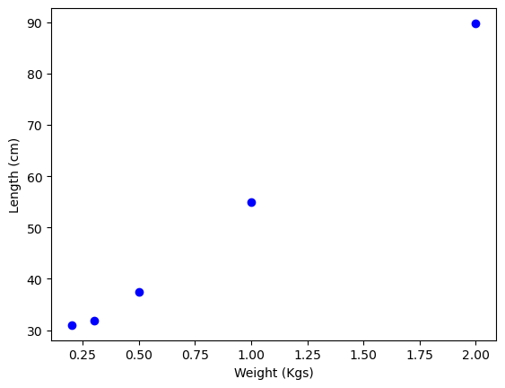
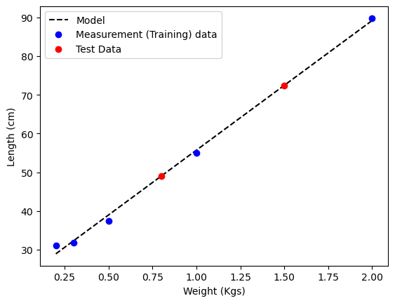
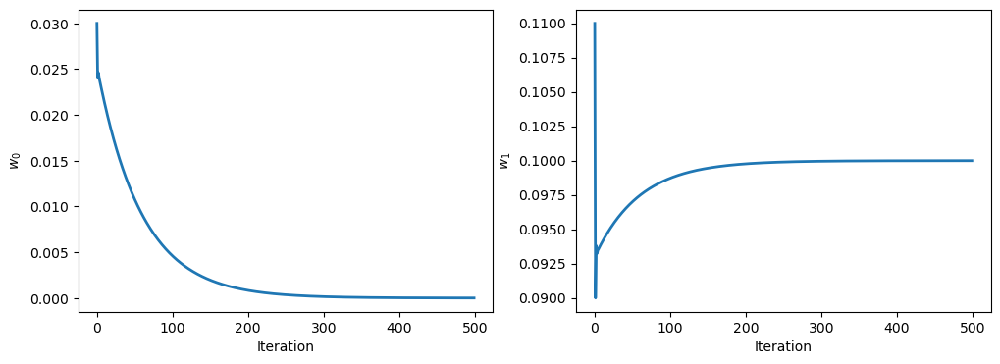
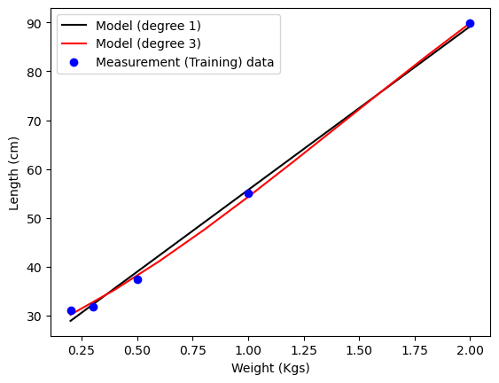

The notes in this page use the following (free) references (see the
[references](/references) section for links):
- Chapters 2 and 3 of *The Elements of Statistical Learning* (Hastie, Tibshirani, and Friedman).
- Chapter 1 of Stanford's *CS229* course notes.
- Slightly more advanced overview: Chapter 4 of *Data-Driven Science and Engineering* (Brunton and Kutz).
- A probabilistic perspective: Chapter 11 of *Probabilistic Machine Learning* (Murphy).

## Introduction to Supervised Learning: Linear Regression 

Imagine being a 17th century scientist. You have discovered a way to design an
experimental setup, where you can control and measure some input quantity $$x$$
that affects some output quantity $$y$$ that you can also measure. For example,
$$x$$ could be the force applied to a spring, and $$y$$ the amount that the
spring is being stretched. In this case, you'd be 17th-century British physicist
Robert Hooke, and the year is circa 1660. You want to understand the
relationship between $$x$$ and $$y$$. How would you do it?

First you will have to measure a few input-output pairs: 


| $$x$$ (Weights) || $$y$$ (Length)  \ 
|---------------||----------------  \ 
| 1             || 55            | 
| .5            || 37.5            |
| 2             || 89.8            |
| .3            || 31.8            |
| .2            || 31            |
|---------------||----------------  \ 


You can plot these input-output pairs on a Cartesian coordinate system.



You notice that the points seem to lie on a straight line. You can use this
line to predict the length of the spring for other weights. The line you're
looking for is called a **model**, or sometimes a **hypothesis**. You can write
it as:

$$y = f(x) = kx + c$$

where $$k$$ and $$c$$ are unknown parameters that will depend on the
measurements you're making. In this case, $$k$$ is the spring constant, and
$$c$$ is the length of the spring when no force is applied. To make notation a
little more general, we can write this model as:

$$y = f_\mathbf{w}(x) = w_0 + w_1 x = [w_0, w_1] \cdot [1, x]$$

where $$\mathbf w = [w_0, w_1]$$ is a vector of *fitting parameters* that we
want to find from the data; in this case, $$w_0 = c$$ and $$w_1 = k$$. Let's
say, you're interested in predicting the length of the spring for a force of 1.5
Kg. If you know $$\mathbf w$$, you can use the model for **inferring** the
length of the spring for this force: $$f(1.5) = 72.5$$.


In the early days of science, empirical laws tended to be linear, and the
mathematical approach for fitting them might have come down to drawing a
straight line with a straight ruler that passes through all the measurement data
laid out on a piece of paper. In modern times, where the amount of data much
greater, and models are much more complex than Hooke's law, scientists solve
**optimization** problems on computers to find the best set of weights $$\mathbf
w$$ that fit a model $$y = f(x)$$. 



## Linear Regression

Here, we assumed that the model is linear in $$x$$, but in general, you can
define any function $$f(x)$$ that you want. As long as the model is linear in
$$\mathbf w$$, it is called a *linear model*. But the model doesn't have to be
linear in $$x$$. For example, you can define a polynomial model as

$$ y = f_{\mathbf w}(x) = w_0 + w_1 x + w_2 x^2 + w_3 x^3 + \dots $$

which would still be linear in $$\mathbf w$$, but nonlinear in $$x$$. Let's
define the **feature vector** $$\phi(x)$$ as:

$$ \phi(x) = [1, x, x^2, x^3, \dots] $$

and write the model as:

$$ f_{\mathbf w}(x) = \mathbf w \cdot \phi(x) = \sum_{i=0}^{d-1} w_i \phi_i(x)
= w_0 + w_1 x + w_2 x^2 + \ldots $$

where $$\mathbf w = [w_0, w_1, \dots, w_{d-1}]$$ is a vector of *weights* (or
*parameters*). The goal of *linear regression* is to find the best set of
weights $$\mathbf w^*$$ that fit the data. How do we define that problem
mathematically?

## The Least Squares Method

For a given input-output pair $$(x, y)$$, we define the **residual** as the
distance between the true output $$y$$, and the prediction $$f_{\mathbf w}(x)$$.
We are interested in finding a function that minimizes the distance, rather than
the signed difference, between prediction and true output, so we define the
**loss function** for a given $$(x, y)$$ as: 

$$\mathcal L(x, y, \mathbf w) = \text{dist}(y, f_{\mathbf w}(x))$$

where $$\text{dist}(a, b)$$ is a measure of the distance between $$a$$ and
$$b$$. The most common choice for $$\text{dist}(a, b)$$ is the squared
difference $$\mathcal L(x, y, \mathbf w) = (y - f_{\mathbf w}(x))^2$$. The loss
function is a measure of how well the model fits the data. The smaller the loss,
the better the fit. A good model will have a small loss for all the input-output
pairs. Thus we define the total loss as the sum of the losses for all the
input-output pairs:

$$ \mathcal L_\text{total}(\mathbf w) = \frac{1}{N}\sum_{i=1}^N \mathcal L(x_i,
y_i, \mathbf w) $$

where $$N$$ is the number of data points (or examples). The goal of linear
regression is to find the best set of weights $$\mathbf w^*$$ that minimize the
total loss:

$$ \mathbf w^* = \underset{\mathbf w}{\text{argmin}} \, \mathcal
L_\text{total}(\mathbf w) $$

This minimization problem is called the **least squares** method, and it was
first proposed by Carl Friedrich Gauss in 1795. We can also write this least
squares loss in matrix form as:

$$ \mathcal L_\text{total}(\mathbf x, \mathbf y, \mathbf w) = \|\mathbf y -
\mathbf X \mathbf w\|_2^2 $$

where $$\mathbf y = [y_1, y_2, \dots, y_N]^T$$ is a vector of the output data
(often called **labels** in applications where the output consists of
categorical values, e.g. cats or dogs), and $$\mathbf X$$ is a matrix of the
input features, often called a **design matrix**:

$$ \mathbf X = \begin{bmatrix} \phi_0(x_1) & \phi_1(x_1) & \dots &
\phi_{d-1}(x_1) \\ \phi_0(x_2) & \phi_1(x_2) & \dots & \phi_{d-1}(x_2) \\ \vdots
& \vdots & \ddots & \vdots \\ \phi_0(x_N) & \phi_1(x_N) & \dots &
\phi_{d-1}(x_N) \end{bmatrix} $$

Here, we can find the minimum of $$\mathcal L_\text{total}$$ by computing its
derivative and setting it to zero, $$\nabla_\mathbf{w} \mathcal
L_\text{total}(\mathbf w) = 0$$. In this case, the problem admits a closed-form
solution called the **normal equation**.

$$ \nabla \mathcal L_\text{total}(\mathbf w) = -2 \mathbf X^T (\mathbf y -
\mathbf X \mathbf w) = 0 $$

$$ \mathbf w = (\mathbf X^T \mathbf X)^{-1} \mathbf X^T \mathbf y $$

where $$\mathbf X^T$$ is the transpose of $$\mathbf X$$, and $$(\mathbf X^T
\mathbf X)^{-1}$$ is the inverse of $$\mathbf X^T \mathbf X$$ (See Problem set 0
for derivation). 

Most problems in machine learning don't have such a simple solution, and we
have to use numerical methods to find $$\mathbf w^*$$. Also, if $$\mathbf X$$ is
large (there are a lot of measurements or examples), then computing the inverse
of $$\mathbf X^T \mathbf X$$ can be computationally expensive. 

For those reasons, the best way to get to the optimal predictor will has to be
done through a numerical optimization technique: the **gradient descent**. 


## Gradient Descent

Gradient descent is an iterative optimization algorithm that can be used to
find the minimum of a function. It is based on the observation that if a
function $$\mathcal L(\mathbf w)$$ is defined and differentiable in a
neighborhood of a point $$\mathbf w_0$$, then $$\mathcal L(\mathbf w)$$
decreases fastest if one goes from $$\mathbf w_0$$ in the direction of the
negative gradient of $$\mathcal L$$ at $$\mathbf w_0$$: $$-\nabla \mathcal
L(\mathbf w)$$.

Using this idea, we can write an iterative algorithm for finding the minimum of
$$\mathcal L_\text{total}(\mathbf w)$$, starting from an initial guess $$\mathbf
w^{(0)}$$, and using this update rule:

$$ \mathbf w^{(n+1)} = \mathbf w^{(n)} - \eta \nabla \mathcal L(\mathbf
w^{(n)}) $$

where $$\eta$$ is called the **learning rate**, or the **step size**. The
learning rate is a hyperparameter that controls how far $$\mathbf w^{(n+1)} $$
is being estimated away from $$\mathbf w^{(n)} $$. If the learning rate is too
large, we might overshoot the minimum. If it is too small, we might need too
many iterations to converge to the best values of the weights. The gradient of
the loss can be computed analytically and the normal equation can be derived as
shown above. Otherwise, we can write an iterative algorithm for finding the best
set of weights using this gradient descent update rule:

$$ \mathbf w^{(n+1)} = \mathbf w^{(n)} + 2 \eta \mathbf X^T (\mathbf y -
\mathbf X \mathbf w^{(n)}) $$

where $$n$$ is the iteration number.

### Implementation in Python

Here's a simple example for implementing gradient descent:

```python
import numpy as np

# Measurement data 
inputs = [1, .5, 2, .3, .2]  # Weight in Kgs
outputs = [55, 37.5, 89.8, 31.8, 31]  # Length in cm 

# Learning rate
eta = 0.01

# Initial guess for the weights
w = np.array([0, 0])

# Number of iterations
n_iterations = 500

# Gradient descent
for i in range(n_iterations):
    X = np.array([np.ones(len(inputs)), inputs]).T
    gradients = -2 * X.T.dot(outputs - X.dot(w))
    w = w - eta * gradients

# Predicted lengths for new weights
test_weights = [1.5, .8]
inputs_query = np.array([np.ones(len(test_weights)), test_weights])
predicted_lengths = inputs_query.T.dot(w)

print("Predicted Lengths:", predicted_lengths)
```

The every update the weights change, until they settle to a minimum value.
Here's a plot of the weights as a function of the number of iterations:



## Feature engineering

We've assumed that the model is linear in $$x$$, but it could have been
quadratic or higher order. How do choose $$\phi(x)$$? This is a deep question in
machine learning, and it will eventually lead us to deep learning (pun
intended). For now, we'll just say that the choice of $$\phi$$ depends on the
problem. In the case of Hooke's law, we know that the model is linear in $$x$$,
so we can just use $$\phi(x) = [1, x]$$. In other cases, we might have to try
different features, and see which ones work best. This is called **feature
engineering**.

Let's say we didn't know that the law is linear in $$\mathbf w$$ and $$x$$, and
we tried a quadratic model: $$ y = f_{\mathbf w}(x) = w_0 + w_1 x + w_2 x^2 $$.
Wouldn't it fit better?

In fact, isn't there a way to fit all the data perfectly? Indeed, you can
always find a polynomial of degree $$N-1$$ that passes through $$N$$ points by
solving the appropriate linear system of equations. The figure below, clearly
shows that a 3rd degree polynomial model fits the data much better; although we
know for a fact that a spring follows Hooke's law. Could the law be wrong??? 



Before jumping to any conclusions, let's think about how we've been evaluating
the goodness of a fit of a model. We have simply been trying to minimize the
distance between the predictions and the measurements, but we didn't make sure
we are able to make predictions of measurements we haven't seen yet. What we are
ultimately interested in is the ability of the model to predict new unseen data.
This is called the **generalization**.

To solve the issue with **overfitting** the data, we can split the data into
two sets: a **training set** and a **test set**. We use the training set to fit
the model, and the test set - which we pretend we haven't seen yet - to evaluate
its performance. The general process of optimizing a machine learning model is
to choose the feature vector $$\phi(x)$$, the model $$f_{\mathbf w}(x)$$, and
the loss function $$\mathcal L(x, y, \mathbf w)$$, and then to use the training
set to find the best set of weights $$\mathbf w^*$$ that minimize the loss. We
then use the test set to evaluate the performance of the model. If we are
satisfied with the performance, we can use the model to make predictions on new
data. If not, we can go back and try different features, models, or loss
functions.

But this approach has a problem: we are using the test set to tune the model.
The feature vector and other parameters (like $$\eta$$) that we're tuning before
we rerun the optimization proceduce (called **hyperparameters**) have also
become optimization parameters. For the same reason, we run the same risk of
overfitting on the test set. 

We can solve this problem by splitting the data into three sets: a **training
set**, a **validation set**, and a **test set**. We use the training set to fit
the model, the validation set to tune the model, and the test set to evaluate
the performance of the model after we're satisfied with the hyperparameter
tuning.


## The Maximum Likelihood Principle

In the context of regression problems, we often choose the least-squares cost
function, but you might ask why? One way to justify this choice is to consider a
probabilistic perspective.

Suppose the target variables $$ y^{(i)} $$ and the feature vector inputs $$
\phi(x^{(i)}) $$ are related as follows: 

$$ y^{(i)} = \mathbf{w} \cdot \phi(x^{(i)}) + \epsilon^{(i)} $$

Here, $$ \epsilon^{(i)} $$ represents an error term capturing unmodeled effects
or random noise. We assume that these error terms are independently and
identically distributed according to a Gaussian distribution with mean zero and
variance $$ \sigma^2 $$, denoted as $$ \epsilon^{(i)} \sim \mathcal{N}(0,
\sigma^2) $$.

This leads us to express the probability of $$ y^{(i)} $$ given $$
\phi(x^{(i)}) $$, parameterized by $$ \mathbf{w} $$ as: 

$$ p(y^{(i)} | \phi(x^{(i)}); \mathbf{w}) = \frac{1}{\sqrt{2\pi\sigma^2}}
\exp\left(-\frac{(y^{(i)} - \mathbf{w}\cdot \phi(x^{(i)}))^2}{2\sigma^2}\right)
$$

Given a design matrix $$ X $$ containing all $$ \phi(x^{(i)}) $$'s and the
parameters $$ \mathbf{w} $$, we consider the likelihood function $$
L(\mathbf{w}) = p(\vec{y} \vert X; \mathbf{w}) $$, which can be expressed as a
product of the individual probabilities for each $$ y^{(i)} $$:

$$ L(\mathbf{w}) = \prod_{i=1}^N p(y^{(i)} | \phi(x^{(i)}); \mathbf{w}) $$

Given this probabilistic model relating the target variables to the inputs, we
can use the **principle of maximum likelihood** to estimate the parameters $$
\mathbf{w} $$. The likelihood function $$ L(\mathbf{w}) $$ is a measure of how
well the model explains the observed data. And the principle of maximum
likelihood suggests choosing $$ \mathbf{w} $$ to maximize this likelihood.

Instead of maximizing $$L(\mathbf w)$$, we can also maximize any strictly
increasing function of it. In particular, the derivations will be a bit simpler
if we maximize the logarithm of the likelihood: 

$$\log L(\mathbf w) = \log \prod_{i=1}^{n} \frac{1}{\sqrt{2\pi\sigma^2}} \exp
\left( \frac{(y^{(i)} - \mathbf w \cdot \phi(x^{(i)}))^2}{2\sigma^2} \right)$$

$$= \sum_{i=1}^{n} \log \left[ \frac{1}{\sqrt{2\pi\sigma^2}} \exp \left(
\frac{(y^{(i)} - \mathbf w \cdot\phi(x^{(i)}))^2}{2\sigma^2} \right) \right]$$ 

$$= n \log \frac{1}{\sqrt{2\pi\sigma^2}} - \frac{\sigma^2}{2} \sum_{i=1}^{n}
\frac{(y^{(i)} - \mathbf w \cdot\phi(x^{(i)}))^2}{\sigma^2}$$ 

Noticing that the first term is not a function of $$\mathbf w$$, maximizing
$$L(\mathbf w)$$ gives the same answer as minimizing $$\frac{1}{n}
\sum_{i=1}^{n} (y^{(i)} - \mathbf w \cdot \phi(x^{(i)}))^2$$, which is our
original least-squares cost function! 

To summarize, the least-squares cost function implicitly assumes that the
target variables are distributed according to a Gaussian distribution with mean
$$\mathbf w \cdot \phi(x)$$ and variance $$\sigma^2$$. 

Note, however that this implicit probabilistic assumption is by no means
necessary for least-squares to be a perfectly good choice, and there may — and
indeed there are — other natural reasons that can also be used to justify it
(such as the fact that it is differentiable at zero while the absolute loss
isn't). Note also that, in our previous discussion, our final choice of
$$\mathbf w$$ did not depend on what was $$\sigma^2$$, and indeed we'd have
arrived at the same result even if $$\sigma^2$$ were unknown. Some models allow
for the dependence of the variance on the input; these are called
**heteroscedastic** models. 

