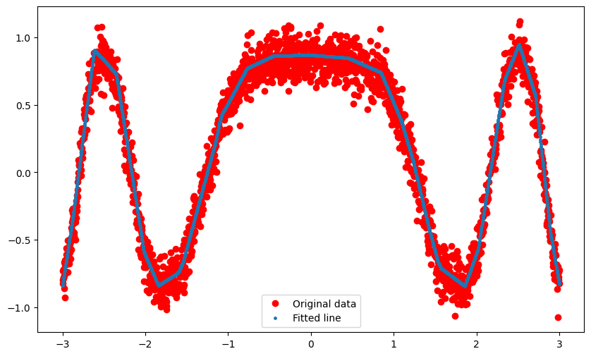
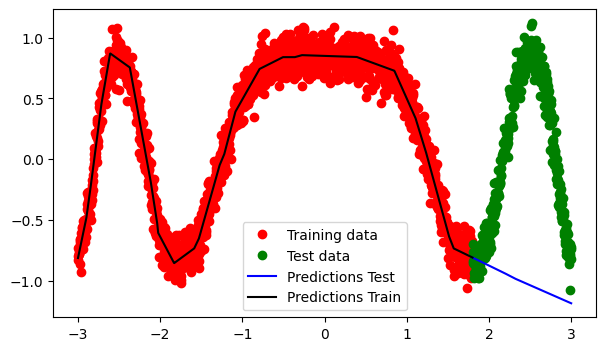
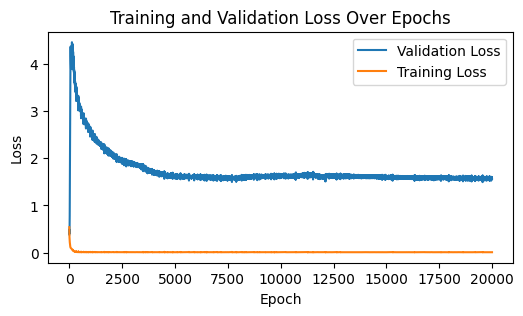
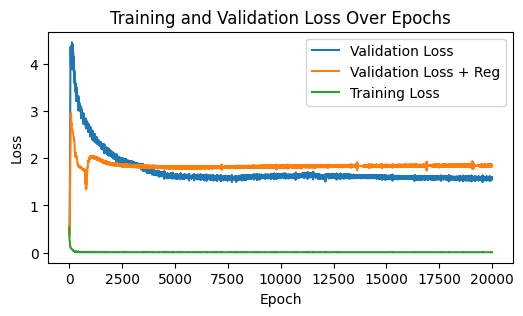
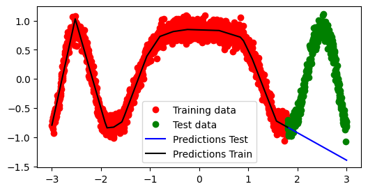
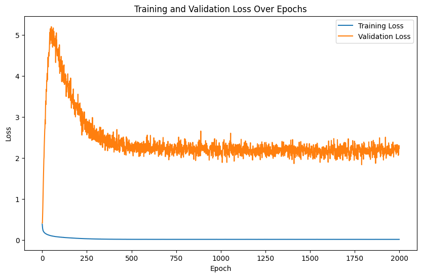
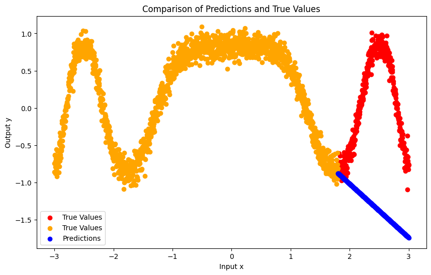
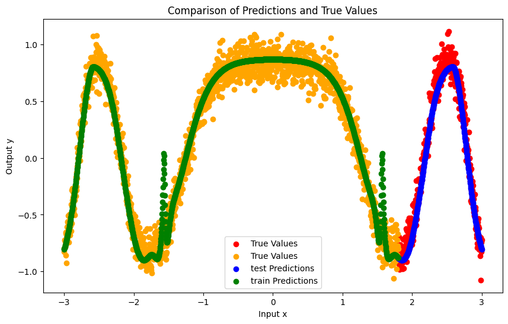

## Introduction to Neural Networks with PyTorch

Neural networks are nonlinear models that consist of a composition of linear
and nonlinear functions. They are used to model complex relationships between
inputs and outputs or to find patterns in data. In this notebook, we will
introduce the basic concepts of neural networks and how to implement them using
PyTorch.

A linear model with multiple inputs $$\mathbf x = (x_1, x_2, \ldots, x_n)$$ and
multiple outputs $$\mathbf y = (y_1, y_2, \ldots, y_m)$$ can be written as:

$$
\mathbf y = \mathbf W \mathbf x + \mathbf b,
$$

or $$y_i = \sum_{j=1}^n W_{ij} x_j + b_i$$, where $$W_{ij}$$ are the weights
and $$b_i$$ are the biases of the model. The weights and biases are learned from
data using an optimization algorithm such as gradient descent.

If the model is nonlinear (e.g. logistic regression), the model can be written
as:

$$
\mathbf y = f(\mathbf W \mathbf x + \mathbf b),
$$

where $$f$$ is a nonlinear function called the activation function. In the case
of logistic regression in the context of multi-class classification, $$f$$ is
the Softmax function. The activation function is applied element-wise to the
output of the linear model.

Given an input vector $$\mathbf{x}$$, a neural network computes the output
$$\mathbf{y}$$ as follows:

$$
\mathbf{y} = f(\mathbf{W}_L f(\mathbf{W}_{L-1} f(\ldots f(\mathbf{W}_1
\mathbf{x} + \mathbf{b}_1) \ldots) + \mathbf{b}_{L-1}) + \mathbf{b}_L)
$$

where $$\mathbf{W}_i$$ and $$\mathbf{b}_i$$ are the weights and biases of the
$$i$$-th layer, and $$f$$ is a nonlinear function called the activation
function. The number of layers and the number of neurons in each layer are
hyperparameters of the model.

One can rewrite the above equation as a composition of linear and nonlinear
functions as follows (assuming the biases are absorbed into the weights):

$$
\mathbf{y} = f_L \circ \mathbf W_L \circ f_{L-1} \circ \mathbf W_{L-1} \circ
\ldots \circ f_1 \circ \mathbf W_1 (\mathbf{x})
$$

In other words, deep networks (i.e. networks with many layers) are a
composition of linear and nonlinear functions.


## PyTorch

PyTorch is a popular open-source machine learning library for Python. It is
widely used for deep learning and is known for its flexibility and ease of use.
PyTorch provides a set of tools for building and training neural networks. In
this notebook, we will use PyTorch to implement a simple neural network for
binary classification.

For a complete introduction to PyTorch, it's always best to refer back to the
original [PyTorch Tutorials](https://pytorch.org/tutorials/).

PyTorch is essentially a library for computation using tensors, which are
similar to NumPy arrays. However, PyTorch tensors can be used on a GPU to
accelerate computing. PyTorch also provides a set of tools for automatic
differentiation, which is essential for training neural networks.


```python
import torch
import torch.nn as nn
import torch.optim as optim
import numpy as np
import matplotlib.pyplot as plt
import torch.nn.functional as F

```

Let's first generate some synthetic data to illustrate the concepts. The input
data is a one-dimensional vector between -3 and 3, and the output data is also
one-dimensional with known map: $$\sin(\cos(x^2))$$.


```python
# Generate synthetic data
x = torch.unsqueeze(torch.linspace(-3, 3, 1000), dim=1)  # x data (tensor),
shape=(1000, 1)
y = torch.sin(torch.cos(x.pow(2))) + 0.1 * torch.randn(x.size())  # noisy y
data (tensor), shape=(1000, 1)
```

One generated, we will create our first neural network as follows:


```python

# Define a simple neural network
class Net(nn.Module):
    def __init__(self):
        super(Net, self).__init__()
        self.fc1 = nn.Linear(1, 20)  # Input layer to hidden layer
        self.fc2 = nn.Linear(20, 15)  # Hidden layer to output layer
        self.fc3 = nn.Linear(15, 1)  # Hidden layer to output layer

    def forward(self, x):
        x = F.relu(self.fc1(x))
        x = F.relu(self.fc2(x))
        x = self.fc3(x)
        return x

net = Net()

```

The next step is to define a the loss function we want to minimize, the
optimizer (e.g. stochastic gradient descent), and the training loop. 


```python

# Define loss function and optimizer
criterion = nn.MSELoss()
optimizer = optim.Adam(net.parameters(), lr=0.01)
# optimizer = optim.SGD(net.parameters(), lr=0.05)

# Train the network
epochs = 5000
loss_list = []
for epoch in range(epochs):
    
    output = net(x)  # input x and predict based on x
    loss = criterion(output, y)  # calculate loss
    loss.backward()  # backpropagation, compute gradients
    optimizer.step()  # apply gradients
    optimizer.zero_grad()  # clear gradients for next train

    if epoch % 100 == 0:
        l = loss.item()
        print(f'Epoch [{epoch}/{epochs}], Loss: {l}')
        loss_list.append(l)

```

    Epoch [0/20000], Loss: 0.41912657022476196
    Epoch [100/20000], Loss: 0.14280371367931366
    Epoch [200/20000], Loss: 0.11963829398155212
    Epoch [300/20000], Loss: 0.08307942748069763
    Epoch [400/20000], Loss: 0.039725162088871
    Epoch [500/20000], Loss: 0.01513218879699707
    Epoch [600/20000], Loss: 0.012770246714353561
    Epoch [700/20000], Loss: 0.014739656820893288
    Epoch [800/20000], Loss: 0.011582354083657265
    Epoch [900/20000], Loss: 0.011630788445472717
    Epoch [1000/20000], Loss: 0.013034353032708168
    Epoch [1100/20000], Loss: 0.011521777138113976
    Epoch [1200/20000], Loss: 0.011487428098917007
    Epoch [1300/20000], Loss: 0.011490545235574245
    Epoch [1400/20000], Loss: 0.011496572755277157
    Epoch [1500/20000], Loss: 0.01144243311136961
    Epoch [1600/20000], Loss: 0.01142533216625452
    Epoch [1700/20000], Loss: 0.01716855727136135
    Epoch [1800/20000], Loss: 0.012829232960939407
    Epoch [1900/20000], Loss: 0.011384370736777782
    Epoch [2000/20000], Loss: 0.01137556228786707
    Epoch [2100/20000], Loss: 0.011474491097033024
    Epoch [2200/20000], Loss: 0.011883093044161797
    Epoch [2300/20000], Loss: 0.016145041212439537
    Epoch [2400/20000], Loss: 0.016864454373717308
    Epoch [2500/20000], Loss: 0.01138111762702465
    Epoch [2600/20000], Loss: 0.01510574109852314
    Epoch [2700/20000], Loss: 0.013368154875934124
    Epoch [2800/20000], Loss: 0.014779391698539257
    Epoch [2900/20000], Loss: 0.01468573696911335
    Epoch [3000/20000], Loss: 0.01131301000714302
    Epoch [3100/20000], Loss: 0.011353567242622375
    Epoch [3200/20000], Loss: 0.012128821574151516
    Epoch [3300/20000], Loss: 0.012392099015414715
    Epoch [3400/20000], Loss: 0.012963863089680672
    Epoch [3500/20000], Loss: 0.011430446058511734
    Epoch [3600/20000], Loss: 0.01215416844934225
    Epoch [3700/20000], Loss: 0.011635344475507736
    Epoch [3800/20000], Loss: 0.01129910722374916
    Epoch [3900/20000], Loss: 0.014195566065609455
    Epoch [4000/20000], Loss: 0.012670162133872509
    Epoch [4100/20000], Loss: 0.01388526614755392
    Epoch [4200/20000], Loss: 0.013643188402056694
    Epoch [4300/20000], Loss: 0.012421529740095139
    Epoch [4400/20000], Loss: 0.011392720974981785
    Epoch [4500/20000], Loss: 0.011326231993734837
    Epoch [4600/20000], Loss: 0.011348853819072247
    Epoch [4700/20000], Loss: 0.011157608591020107
    Epoch [4800/20000], Loss: 0.011723720468580723
    Epoch [4900/20000], Loss: 0.011233065277338028
    Epoch [5000/20000], Loss: 0.011242262087762356
    Epoch [5100/20000], Loss: 0.011531303636729717
    Epoch [5200/20000], Loss: 0.011142279021441936
    Epoch [5300/20000], Loss: 0.01213954109698534
    Epoch [5400/20000], Loss: 0.01114191859960556
    Epoch [5500/20000], Loss: 0.012194713577628136
    Epoch [5600/20000], Loss: 0.011144627816975117
    Epoch [5700/20000], Loss: 0.011394328437745571
    Epoch [5800/20000], Loss: 0.011164483614265919
    Epoch [5900/20000], Loss: 0.011302005499601364
    Epoch [6000/20000], Loss: 0.0115869902074337
    Epoch [6100/20000], Loss: 0.011155813001096249
    Epoch [6200/20000], Loss: 0.0111848721280694
    Epoch [6300/20000], Loss: 0.01194860227406025
    Epoch [6400/20000], Loss: 0.01122762355953455
    Epoch [6500/20000], Loss: 0.011355986818671227
    Epoch [6600/20000], Loss: 0.011141075752675533
    Epoch [6700/20000], Loss: 0.011338897980749607
    Epoch [6800/20000], Loss: 0.011151534505188465
    Epoch [6900/20000], Loss: 0.011791776865720749
    Epoch [7000/20000], Loss: 0.011253108270466328
    Epoch [7100/20000], Loss: 0.011110644787549973
    Epoch [7200/20000], Loss: 0.011361252516508102
    Epoch [7300/20000], Loss: 0.011096406728029251
    Epoch [7400/20000], Loss: 0.011737039312720299
    Epoch [7500/20000], Loss: 0.011236372403800488
    Epoch [7600/20000], Loss: 0.011142960749566555
    Epoch [7700/20000], Loss: 0.011137937195599079
    Epoch [7800/20000], Loss: 0.010845868848264217
    Epoch [7900/20000], Loss: 0.010663334280252457
    Epoch [8000/20000], Loss: 0.010603589005768299
    Epoch [8100/20000], Loss: 0.010770570486783981
    Epoch [8200/20000], Loss: 0.010405121371150017
    Epoch [8300/20000], Loss: 0.010376694612205029
    Epoch [8400/20000], Loss: 0.010585950687527657
    Epoch [8500/20000], Loss: 0.010669435374438763
    Epoch [8600/20000], Loss: 0.010331910103559494
    Epoch [8700/20000], Loss: 0.010796173475682735
    Epoch [8800/20000], Loss: 0.010326347313821316
    Epoch [8900/20000], Loss: 0.010218469426035881
    Epoch [9000/20000], Loss: 0.010197094641625881
    Epoch [9100/20000], Loss: 0.01073471736162901
    Epoch [9200/20000], Loss: 0.010210725478827953
    Epoch [9300/20000], Loss: 0.010175011120736599
    Epoch [9400/20000], Loss: 0.010150698013603687
    Epoch [9500/20000], Loss: 0.010145721025764942
    Epoch [9600/20000], Loss: 0.011557466350495815
    Epoch [9700/20000], Loss: 0.010121755301952362
    Epoch [9800/20000], Loss: 0.010313373990356922
    Epoch [9900/20000], Loss: 0.010130166076123714
    Epoch [10000/20000], Loss: 0.010200287215411663
    Epoch [10100/20000], Loss: 0.010109759867191315
    Epoch [10200/20000], Loss: 0.010122877545654774
    Epoch [10300/20000], Loss: 0.01130234356969595
    Epoch [10400/20000], Loss: 0.010326801799237728
    Epoch [10500/20000], Loss: 0.0101765226572752
    Epoch [10600/20000], Loss: 0.010735285468399525
    Epoch [10700/20000], Loss: 0.010060552507638931
    Epoch [10800/20000], Loss: 0.010065288282930851
    Epoch [10900/20000], Loss: 0.01010986790060997
    Epoch [11000/20000], Loss: 0.010671544820070267
    Epoch [11100/20000], Loss: 0.010028387419879436
    Epoch [11200/20000], Loss: 0.010568307712674141
    Epoch [11300/20000], Loss: 0.010067564435303211
    Epoch [11400/20000], Loss: 0.010198881849646568
    Epoch [11500/20000], Loss: 0.010038635693490505
    Epoch [11600/20000], Loss: 0.010687080211937428
    Epoch [11700/20000], Loss: 0.010076533071696758
    Epoch [11800/20000], Loss: 0.009970401413738728
    Epoch [11900/20000], Loss: 0.009951156564056873
    Epoch [12000/20000], Loss: 0.009953209199011326
    Epoch [12100/20000], Loss: 0.010355198755860329
    Epoch [12200/20000], Loss: 0.01010445598512888
    Epoch [12300/20000], Loss: 0.010130519047379494
    Epoch [12400/20000], Loss: 0.009965933859348297
    Epoch [12500/20000], Loss: 0.009920340031385422
    Epoch [12600/20000], Loss: 0.009932897053658962
    Epoch [12700/20000], Loss: 0.01005516853183508
    Epoch [12800/20000], Loss: 0.009939507581293583
    Epoch [12900/20000], Loss: 0.0101575693115592
    Epoch [13000/20000], Loss: 0.00992005504667759
    Epoch [13100/20000], Loss: 0.00994208361953497
    Epoch [13200/20000], Loss: 0.010883771814405918
    Epoch [13300/20000], Loss: 0.010898538865149021
    Epoch [13400/20000], Loss: 0.009905719198286533
    Epoch [13500/20000], Loss: 0.009932504035532475
    Epoch [13600/20000], Loss: 0.009938355535268784
    Epoch [13700/20000], Loss: 0.009921868331730366
    Epoch [13800/20000], Loss: 0.010023830458521843
    Epoch [13900/20000], Loss: 0.01011638343334198
    Epoch [14000/20000], Loss: 0.01039089821279049
    Epoch [14100/20000], Loss: 0.01103658601641655
    Epoch [14200/20000], Loss: 0.010503805242478848
    Epoch [14300/20000], Loss: 0.009941630996763706
    Epoch [14400/20000], Loss: 0.009891384281218052
    Epoch [14500/20000], Loss: 0.009915182366967201
    Epoch [14600/20000], Loss: 0.009919313713908195
    Epoch [14700/20000], Loss: 0.009905622340738773
    Epoch [14800/20000], Loss: 0.009891901165246964
    Epoch [14900/20000], Loss: 0.009934039786458015
    Epoch [15000/20000], Loss: 0.010597524233162403
    Epoch [15100/20000], Loss: 0.01095337513834238
    Epoch [15200/20000], Loss: 0.009907710365951061
    Epoch [15300/20000], Loss: 0.010186527855694294
    Epoch [15400/20000], Loss: 0.011035599745810032
    Epoch [15500/20000], Loss: 0.00988533440977335
    Epoch [15600/20000], Loss: 0.010963316075503826
    Epoch [15700/20000], Loss: 0.010034039616584778
    Epoch [15800/20000], Loss: 0.010002597235143185
    Epoch [15900/20000], Loss: 0.010000569745898247
    Epoch [16000/20000], Loss: 0.010399428196251392
    Epoch [16100/20000], Loss: 0.01021900586783886
    Epoch [16200/20000], Loss: 0.01018004771322012
    Epoch [16300/20000], Loss: 0.00998680666089058
    Epoch [16400/20000], Loss: 0.0100729214027524
    Epoch [16500/20000], Loss: 0.009893327951431274
    Epoch [16600/20000], Loss: 0.009907718747854233
    Epoch [16700/20000], Loss: 0.01118294708430767
    Epoch [16800/20000], Loss: 0.009998630732297897
    Epoch [16900/20000], Loss: 0.010291235521435738
    Epoch [17000/20000], Loss: 0.0099458834156394
    Epoch [17100/20000], Loss: 0.014563112519681454
    Epoch [17200/20000], Loss: 0.009865891188383102
    Epoch [17300/20000], Loss: 0.009887127205729485
    Epoch [17400/20000], Loss: 0.00986623577773571
    Epoch [17500/20000], Loss: 0.009859374724328518
    Epoch [17600/20000], Loss: 0.011511835269629955
    Epoch [17700/20000], Loss: 0.010157969780266285
    Epoch [17800/20000], Loss: 0.009956024587154388
    Epoch [17900/20000], Loss: 0.010145970620214939
    Epoch [18000/20000], Loss: 0.010634553618729115
    Epoch [18100/20000], Loss: 0.009931659325957298
    Epoch [18200/20000], Loss: 0.010085968300700188
    Epoch [18300/20000], Loss: 0.009912930428981781
    Epoch [18400/20000], Loss: 0.009983417578041553
    Epoch [18500/20000], Loss: 0.00986243225634098
    Epoch [18600/20000], Loss: 0.009846597909927368
    Epoch [18700/20000], Loss: 0.009888527914881706
    Epoch [18800/20000], Loss: 0.010237548500299454
    Epoch [18900/20000], Loss: 0.009875998832285404
    Epoch [19000/20000], Loss: 0.01019313745200634
    Epoch [19100/20000], Loss: 0.011363179422914982
    Epoch [19200/20000], Loss: 0.009838379919528961
    Epoch [19300/20000], Loss: 0.009849149733781815
    Epoch [19400/20000], Loss: 0.010833090171217918
    Epoch [19500/20000], Loss: 0.009854665026068687
    Epoch [19600/20000], Loss: 0.01028574537485838
    Epoch [19700/20000], Loss: 0.009860338643193245
    Epoch [19800/20000], Loss: 0.009859208017587662
    Epoch [19900/20000], Loss: 0.009859846904873848


```python

# Plot the results
predicted = net(x).data.numpy()

plt.figure(figsize=(10, 6))
plt.plot(x.numpy(), y.numpy(), 'ro', label='Original data')
plt.plot(x.numpy(), predicted, '.', ms=5, label='Fitted line')
plt.legend()
plt.show()

```


    

    


### Split data in terms of test and training sets
To make things in a little more general, we will split the data into test and
training sets (a functionality pytorch provides). And we will define a training
loop.


```python
# Split the data into training and test sets
train_size = int(0.8 * len(x))
test_size = len(x) - train_size
x_train, x_test = torch.split(x, [train_size, test_size])
y_train, y_test = torch.split(y, [train_size, test_size])

# Define a simple neural network
net = Net()

# Define loss function and optimizer
criterion = nn.MSELoss()
optimizer = optim.Adam(net.parameters(), lr=0.01)

# Test function
def evaluate(net, x):
    net.eval()  # Set the network to evaluation mode
    with torch.no_grad():  # Gradient computation is not needed for inference
        predictions = net(x)
    return predictions

# Training function
def train(net, criterion, optimizer, x_train, y_train, epochs):
    eval_loss_list = []
    train_loss_list = []
    for epoch in range(epochs):
        output = net(x_train)
        loss = criterion(output, y_train)
        loss.backward()
        optimizer.step()
        optimizer.zero_grad()

        # Logging
        eval_loss = criterion(evaluate(net, x_test), y_test)
        eval_loss_list.append(eval_loss.item())
        train_loss_list.append(loss.item())

        # Print
        if epoch % 100 == 0:
            print(f'Epoch [{epoch}/{epochs}], Loss: {loss.item()}, Eval Loss: {eval_loss.item()}')

    
    return eval_loss_list, train_loss_list


# Train the network
eval_loss_list, train_loss_list = train(net, criterion, optimizer, x_train,
y_train, epochs=epochs)

# Test the network
predictions = evaluate(net, x_test)
predictions_train = evaluate(net, x_train)


```

    Epoch [0/20000], Loss: 0.5395350456237793, Eval Loss: 0.3864257335662842
    Epoch [100/20000], Loss: 0.08504823595285416, Eval Loss: 4.209470748901367
    Epoch [200/20000], Loss: 0.03844190016388893, Eval Loss: 4.0536909103393555
    Epoch [300/20000], Loss: 0.016203980892896652, Eval Loss: 3.4346954822540283
    Epoch [400/20000], Loss: 0.012500549666583538, Eval Loss: 3.2388906478881836
    Epoch [500/20000], Loss: 0.011567395180463791, Eval Loss: 3.0611932277679443
    Epoch [600/20000], Loss: 0.01121881976723671, Eval Loss: 2.950810432434082
    Epoch [700/20000], Loss: 0.011551052331924438, Eval Loss: 2.8685355186462402
    Epoch [800/20000], Loss: 0.012086404487490654, Eval Loss: 2.7351365089416504
    Epoch [900/20000], Loss: 0.010830305516719818, Eval Loss: 2.669358015060425
    Epoch [1000/20000], Loss: 0.010772398672997952, Eval Loss: 2.595892906188965
    Epoch [1100/20000], Loss: 0.017358427867293358, Eval Loss: 2.585994243621826
    Epoch [1200/20000], Loss: 0.0111027667298913, Eval Loss: 2.4026787281036377
    Epoch [1300/20000], Loss: 0.014016564004123211, Eval Loss: 2.3106420040130615
    Epoch [1400/20000], Loss: 0.010720952413976192, Eval Loss: 2.3120415210723877
    Epoch [1500/20000], Loss: 0.011259365826845169, Eval Loss: 2.313253879547119
    Epoch [1600/20000], Loss: 0.01069791242480278, Eval Loss: 2.2247307300567627
    Epoch [1700/20000], Loss: 0.010609124787151814, Eval Loss: 2.210414171218872
    Epoch [1800/20000], Loss: 0.010530169121921062, Eval Loss: 2.1602516174316406
    Epoch [1900/20000], Loss: 0.010527338832616806, Eval Loss: 2.1270949840545654
    Epoch [2000/20000], Loss: 0.010636338964104652, Eval Loss: 2.102872848510742
    Epoch [2100/20000], Loss: 0.01097643468528986, Eval Loss: 2.0708703994750977
    Epoch [2200/20000], Loss: 0.010626033879816532, Eval Loss: 2.015833854675293
    Epoch [2300/20000], Loss: 0.01045879814773798, Eval Loss: 2.0072836875915527
    Epoch [2400/20000], Loss: 0.010538131929934025, Eval Loss: 1.963024616241455
    Epoch [2500/20000], Loss: 0.013137404806911945, Eval Loss: 1.8861972093582153
    Epoch [2600/20000], Loss: 0.011183627881109715, Eval Loss: 1.8870679140090942
    Epoch [2700/20000], Loss: 0.012156512588262558, Eval Loss: 1.8748061656951904
    Epoch [2800/20000], Loss: 0.01250649243593216, Eval Loss: 1.8498215675354004
    Epoch [2900/20000], Loss: 0.010348446667194366, Eval Loss: 1.9007681608200073
    Epoch [3000/20000], Loss: 0.010412024334073067, Eval Loss: 1.8801779747009277
    Epoch [3100/20000], Loss: 0.011208194307982922, Eval Loss: 1.8395791053771973
    Epoch [3200/20000], Loss: 0.010442760773003101, Eval Loss: 1.8705437183380127
    Epoch [3300/20000], Loss: 0.010884672403335571, Eval Loss: 1.8208715915679932
    Epoch [3400/20000], Loss: 0.010543245822191238, Eval Loss: 1.8072563409805298
    Epoch [3500/20000], Loss: 0.010273963212966919, Eval Loss: 1.7793980836868286
    Epoch [3600/20000], Loss: 0.010837079025804996, Eval Loss: 1.8156754970550537
    Epoch [3700/20000], Loss: 0.013004430569708347, Eval Loss: 1.6914260387420654
    Epoch [3800/20000], Loss: 0.01061723567545414, Eval Loss: 1.7208504676818848
    Epoch [3900/20000], Loss: 0.010319607332348824, Eval Loss: 1.7391915321350098
    Epoch [4000/20000], Loss: 0.010340053588151932, Eval Loss: 1.70839262008667
    Epoch [4100/20000], Loss: 0.011140056885778904, Eval Loss: 1.7097069025039673
    Epoch [4200/20000], Loss: 0.010297615081071854, Eval Loss: 1.6958802938461304
    Epoch [4300/20000], Loss: 0.010213177651166916, Eval Loss: 1.6797852516174316
    Epoch [4400/20000], Loss: 0.010312531143426895, Eval Loss: 1.6853127479553223
    Epoch [4500/20000], Loss: 0.011491980403661728, Eval Loss: 1.6357545852661133
    Epoch [4600/20000], Loss: 0.01019390020519495, Eval Loss: 1.6446795463562012
    Epoch [4700/20000], Loss: 0.010191637091338634, Eval Loss: 1.6373518705368042
    Epoch [4800/20000], Loss: 0.011601344682276249, Eval Loss: 1.6047675609588623
    Epoch [4900/20000], Loss: 0.011117390356957912, Eval Loss: 1.6039226055145264
    Epoch [5000/20000], Loss: 0.010338421911001205, Eval Loss: 1.6325433254241943
    Epoch [5100/20000], Loss: 0.013329798355698586, Eval Loss: 1.659633755683899
    Epoch [5200/20000], Loss: 0.010290063917636871, Eval Loss: 1.6448832750320435
    Epoch [5300/20000], Loss: 0.010171301662921906, Eval Loss: 1.6240057945251465
    Epoch [5400/20000], Loss: 0.010139570571482182, Eval Loss: 1.629854679107666
    Epoch [5500/20000], Loss: 0.010223384946584702, Eval Loss: 1.6296796798706055
    Epoch [5600/20000], Loss: 0.01027362234890461, Eval Loss: 1.6006121635437012
    Epoch [5700/20000], Loss: 0.01022197026759386, Eval Loss: 1.6264262199401855
    Epoch [5800/20000], Loss: 0.010277393274009228, Eval Loss: 1.616471529006958
    Epoch [5900/20000], Loss: 0.010917969979345798, Eval Loss: 1.5766844749450684
    Epoch [6000/20000], Loss: 0.010232278145849705, Eval Loss: 1.5993905067443848
    Epoch [6100/20000], Loss: 0.0101799126714468, Eval Loss: 1.6021724939346313
    Epoch [6200/20000], Loss: 0.010481161996722221, Eval Loss: 1.5874232053756714
    Epoch [6300/20000], Loss: 0.010431739501655102, Eval Loss: 1.5777065753936768
    Epoch [6400/20000], Loss: 0.01181844249367714, Eval Loss: 1.602593183517456
    Epoch [6500/20000], Loss: 0.013908245600759983, Eval Loss: 1.5337066650390625
    Epoch [6600/20000], Loss: 0.010628185234963894, Eval Loss: 1.6228432655334473
    Epoch [6700/20000], Loss: 0.010110207833349705, Eval Loss: 1.5897594690322876
    Epoch [6800/20000], Loss: 0.010031304322183132, Eval Loss: 1.5909302234649658
    Epoch [6900/20000], Loss: 0.01014961488544941, Eval Loss: 1.5676530599594116
    Epoch [7000/20000], Loss: 0.011184548027813435, Eval Loss: 1.5637383460998535
    Epoch [7100/20000], Loss: 0.010025317780673504, Eval Loss: 1.593298077583313
    Epoch [7200/20000], Loss: 0.010102552361786366, Eval Loss: 1.5779786109924316
    Epoch [7300/20000], Loss: 0.010064620524644852, Eval Loss: 1.6005182266235352
    Epoch [7400/20000], Loss: 0.010965224355459213, Eval Loss: 1.5565059185028076
    Epoch [7500/20000], Loss: 0.010182546451687813, Eval Loss: 1.5721101760864258
    Epoch [7600/20000], Loss: 0.01009775884449482, Eval Loss: 1.5905455350875854
    Epoch [7700/20000], Loss: 0.010738699696958065, Eval Loss: 1.6118943691253662
    Epoch [7800/20000], Loss: 0.010035659186542034, Eval Loss: 1.5725173950195312
    Epoch [7900/20000], Loss: 0.013178183697164059, Eval Loss: 1.5213454961776733
    Epoch [8000/20000], Loss: 0.010237913578748703, Eval Loss: 1.5989166498184204
    Epoch [8100/20000], Loss: 0.010213984176516533, Eval Loss: 1.6062397956848145
    Epoch [8200/20000], Loss: 0.00998962577432394, Eval Loss: 1.6046955585479736
    Epoch [8300/20000], Loss: 0.010087068192660809, Eval Loss: 1.6002190113067627
    Epoch [8400/20000], Loss: 0.010039661079645157, Eval Loss: 1.6050459146499634
    Epoch [8500/20000], Loss: 0.01006829459220171, Eval Loss: 1.5985263586044312
    Epoch [8600/20000], Loss: 0.011651388369500637, Eval Loss: 1.6422486305236816
    Epoch [8700/20000], Loss: 0.010062322951853275, Eval Loss: 1.6094967126846313
    Epoch [8800/20000], Loss: 0.010055662132799625, Eval Loss: 1.6226071119308472
    Epoch [8900/20000], Loss: 0.011089741252362728, Eval Loss: 1.5841948986053467
    Epoch [9000/20000], Loss: 0.011461320333182812, Eval Loss: 1.6507688760757446
    Epoch [9100/20000], Loss: 0.010151078924536705, Eval Loss: 1.6069378852844238
    Epoch [9200/20000], Loss: 0.010103825479745865, Eval Loss: 1.5999755859375
    Epoch [9300/20000], Loss: 0.010156579315662384, Eval Loss: 1.606137990951538
    Epoch [9400/20000], Loss: 0.009993680752813816, Eval Loss: 1.609629511833191
    Epoch [9500/20000], Loss: 0.010113764554262161, Eval Loss: 1.604934573173523
    Epoch [9600/20000], Loss: 0.009929870255291462, Eval Loss: 1.631558895111084
    Epoch [9700/20000], Loss: 0.01420685276389122, Eval Loss: 1.551926612854004
    Epoch [9800/20000], Loss: 0.010836135596036911, Eval Loss: 1.6626781225204468
    Epoch [9900/20000], Loss: 0.009935757145285606, Eval Loss: 1.6180920600891113
    Epoch [10000/20000], Loss: 0.009998269379138947, Eval Loss: 1.6358221769332886
    Epoch [10100/20000], Loss: 0.009969111531972885, Eval Loss: 1.6374716758728027
    Epoch [10200/20000], Loss: 0.009976344183087349, Eval Loss: 1.6278709173202515
    Epoch [10300/20000], Loss: 0.009907431900501251, Eval Loss: 1.6334766149520874
    Epoch [10400/20000], Loss: 0.010449063964188099, Eval Loss: 1.647473931312561
    Epoch [10500/20000], Loss: 0.009869732894003391, Eval Loss: 1.6294513940811157
    Epoch [10600/20000], Loss: 0.010241376236081123, Eval Loss: 1.6031521558761597
    Epoch [10700/20000], Loss: 0.009903832338750362, Eval Loss: 1.6147581338882446
    Epoch [10800/20000], Loss: 0.00993178877979517, Eval Loss: 1.6444648504257202
    Epoch [10900/20000], Loss: 0.010214511305093765, Eval Loss: 1.647336483001709
    Epoch [11000/20000], Loss: 0.009961936622858047, Eval Loss: 1.6550942659378052
    Epoch [11100/20000], Loss: 0.009837562218308449, Eval Loss: 1.6473056077957153
    Epoch [11200/20000], Loss: 0.010248958133161068, Eval Loss: 1.6657997369766235
    Epoch [11300/20000], Loss: 0.010188842192292213, Eval Loss: 1.6310299634933472
    Epoch [11400/20000], Loss: 0.009842483326792717, Eval Loss: 1.6401581764221191
    Epoch [11500/20000], Loss: 0.00984024628996849, Eval Loss: 1.6503403186798096
    Epoch [11600/20000], Loss: 0.009842953644692898, Eval Loss: 1.638145923614502
    Epoch [11700/20000], Loss: 0.010415132157504559, Eval Loss: 1.651435375213623
    Epoch [11800/20000], Loss: 0.009824779815971851, Eval Loss: 1.6156312227249146
    Epoch [11900/20000], Loss: 0.009900443255901337, Eval Loss: 1.6252120733261108
    Epoch [12000/20000], Loss: 0.010236251167953014, Eval Loss: 1.580986499786377
    Epoch [12100/20000], Loss: 0.009821780025959015, Eval Loss: 1.5918779373168945
    Epoch [12200/20000], Loss: 0.0098591148853302, Eval Loss: 1.6358153820037842
    Epoch [12300/20000], Loss: 0.009829473681747913, Eval Loss: 1.6438440084457397
    Epoch [12400/20000], Loss: 0.009938469156622887, Eval Loss: 1.6122363805770874
    Epoch [12500/20000], Loss: 0.010019402951002121, Eval Loss: 1.6416090726852417
    Epoch [12600/20000], Loss: 0.010116812773048878, Eval Loss: 1.6381430625915527
    Epoch [12700/20000], Loss: 0.009814579039812088, Eval Loss: 1.6280806064605713
    Epoch [12800/20000], Loss: 0.009810292162001133, Eval Loss: 1.6279820203781128
    Epoch [12900/20000], Loss: 0.0098728584125638, Eval Loss: 1.607192873954773
    Epoch [13000/20000], Loss: 0.010097824037075043, Eval Loss: 1.606773018836975
    Epoch [13100/20000], Loss: 0.009805222973227501, Eval Loss: 1.6213538646697998
    Epoch [13200/20000], Loss: 0.009842201136052608, Eval Loss: 1.6303538084030151
    Epoch [13300/20000], Loss: 0.009806887246668339, Eval Loss: 1.6187607049942017
    Epoch [13400/20000], Loss: 0.010694997385144234, Eval Loss: 1.6461267471313477
    Epoch [13500/20000], Loss: 0.009815012104809284, Eval Loss: 1.6202914714813232
    Epoch [13600/20000], Loss: 0.010333573445677757, Eval Loss: 1.6426845788955688
    Epoch [13700/20000], Loss: 0.010316388681530952, Eval Loss: 1.6406277418136597
    Epoch [13800/20000], Loss: 0.010225160047411919, Eval Loss: 1.6358017921447754
    Epoch [13900/20000], Loss: 0.010326752439141273, Eval Loss: 1.6391977071762085
    Epoch [14000/20000], Loss: 0.010204445570707321, Eval Loss: 1.636201024055481
    Epoch [14100/20000], Loss: 0.010220847092568874, Eval Loss: 1.6355503797531128
    Epoch [14200/20000], Loss: 0.010162676684558392, Eval Loss: 1.629624605178833
    Epoch [14300/20000], Loss: 0.00999567098915577, Eval Loss: 1.6248953342437744
    Epoch [14400/20000], Loss: 0.009941586293280125, Eval Loss: 1.624148964881897
    Epoch [14500/20000], Loss: 0.009810048155486584, Eval Loss: 1.6146588325500488
    Epoch [14600/20000], Loss: 0.009848280809819698, Eval Loss: 1.6025192737579346
    Epoch [14700/20000], Loss: 0.0098147913813591, Eval Loss: 1.607923984527588
    Epoch [14800/20000], Loss: 0.01246671937406063, Eval Loss: 1.649540901184082
    Epoch [14900/20000], Loss: 0.009996805340051651, Eval Loss: 1.6098138093948364
    Epoch [15000/20000], Loss: 0.009846925735473633, Eval Loss: 1.5957140922546387
    Epoch [15100/20000], Loss: 0.010059025138616562, Eval Loss: 1.5767817497253418
    Epoch [15200/20000], Loss: 0.01097370870411396, Eval Loss: 1.5588526725769043
    Epoch [15300/20000], Loss: 0.011076732538640499, Eval Loss: 1.6010422706604004
    Epoch [15400/20000], Loss: 0.0098048010841012, Eval Loss: 1.5946791172027588
    Epoch [15500/20000], Loss: 0.010197186842560768, Eval Loss: 1.5714936256408691
    Epoch [15600/20000], Loss: 0.009978103451430798, Eval Loss: 1.610234022140503
    Epoch [15700/20000], Loss: 0.010220639407634735, Eval Loss: 1.610740303993225
    Epoch [15800/20000], Loss: 0.010087267495691776, Eval Loss: 1.607338309288025
    Epoch [15900/20000], Loss: 0.010064861737191677, Eval Loss: 1.6082720756530762
    Epoch [16000/20000], Loss: 0.009804285131394863, Eval Loss: 1.5954136848449707
    Epoch [16100/20000], Loss: 0.009959448128938675, Eval Loss: 1.5770190954208374
    Epoch [16200/20000], Loss: 0.01031977217644453, Eval Loss: 1.567515254020691
    Epoch [16300/20000], Loss: 0.009842588566243649, Eval Loss: 1.5867353677749634
    Epoch [16400/20000], Loss: 0.00980432890355587, Eval Loss: 1.5866327285766602
    Epoch [16500/20000], Loss: 0.010440178215503693, Eval Loss: 1.5560656785964966
    Epoch [16600/20000], Loss: 0.010194244794547558, Eval Loss: 1.5663012266159058
    Epoch [16700/20000], Loss: 0.009807655587792397, Eval Loss: 1.5898280143737793
    Epoch [16800/20000], Loss: 0.009810229763388634, Eval Loss: 1.5801892280578613
    Epoch [16900/20000], Loss: 0.010004255920648575, Eval Loss: 1.6044797897338867
    Epoch [17000/20000], Loss: 0.009798618964850903, Eval Loss: 1.5863031148910522
    Epoch [17100/20000], Loss: 0.009803890250623226, Eval Loss: 1.589319109916687
    Epoch [17200/20000], Loss: 0.009812477976083755, Eval Loss: 1.593700885772705
    Epoch [17300/20000], Loss: 0.00979636050760746, Eval Loss: 1.5861796140670776
    Epoch [17400/20000], Loss: 0.010165024548768997, Eval Loss: 1.5654282569885254
    Epoch [17500/20000], Loss: 0.010395756922662258, Eval Loss: 1.5537573099136353
    Epoch [17600/20000], Loss: 0.010101085528731346, Eval Loss: 1.6223739385604858
    Epoch [17700/20000], Loss: 0.00982591137290001, Eval Loss: 1.6046533584594727
    Epoch [17800/20000], Loss: 0.010146387852728367, Eval Loss: 1.6010953187942505
    Epoch [17900/20000], Loss: 0.009822960942983627, Eval Loss: 1.5793777704238892
    Epoch [18000/20000], Loss: 0.009843784384429455, Eval Loss: 1.5926209688186646
    Epoch [18100/20000], Loss: 0.009913915768265724, Eval Loss: 1.571076512336731
    Epoch [18200/20000], Loss: 0.0101114921271801, Eval Loss: 1.5621774196624756
    Epoch [18300/20000], Loss: 0.009993177838623524, Eval Loss: 1.5617949962615967
    Epoch [18400/20000], Loss: 0.010040518827736378, Eval Loss: 1.5644749402999878
    Epoch [18500/20000], Loss: 0.009818464517593384, Eval Loss: 1.5950875282287598
    Epoch [18600/20000], Loss: 0.009800761006772518, Eval Loss: 1.5845826864242554
    Epoch [18700/20000], Loss: 0.009874720126390457, Eval Loss: 1.5637197494506836
    Epoch [18800/20000], Loss: 0.009859539568424225, Eval Loss: 1.5918974876403809
    Epoch [18900/20000], Loss: 0.009801329113543034, Eval Loss: 1.5772117376327515
    Epoch [19000/20000], Loss: 0.009903687983751297, Eval Loss: 1.5867741107940674
    Epoch [19100/20000], Loss: 0.009798748418688774, Eval Loss: 1.5721137523651123
    Epoch [19200/20000], Loss: 0.012073628604412079, Eval Loss: 1.515730857849121
    Epoch [19300/20000], Loss: 0.010224871337413788, Eval Loss: 1.5579992532730103
    Epoch [19400/20000], Loss: 0.00992211140692234, Eval Loss: 1.5911743640899658
    Epoch [19500/20000], Loss: 0.009953437373042107, Eval Loss: 1.5863858461380005
    Epoch [19600/20000], Loss: 0.009841361083090305, Eval Loss: 1.5908931493759155
    Epoch [19700/20000], Loss: 0.00985700823366642, Eval Loss: 1.5649914741516113
    Epoch [19800/20000], Loss: 0.00985167920589447, Eval Loss: 1.56708562374115
    Epoch [19900/20000], Loss: 0.010103526525199413, Eval Loss: 1.5838305950164795


```python
# Plot training data, test data, and the model prediction
plt.figure(figsize=(7, 4))
plt.plot(x_train.data.numpy(), y_train.data.numpy(), 'ro', label='Training
data')
plt.plot(x_test.data.numpy(), y_test.data.numpy(), 'go', label='Test data')
plt.plot(x_test.data.numpy(), predictions.data.numpy(), 'b-',
label='Predictions Test')
plt.plot(x_train.data.numpy(), predictions_train.data.numpy(), 'k-',
label='Predictions Train')
plt.legend()
plt.show()
```


    

    


```python
# Plotting the training and validation losses
# %matplotlib widget
plt.figure(figsize=(6, 3))
plt.plot(eval_loss_list, label='Validation Loss')
plt.plot(train_loss_list, label='Training Loss')
plt.xlabel('Epoch')
plt.ylabel('Loss')
plt.title('Training and Validation Loss Over Epochs')
plt.legend()
plt.show()
```


    

    


One way to prevent overfitting is to add a regularization term. In Pytorch,
that's as simple as adding a weight_decay argument to the optimizer.


```python
net_reg = Net()

optimizer = optim.Adam(net_reg.parameters(), lr=0.01, weight_decay=1e-3)
criterion = nn.MSELoss()

# Train the network
eval_loss_list_reg, train_loss_list_reg = train(net_reg, criterion, optimizer,
x_train, y_train, epochs=epochs)

# %matplotlib widget
plt.figure(figsize=(6, 3))
plt.plot(eval_loss_list, label='Validation Loss')
plt.plot(eval_loss_list_reg, label='Validation Loss + Reg')
plt.plot(train_loss_list, label='Training Loss')
plt.xlabel('Epoch')
plt.ylabel('Loss')
plt.title('Training and Validation Loss Over Epochs')
plt.legend()
plt.show()

```

    Epoch [0/20000], Loss: 0.6357275247573853, Eval Loss: 0.5332711935043335
    Epoch [100/20000], Loss: 0.09781152755022049, Eval Loss: 2.7470149993896484
    Epoch [200/20000], Loss: 0.09753874689340591, Eval Loss: 2.461693525314331
    Epoch [300/20000], Loss: 0.09700100868940353, Eval Loss: 2.0969321727752686
    Epoch [400/20000], Loss: 0.09689640253782272, Eval Loss: 1.8611756563186646
    Epoch [500/20000], Loss: 0.09689412266016006, Eval Loss: 1.8200654983520508
    Epoch [600/20000], Loss: 0.09687962383031845, Eval Loss: 1.7754356861114502
    Epoch [700/20000], Loss: 0.09687324613332748, Eval Loss: 1.7459039688110352
    Epoch [800/20000], Loss: 0.014662301167845726, Eval Loss: 1.389796257019043
    Epoch [900/20000], Loss: 0.012049637734889984, Eval Loss: 1.9136090278625488
    Epoch [1000/20000], Loss: 0.012260636314749718, Eval Loss: 2.0129406452178955
    Epoch [1100/20000], Loss: 0.012147133238613605, Eval Loss: 2.040855884552002
    Epoch [1200/20000], Loss: 0.012026889249682426, Eval Loss: 2.0211570262908936
    Epoch [1300/20000], Loss: 0.01265663467347622, Eval Loss: 2.022010326385498
    Epoch [1400/20000], Loss: 0.012158260680735111, Eval Loss: 1.9900388717651367
    Epoch [1500/20000], Loss: 0.012111126445233822, Eval Loss: 1.97011137008667
    Epoch [1600/20000], Loss: 0.012056350708007812, Eval Loss: 1.922926902770996
    Epoch [1700/20000], Loss: 0.011931534856557846, Eval Loss: 1.9186161756515503
    Epoch [1800/20000], Loss: 0.011998686008155346, Eval Loss: 1.8868905305862427
    Epoch [1900/20000], Loss: 0.011906969361007214, Eval Loss: 1.888190746307373
    Epoch [2000/20000], Loss: 0.01189564261585474, Eval Loss: 1.8794435262680054
    Epoch [2100/20000], Loss: 0.011895344592630863, Eval Loss: 1.8743922710418701
    Epoch [2200/20000], Loss: 0.01188577152788639, Eval Loss: 1.8668997287750244
    Epoch [2300/20000], Loss: 0.011920941062271595, Eval Loss: 1.8562257289886475
    Epoch [2400/20000], Loss: 0.012186126783490181, Eval Loss: 1.8334803581237793
    Epoch [2500/20000], Loss: 0.011891668662428856, Eval Loss: 1.8524589538574219
    Epoch [2600/20000], Loss: 0.01187776681035757, Eval Loss: 1.841932773590088
    Epoch [2700/20000], Loss: 0.011878103949129581, Eval Loss: 1.8494274616241455
    Epoch [2800/20000], Loss: 0.011924057267606258, Eval Loss: 1.8371517658233643
    Epoch [2900/20000], Loss: 0.011880405247211456, Eval Loss: 1.8377900123596191
    Epoch [3000/20000], Loss: 0.012212652713060379, Eval Loss: 1.8116205930709839
    Epoch [3100/20000], Loss: 0.012079179286956787, Eval Loss: 1.8567876815795898
    Epoch [3200/20000], Loss: 0.011904413811862469, Eval Loss: 1.8384661674499512
    Epoch [3300/20000], Loss: 0.011883461847901344, Eval Loss: 1.83528733253479
    Epoch [3400/20000], Loss: 0.01186363585293293, Eval Loss: 1.8245480060577393
    Epoch [3500/20000], Loss: 0.011877050623297691, Eval Loss: 1.8207834959030151
    Epoch [3600/20000], Loss: 0.012037756852805614, Eval Loss: 1.808127760887146
    Epoch [3700/20000], Loss: 0.012051126919686794, Eval Loss: 1.8341624736785889
    Epoch [3800/20000], Loss: 0.012095327489078045, Eval Loss: 1.835344672203064
    Epoch [3900/20000], Loss: 0.011930400505661964, Eval Loss: 1.8243488073349
    Epoch [4000/20000], Loss: 0.011858402751386166, Eval Loss: 1.8204318284988403
    Epoch [4100/20000], Loss: 0.012128673493862152, Eval Loss: 1.7918533086776733
    Epoch [4200/20000], Loss: 0.011951791122555733, Eval Loss: 1.797499418258667
    Epoch [4300/20000], Loss: 0.012040763162076473, Eval Loss: 1.791630744934082
    Epoch [4400/20000], Loss: 0.012041126377880573, Eval Loss: 1.8247389793395996
    Epoch [4500/20000], Loss: 0.012079928070306778, Eval Loss: 1.8280731439590454
    Epoch [4600/20000], Loss: 0.01201724074780941, Eval Loss: 1.793748378753662
    Epoch [4700/20000], Loss: 0.011858737096190453, Eval Loss: 1.8073022365570068
    Epoch [4800/20000], Loss: 0.011962557211518288, Eval Loss: 1.7857409715652466
    Epoch [4900/20000], Loss: 0.012060320004820824, Eval Loss: 1.7896755933761597
    Epoch [5000/20000], Loss: 0.012049916200339794, Eval Loss: 1.8263760805130005
    Epoch [5100/20000], Loss: 0.01188482716679573, Eval Loss: 1.8121532201766968
    Epoch [5200/20000], Loss: 0.01186649315059185, Eval Loss: 1.8073687553405762
    Epoch [5300/20000], Loss: 0.012002222239971161, Eval Loss: 1.7868478298187256
    Epoch [5400/20000], Loss: 0.012051790952682495, Eval Loss: 1.822934865951538
    Epoch [5500/20000], Loss: 0.011911923997104168, Eval Loss: 1.7923974990844727
    Epoch [5600/20000], Loss: 0.011952538043260574, Eval Loss: 1.816880702972412
    Epoch [5700/20000], Loss: 0.011954495683312416, Eval Loss: 1.8209233283996582
    Epoch [5800/20000], Loss: 0.011870340444147587, Eval Loss: 1.8066004514694214
    Epoch [5900/20000], Loss: 0.01186620444059372, Eval Loss: 1.806881070137024
    Epoch [6000/20000], Loss: 0.011919353157281876, Eval Loss: 1.8158520460128784
    Epoch [6100/20000], Loss: 0.012041662819683552, Eval Loss: 1.8239545822143555
    Epoch [6200/20000], Loss: 0.011870338581502438, Eval Loss: 1.7984025478363037
    Epoch [6300/20000], Loss: 0.011910649947822094, Eval Loss: 1.800435185432434
    Epoch [6400/20000], Loss: 0.012094398960471153, Eval Loss: 1.7831087112426758
    Epoch [6500/20000], Loss: 0.012070801109075546, Eval Loss: 1.7913211584091187
    Epoch [6600/20000], Loss: 0.012030074372887611, Eval Loss: 1.8249362707138062
    Epoch [6700/20000], Loss: 0.011879544705152512, Eval Loss: 1.8109456300735474
    Epoch [6800/20000], Loss: 0.011876502074301243, Eval Loss: 1.8123385906219482
    Epoch [6900/20000], Loss: 0.011882332153618336, Eval Loss: 1.8150569200515747
    Epoch [7000/20000], Loss: 0.012131099589169025, Eval Loss: 1.7937029600143433
    Epoch [7100/20000], Loss: 0.011861312203109264, Eval Loss: 1.8108340501785278
    Epoch [7200/20000], Loss: 0.012113762088119984, Eval Loss: 1.8007216453552246
    Epoch [7300/20000], Loss: 0.011853334493935108, Eval Loss: 1.809980869293213
    Epoch [7400/20000], Loss: 0.011936292983591557, Eval Loss: 1.794039011001587
    Epoch [7500/20000], Loss: 0.01189520861953497, Eval Loss: 1.821751594543457
    Epoch [7600/20000], Loss: 0.011910620145499706, Eval Loss: 1.8011435270309448
    Epoch [7700/20000], Loss: 0.011868339031934738, Eval Loss: 1.8130464553833008
    Epoch [7800/20000], Loss: 0.011932340450584888, Eval Loss: 1.795813798904419
    Epoch [7900/20000], Loss: 0.012084647081792355, Eval Loss: 1.8007882833480835
    Epoch [8000/20000], Loss: 0.011943441815674305, Eval Loss: 1.8002119064331055
    Epoch [8100/20000], Loss: 0.012024939991533756, Eval Loss: 1.832300066947937
    Epoch [8200/20000], Loss: 0.011945086531341076, Eval Loss: 1.8258328437805176
    Epoch [8300/20000], Loss: 0.011979274451732635, Eval Loss: 1.7949540615081787
    Epoch [8400/20000], Loss: 0.012129973620176315, Eval Loss: 1.7943729162216187
    Epoch [8500/20000], Loss: 0.012040132656693459, Eval Loss: 1.8328593969345093
    Epoch [8600/20000], Loss: 0.011941804550588131, Eval Loss: 1.8266314268112183
    Epoch [8700/20000], Loss: 0.01200254075229168, Eval Loss: 1.8067265748977661
    Epoch [8800/20000], Loss: 0.011998956091701984, Eval Loss: 1.8338584899902344
    Epoch [8900/20000], Loss: 0.011921119876205921, Eval Loss: 1.8068652153015137
    Epoch [9000/20000], Loss: 0.012001888826489449, Eval Loss: 1.8358956575393677
    Epoch [9100/20000], Loss: 0.01196475699543953, Eval Loss: 1.8075257539749146
    Epoch [9200/20000], Loss: 0.011966395191848278, Eval Loss: 1.8381397724151611
    Epoch [9300/20000], Loss: 0.011864831671118736, Eval Loss: 1.818127155303955
    Epoch [9400/20000], Loss: 0.011876224540174007, Eval Loss: 1.8135910034179688
    Epoch [9500/20000], Loss: 0.012235415168106556, Eval Loss: 1.8496143817901611
    Epoch [9600/20000], Loss: 0.011868161149322987, Eval Loss: 1.815003514289856
    Epoch [9700/20000], Loss: 0.01186314970254898, Eval Loss: 1.8252651691436768
    Epoch [9800/20000], Loss: 0.01188131608068943, Eval Loss: 1.8023598194122314
    Epoch [9900/20000], Loss: 0.011881598271429539, Eval Loss: 1.8124873638153076
    Epoch [10000/20000], Loss: 0.012007900513708591, Eval Loss: 1.8106601238250732
    Epoch [10100/20000], Loss: 0.01187018770724535, Eval Loss: 1.8196139335632324
    Epoch [10200/20000], Loss: 0.011995329521596432, Eval Loss: 1.8423371315002441
    Epoch [10300/20000], Loss: 0.01212244387716055, Eval Loss: 1.8015704154968262
    Epoch [10400/20000], Loss: 0.011865220963954926, Eval Loss: 1.8175666332244873
    Epoch [10500/20000], Loss: 0.011936708353459835, Eval Loss: 1.808985948562622
    Epoch [10600/20000], Loss: 0.012085502967238426, Eval Loss: 1.8492375612258911
    Epoch [10700/20000], Loss: 0.012028695084154606, Eval Loss: 1.8043125867843628
    Epoch [10800/20000], Loss: 0.011881018057465553, Eval Loss: 1.8287485837936401
    Epoch [10900/20000], Loss: 0.011891200207173824, Eval Loss: 1.8333622217178345
    Epoch [11000/20000], Loss: 0.012554023414850235, Eval Loss: 1.8501743078231812
    Epoch [11100/20000], Loss: 0.011919928714632988, Eval Loss: 1.8358062505722046
    Epoch [11200/20000], Loss: 0.012021699920296669, Eval Loss: 1.811438798904419
    Epoch [11300/20000], Loss: 0.011889425106346607, Eval Loss: 1.8191652297973633
    Epoch [11400/20000], Loss: 0.011935079470276833, Eval Loss: 1.8149664402008057
    Epoch [11500/20000], Loss: 0.011862587183713913, Eval Loss: 1.822831630706787
    Epoch [11600/20000], Loss: 0.011895069852471352, Eval Loss: 1.8342078924179077
    Epoch [11700/20000], Loss: 0.012043354101479053, Eval Loss: 1.8506779670715332
    Epoch [11800/20000], Loss: 0.011861823499202728, Eval Loss: 1.8316147327423096
    Epoch [11900/20000], Loss: 0.011860284022986889, Eval Loss: 1.8334426879882812
    Epoch [12000/20000], Loss: 0.011865313164889812, Eval Loss: 1.8251886367797852
    Epoch [12100/20000], Loss: 0.011860804632306099, Eval Loss: 1.8283088207244873
    Epoch [12200/20000], Loss: 0.012029936537146568, Eval Loss: 1.8504291772842407
    Epoch [12300/20000], Loss: 0.011875968426465988, Eval Loss: 1.8337490558624268
    Epoch [12400/20000], Loss: 0.011993221938610077, Eval Loss: 1.8156682252883911
    Epoch [12500/20000], Loss: 0.012046534568071365, Eval Loss: 1.8533129692077637
    Epoch [12600/20000], Loss: 0.012023214250802994, Eval Loss: 1.8515238761901855
    Epoch [12700/20000], Loss: 0.011892259120941162, Eval Loss: 1.8415013551712036
    Epoch [12800/20000], Loss: 0.01194751262664795, Eval Loss: 1.8495334386825562
    Epoch [12900/20000], Loss: 0.01207754760980606, Eval Loss: 1.8546819686889648
    Epoch [13000/20000], Loss: 0.01187594048678875, Eval Loss: 1.837580919265747
    Epoch [13100/20000], Loss: 0.012004399672150612, Eval Loss: 1.8514761924743652
    Epoch [13200/20000], Loss: 0.011877398937940598, Eval Loss: 1.8380000591278076
    Epoch [13300/20000], Loss: 0.011961218900978565, Eval Loss: 1.8239340782165527
    Epoch [13400/20000], Loss: 0.011858265846967697, Eval Loss: 1.832790493965149
    Epoch [13500/20000], Loss: 0.01191383134573698, Eval Loss: 1.8474760055541992
    Epoch [13600/20000], Loss: 0.011967889964580536, Eval Loss: 1.8476868867874146
    Epoch [13700/20000], Loss: 0.011851910501718521, Eval Loss: 1.8348106145858765
    Epoch [13800/20000], Loss: 0.011850226670503616, Eval Loss: 1.8334746360778809
    Epoch [13900/20000], Loss: 0.01185598224401474, Eval Loss: 1.8295196294784546
    Epoch [14000/20000], Loss: 0.012001773342490196, Eval Loss: 1.8551652431488037
    Epoch [14100/20000], Loss: 0.011997858062386513, Eval Loss: 1.8201526403427124
    Epoch [14200/20000], Loss: 0.01188207883387804, Eval Loss: 1.8296083211898804
    Epoch [14300/20000], Loss: 0.011938363313674927, Eval Loss: 1.8507555723190308
    Epoch [14400/20000], Loss: 0.011912662535905838, Eval Loss: 1.8505761623382568
    Epoch [14500/20000], Loss: 0.011875697411596775, Eval Loss: 1.8396086692810059
    Epoch [14600/20000], Loss: 0.011963045224547386, Eval Loss: 1.8538917303085327
    Epoch [14700/20000], Loss: 0.011857016012072563, Eval Loss: 1.8330776691436768
    Epoch [14800/20000], Loss: 0.011947201564908028, Eval Loss: 1.8492053747177124
    Epoch [14900/20000], Loss: 0.011863243766129017, Eval Loss: 1.8396130800247192
    Epoch [15000/20000], Loss: 0.012156498618423939, Eval Loss: 1.8142765760421753
    Epoch [15100/20000], Loss: 0.01199040561914444, Eval Loss: 1.8527189493179321
    Epoch [15200/20000], Loss: 0.01187119446694851, Eval Loss: 1.8288410902023315
    Epoch [15300/20000], Loss: 0.011868517845869064, Eval Loss: 1.849271297454834
    Epoch [15400/20000], Loss: 0.0118544427677989, Eval Loss: 1.8376774787902832
    Epoch [15500/20000], Loss: 0.011877689510583878, Eval Loss: 1.8326855897903442
    Epoch [15600/20000], Loss: 0.01200732123106718, Eval Loss: 1.8259408473968506
    Epoch [15700/20000], Loss: 0.011929815635085106, Eval Loss: 1.8276619911193848
    Epoch [15800/20000], Loss: 0.012074669823050499, Eval Loss: 1.8191559314727783
    Epoch [15900/20000], Loss: 0.011960399337112904, Eval Loss: 1.857573390007019
    Epoch [16000/20000], Loss: 0.011898973025381565, Eval Loss: 1.8487350940704346
    Epoch [16100/20000], Loss: 0.011863305233418941, Eval Loss: 1.842502474784851
    Epoch [16200/20000], Loss: 0.011882665567100048, Eval Loss: 1.8340063095092773
    Epoch [16300/20000], Loss: 0.011972184292972088, Eval Loss: 1.8590420484542847
    Epoch [16400/20000], Loss: 0.011863857507705688, Eval Loss: 1.84177827835083
    Epoch [16500/20000], Loss: 0.0119631914421916, Eval Loss: 1.853946328163147
    Epoch [16600/20000], Loss: 0.012005828320980072, Eval Loss: 1.826655387878418
    Epoch [16700/20000], Loss: 0.01201622560620308, Eval Loss: 1.8265475034713745
    Epoch [16800/20000], Loss: 0.011907706037163734, Eval Loss: 1.8508297204971313
    Epoch [16900/20000], Loss: 0.011860613711178303, Eval Loss: 1.8484622240066528
    Epoch [17000/20000], Loss: 0.011850118637084961, Eval Loss: 1.8430579900741577
    Epoch [17100/20000], Loss: 0.011852395720779896, Eval Loss: 1.8378900289535522
    Epoch [17200/20000], Loss: 0.011860187165439129, Eval Loss: 1.838132619857788
    Epoch [17300/20000], Loss: 0.011865557171404362, Eval Loss: 1.8411760330200195
    Epoch [17400/20000], Loss: 0.012042323127388954, Eval Loss: 1.8202941417694092
    Epoch [17500/20000], Loss: 0.01216212660074234, Eval Loss: 1.8557727336883545
    Epoch [17600/20000], Loss: 0.011945678852498531, Eval Loss: 1.8579151630401611
    Epoch [17700/20000], Loss: 0.01195288635790348, Eval Loss: 1.8297946453094482
    Epoch [17800/20000], Loss: 0.011936399154365063, Eval Loss: 1.8550583124160767
    Epoch [17900/20000], Loss: 0.011996528133749962, Eval Loss: 1.8277174234390259
    Epoch [18000/20000], Loss: 0.012028953060507774, Eval Loss: 1.8617148399353027
    Epoch [18100/20000], Loss: 0.011898488737642765, Eval Loss: 1.8475521802902222
    Epoch [18200/20000], Loss: 0.011889969930052757, Eval Loss: 1.8380872011184692
    Epoch [18300/20000], Loss: 0.011971595697104931, Eval Loss: 1.8265615701675415
    Epoch [18400/20000], Loss: 0.01186012290418148, Eval Loss: 1.8481336832046509
    Epoch [18500/20000], Loss: 0.01205790787935257, Eval Loss: 1.8585233688354492
    Epoch [18600/20000], Loss: 0.01196151040494442, Eval Loss: 1.8595216274261475
    Epoch [18700/20000], Loss: 0.011871409602463245, Eval Loss: 1.8427470922470093
    Epoch [18800/20000], Loss: 0.01209494099020958, Eval Loss: 1.8618075847625732
    Epoch [18900/20000], Loss: 0.011899402365088463, Eval Loss: 1.8431406021118164
    Epoch [19000/20000], Loss: 0.012114889919757843, Eval Loss: 1.82737398147583
    Epoch [19100/20000], Loss: 0.011925381608307362, Eval Loss: 1.8571172952651978
    Epoch [19200/20000], Loss: 0.011853402480483055, Eval Loss: 1.8434956073760986
    Epoch [19300/20000], Loss: 0.011852635070681572, Eval Loss: 1.8409837484359741
    Epoch [19400/20000], Loss: 0.011862385086715221, Eval Loss: 1.842138648033142
    Epoch [19500/20000], Loss: 0.011998485773801804, Eval Loss: 1.8204665184020996
    Epoch [19600/20000], Loss: 0.011896013282239437, Eval Loss: 1.8482803106307983
    Epoch [19700/20000], Loss: 0.011984705924987793, Eval Loss: 1.827001929283142
    Epoch [19800/20000], Loss: 0.01188744232058525, Eval Loss: 1.8540129661560059
    Epoch [19900/20000], Loss: 0.011886168271303177, Eval Loss: 1.8328557014465332


    

    


```python
predictions_test_reg = evaluate(net_reg, x_test)
predictions_train_reg = evaluate(net_reg, x_train)

# Plot training data, test data, and the model prediction
plt.figure(figsize=(6, 3))
plt.plot(x_train.data.numpy(), y_train.data.numpy(), 'ro', label='Training
data')
plt.plot(x_test.data.numpy(), y_test.data.numpy(), 'go', label='Test data')
plt.plot(x_test.data.numpy(), predictions_test_reg.data.numpy(), 'b-',
label='Predictions Test')
plt.plot(x_train.data.numpy(), predictions_train_reg.data.numpy(), 'k-',
label='Predictions Train')
plt.legend()

```


    <matplotlib.legend.Legend at 0x7fcc105ec850>


    

    


## Dataloaders, training and validation loops

Finally, let's add a validation loop to our training loop. We will use the
validation set to evaluate the model's performance and to prevent overfitting.
We will also use PyTorch's DataLoader to load the data in batches and to shuffle
the data to facilitate batch gradient descent.


```python
from torch.utils.data import TensorDataset, DataLoader

# Generate synthetic data
x = torch.unsqueeze(torch.linspace(-3, 3, 2000), dim=1)
y = torch.sin(torch.cos(x.pow(2))) + 0.1 * torch.randn(x.size())

# Split the data into training and test sets and create DataLoaders
train_size = int(0.8 * len(x))
test_size = len(x) - train_size
x_train, x_test = torch.split(x, [train_size, test_size])
y_train, y_test = torch.split(y, [train_size, test_size])

train_dataset = TensorDataset(x_train, y_train)
train_loader = DataLoader(dataset=train_dataset, batch_size=64, shuffle=True)

test_dataset = TensorDataset(x_test, y_test)
test_loader = DataLoader(dataset=test_dataset, batch_size=64, shuffle=False)

```


```python
train_loader
```


    <torch.utils.data.dataloader.DataLoader at 0x7fcc517b0400>


```python

# Define the neural network
class Net(nn.Module):
    def __init__(self):
        super(Net, self).__init__()
        self.fc1 = nn.Linear(1, 50)
        self.fc2 = nn.Linear(50, 1)

    def forward(self, x):
        x = torch.relu(self.fc1(x))
        x = self.fc2(x)
        return x

net = Net()

# Define loss function and optimizer
criterion = nn.MSELoss()
optimizer = optim.Adam(net.parameters(), lr=1e-3)

# Train step function
def train_step(model, criterion, optimizer, x, y):
    model.train()
    optimizer.zero_grad()
    output = model(x)
    loss = criterion(output, y)
    loss.backward()
    optimizer.step()
    return loss.item()

# Validation step function
def validation_step(model, criterion, x, y):
    model.eval()
    with torch.no_grad():
        output = model(x)
        loss = criterion(output, y)
    return loss.item()

# Training and evaluation loop with loss tracking
def train_and_evaluate(model, criterion, optimizer, train_loader, test_loader,
epochs):
    train_losses = []
    val_losses = []
    for epoch in range(epochs):
        train_loss = 0.0
        for x_batch, y_batch in train_loader:
            train_loss += train_step(model, criterion, optimizer, x_batch, y_batch)
        train_loss /= len(train_loader)
        train_losses.append(train_loss)

        val_loss = 0.0
        for x_batch, y_batch in test_loader:
            val_loss += validation_step(model, criterion, x_batch, y_batch)
        val_loss /= len(test_loader)
        val_losses.append(val_loss)

        if epoch % 100 == 0:
            print(f'Epoch [{epoch}/{epochs}] Train Loss: {train_loss:.4f}, Validation Loss: {val_loss:.4f}')

    return train_losses, val_losses

# Run the training and evaluation
train_losses, val_losses = train_and_evaluate(net, criterion, optimizer,
train_loader, test_loader, epochs=2000)


```

    Epoch [0/2000] Train Loss: 0.3821, Validation Loss: 0.4095
    Epoch [100/2000] Train Loss: 0.0660, Validation Loss: 4.3898
    Epoch [200/2000] Train Loss: 0.0368, Validation Loss: 3.5511
    Epoch [300/2000] Train Loss: 0.0204, Validation Loss: 2.5461
    Epoch [400/2000] Train Loss: 0.0137, Validation Loss: 2.2915
    Epoch [500/2000] Train Loss: 0.0115, Validation Loss: 2.2926
    Epoch [600/2000] Train Loss: 0.0109, Validation Loss: 2.3541
    Epoch [700/2000] Train Loss: 0.0107, Validation Loss: 2.1861
    Epoch [800/2000] Train Loss: 0.0109, Validation Loss: 2.2579
    Epoch [900/2000] Train Loss: 0.0108, Validation Loss: 2.1711
    Epoch [1000/2000] Train Loss: 0.0107, Validation Loss: 2.0881
    Epoch [1100/2000] Train Loss: 0.0107, Validation Loss: 2.2374
    Epoch [1200/2000] Train Loss: 0.0107, Validation Loss: 2.0560
    Epoch [1300/2000] Train Loss: 0.0106, Validation Loss: 2.2619
    Epoch [1400/2000] Train Loss: 0.0109, Validation Loss: 2.0449
    Epoch [1500/2000] Train Loss: 0.0106, Validation Loss: 2.1157
    Epoch [1600/2000] Train Loss: 0.0107, Validation Loss: 2.1463
    Epoch [1700/2000] Train Loss: 0.0106, Validation Loss: 2.2926
    Epoch [1800/2000] Train Loss: 0.0109, Validation Loss: 2.2216
    Epoch [1900/2000] Train Loss: 0.0104, Validation Loss: 2.1994


```python
# Plotting the training and validation losses
plt.figure(figsize=(10, 6))
plt.plot(train_losses, label='Training Loss')
plt.plot(val_losses, label='Validation Loss')
plt.xlabel('Epoch')
plt.ylabel('Loss')
plt.title('Training and Validation Loss Over Epochs')
plt.legend()
plt.show()

```


    

    


```python
# After training
net.eval()
x_test_tensor = torch.tensor(x_test, dtype=torch.float32)
predictions = net(x_test_tensor).detach().numpy()

# Plot the results
plt.figure(figsize=(10, 6))
plt.scatter(x_test, y_test, color='red', label='True Values')
plt.scatter(x_train, y_train, color='orange', label='True Values')
plt.scatter(x_test, predictions, color='blue', label='Predictions')
plt.title('Comparison of Predictions and True Values')
plt.xlabel('Input x')
plt.ylabel('Output y')
plt.legend()
plt.show()
```

    /var/folders/wq/rd7c2mhn7fs9y313qjs3c58r0000gn/T/ipykernel_56098/523898071.py:3: UserWarning: To copy construct from a tensor, it is recommended to use sourceTensor.clone().detach() or sourceTensor.clone().detach().requires_grad_(True), rather than torch.tensor(sourceTensor).
      x_test_tensor = torch.tensor(x_test, dtype=torch.float32)


    

    


```python
import torch
import torch.nn as nn
import torch.nn.functional as F

# Generate synthetic data
x = torch.unsqueeze(torch.linspace(-3, 3, 2000), dim=1)
y = torch.sin(torch.cos(x.pow(2))) + 0.1 * torch.randn(x.size())

# Split the data into training and test sets and create DataLoaders
train_size = int(0.8 * len(x))
test_size = len(x) - train_size
x_train, x_test = torch.split(x, [train_size, test_size])
y_train, y_test = torch.split(y, [train_size, test_size])

train_dataset = TensorDataset(x_train, y_train)
train_loader = DataLoader(dataset=train_dataset, batch_size=64, shuffle=True)

test_dataset = TensorDataset(x_test, y_test)

class SymmetricNet(nn.Module):
    def __init__(self, input_size, hidden_size, hidden_size2, output_size):
        super(SymmetricNet, self).__init__()
        self.fc1 = nn.Linear(input_size, hidden_size, bias=False)
        self.fc2 = nn.Linear(hidden_size, hidden_size2, bias=False)
        self.fc3 = nn.Linear(hidden_size2, output_size, bias=False)

    def forward(self, x):
        x = torch.cos(x)
        x = F.elu(self.fc1(x))
        x = F.elu(self.fc2(x))
        x = self.fc3(x)
        # x = torch.cos(self.fc3(x))
        return x

symnet = SymmetricNet(input_size=1, hidden_size=20, hidden_size2=15,
output_size=1)

# Set the hyperparameters
learning_rate = 0.003
num_epochs = 5000

# Define the loss function
criterion = nn.MSELoss()

# Define the optimizer
optimizer = torch.optim.Adam(symnet.parameters(), lr=learning_rate,
weight_decay=1e-5)

# Run the training and evaluation
train_losses, val_losses = train_and_evaluate(symnet, criterion, optimizer,
train_loader, test_loader, epochs=num_epochs)

```

    Epoch [0/5000] Train Loss: 0.3451, Validation Loss: 0.6773
    Epoch [100/5000] Train Loss: 0.1855, Validation Loss: 0.4188
    Epoch [200/5000] Train Loss: 0.1848, Validation Loss: 0.4232
    Epoch [300/5000] Train Loss: 0.1848, Validation Loss: 0.4265
    Epoch [400/5000] Train Loss: 0.1851, Validation Loss: 0.4113
    Epoch [500/5000] Train Loss: 0.1843, Validation Loss: 0.4135
    Epoch [600/5000] Train Loss: 0.1838, Validation Loss: 0.4120
    Epoch [700/5000] Train Loss: 0.1837, Validation Loss: 0.4135
    Epoch [800/5000] Train Loss: 0.1828, Validation Loss: 0.4056
    Epoch [900/5000] Train Loss: 0.1837, Validation Loss: 0.4036
    Epoch [1000/5000] Train Loss: 0.1626, Validation Loss: 0.3804
    Epoch [1100/5000] Train Loss: 0.1074, Validation Loss: 0.2064
    Epoch [1200/5000] Train Loss: 0.0613, Validation Loss: 0.0715
    Epoch [1300/5000] Train Loss: 0.0434, Validation Loss: 0.0293
    Epoch [1400/5000] Train Loss: 0.0357, Validation Loss: 0.0269
    Epoch [1500/5000] Train Loss: 0.0309, Validation Loss: 0.0376
    Epoch [1600/5000] Train Loss: 0.0280, Validation Loss: 0.0184
    Epoch [1700/5000] Train Loss: 0.0270, Validation Loss: 0.0168
    Epoch [1800/5000] Train Loss: 0.0261, Validation Loss: 0.0338
    Epoch [1900/5000] Train Loss: 0.0248, Validation Loss: 0.0156
    Epoch [2000/5000] Train Loss: 0.0242, Validation Loss: 0.0150
    Epoch [2100/5000] Train Loss: 0.0237, Validation Loss: 0.0171
    Epoch [2200/5000] Train Loss: 0.0225, Validation Loss: 0.0136
    Epoch [2300/5000] Train Loss: 0.0237, Validation Loss: 0.0149
    Epoch [2400/5000] Train Loss: 0.0229, Validation Loss: 0.0130
    Epoch [2500/5000] Train Loss: 0.0222, Validation Loss: 0.0125
    Epoch [2600/5000] Train Loss: 0.0230, Validation Loss: 0.0170
    Epoch [2700/5000] Train Loss: 0.0248, Validation Loss: 0.0144
    Epoch [2800/5000] Train Loss: 0.0206, Validation Loss: 0.0150
    Epoch [2900/5000] Train Loss: 0.0219, Validation Loss: 0.0113
    Epoch [3000/5000] Train Loss: 0.0190, Validation Loss: 0.0162
    Epoch [3100/5000] Train Loss: 0.0201, Validation Loss: 0.0144
    Epoch [3200/5000] Train Loss: 0.0192, Validation Loss: 0.0123
    Epoch [3300/5000] Train Loss: 0.0196, Validation Loss: 0.0156
    Epoch [3400/5000] Train Loss: 0.0205, Validation Loss: 0.0126
    Epoch [3500/5000] Train Loss: 0.0186, Validation Loss: 0.0202
    Epoch [3600/5000] Train Loss: 0.0219, Validation Loss: 0.0189
    Epoch [3700/5000] Train Loss: 0.0192, Validation Loss: 0.0225
    Epoch [3800/5000] Train Loss: 0.0191, Validation Loss: 0.0205
    Epoch [3900/5000] Train Loss: 0.0179, Validation Loss: 0.0113
    Epoch [4000/5000] Train Loss: 0.0181, Validation Loss: 0.0107
    Epoch [4100/5000] Train Loss: 0.0189, Validation Loss: 0.0155
    Epoch [4200/5000] Train Loss: 0.0172, Validation Loss: 0.0134
    Epoch [4300/5000] Train Loss: 0.0173, Validation Loss: 0.0126
    Epoch [4400/5000] Train Loss: 0.0179, Validation Loss: 0.0123
    Epoch [4500/5000] Train Loss: 0.0172, Validation Loss: 0.0124
    Epoch [4600/5000] Train Loss: 0.0184, Validation Loss: 0.0194
    Epoch [4700/5000] Train Loss: 0.0181, Validation Loss: 0.0126
    Epoch [4800/5000] Train Loss: 0.0189, Validation Loss: 0.0132
    Epoch [4900/5000] Train Loss: 0.0168, Validation Loss: 0.0188


```python
symnet.eval()
x_test_tensor = torch.tensor(x_test, dtype=torch.float32)
x_train_tensor = torch.tensor(x_train, dtype=torch.float32)
predictions_test = symnet(x_test_tensor).detach().numpy()
predictions_train = symnet(x_train_tensor).detach().numpy()

# Plot the results
plt.figure(figsize=(10, 6))
plt.scatter(x_test, y_test, color='red', label='True Values')
plt.scatter(x_train, y_train, color='orange', label='True Values')
plt.scatter(x_test, predictions_test, color='blue', label='test Predictions')
plt.scatter(x_train, predictions_train, color='green', label='train
Predictions')
plt.title('Comparison of Predictions and True Values')
plt.xlabel('Input x')
plt.ylabel('Output y')
plt.legend()
plt.show()
```

    /var/folders/wq/rd7c2mhn7fs9y313qjs3c58r0000gn/T/ipykernel_56098/1837863936.py:2: UserWarning: To copy construct from a tensor, it is recommended to use sourceTensor.clone().detach() or sourceTensor.clone().detach().requires_grad_(True), rather than torch.tensor(sourceTensor).
      x_test_tensor = torch.tensor(x_test, dtype=torch.float32)
    /var/folders/wq/rd7c2mhn7fs9y313qjs3c58r0000gn/T/ipykernel_56098/1837863936.py:3: UserWarning: To copy construct from a tensor, it is recommended to use sourceTensor.clone().detach() or sourceTensor.clone().detach().requires_grad_(True), rather than torch.tensor(sourceTensor).
      x_train_tensor = torch.tensor(x_train, dtype=torch.float32)


    

    

