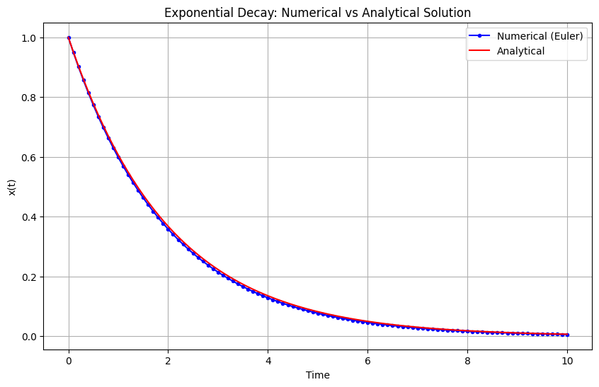
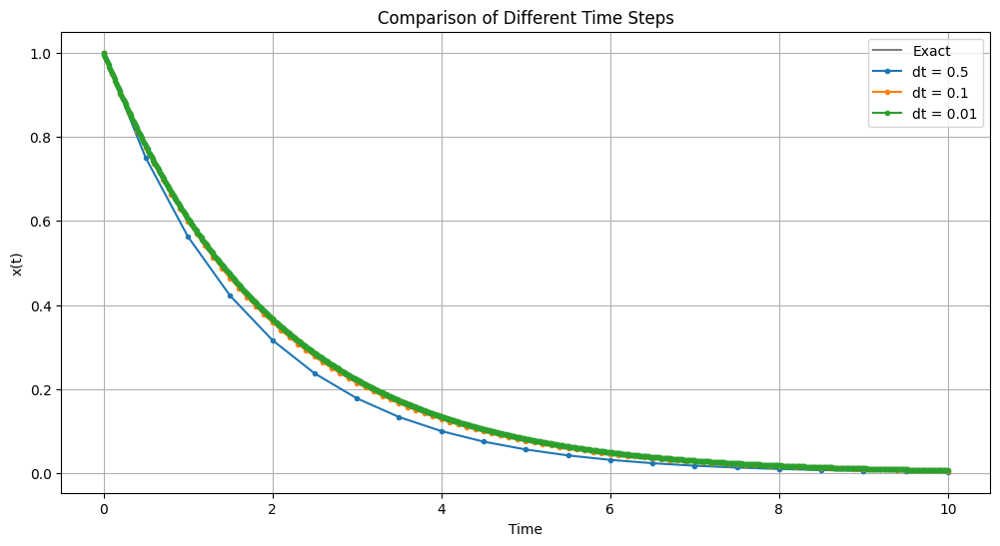

# Introduction to Numerical Computing

After exploring the importance of differential equations in modeling complex
systems, we now turn to the practical question: How do we actually solve these
equations? While some simple differential equations have analytical solutions,
most real-world problems require numerical methods. Let's start with a basic
example that illustrates the key concepts.

## A Simple Example: The Exponential Decay

Consider one of the simplest differential equations:

$$\frac{dx}{dt} = -\lambda x$$

This equation describes many natural phenomena, from radioactive decay to the
cooling of a cup of coffee. The analytical solution is:

$$x(t) = x_0e^{-\lambda t}$$

where $$x_0$$ is the initial condition at $$t=0$$. While we can solve this
equation analytically, let's use it to introduce numerical methods.


```python
import numpy as np
import matplotlib.pyplot as plt

def exponential_decay(x, lambda_):
    """Right-hand side of the differential equation dx/dt = -lambda * x"""
    return -lambda_ * x

# Parameters
lambda_ = 0.5  # decay rate
x0 = 1.0      # initial condition
t_final = 10  # final time
dt = 0.1      # time step
n_steps = int(t_final/dt)

# Arrays to store results
t = np.zeros(n_steps + 1)
x_numerical = np.zeros(n_steps + 1)
x_analytical = np.zeros(n_steps + 1)

# Initial conditions
t[0] = 0
x_numerical[0] = x0
x_analytical[0] = x0

# Euler integration
for i in range(n_steps):
    # Update time
    t[i+1] = t[i] + dt
    
    # Numerical solution (Euler method)
    dx = exponential_decay(x_numerical[i], lambda_)
    x_numerical[i+1] = x_numerical[i] + dt * dx
    
    # Analytical solution for comparison
    x_analytical[i+1] = x0 * np.exp(-lambda_ * t[i+1])

# Plotting
plt.figure(figsize=(10, 6))
plt.plot(t, x_numerical, 'b.-', label='Numerical (Euler)')
plt.plot(t, x_analytical, 'r-', label='Analytical')
plt.xlabel('Time')
plt.ylabel('x(t)')
plt.title('Exponential Decay: Numerical vs Analytical Solution')
plt.legend()
plt.grid(True)
plt.show()
```


    

    


## Understanding Numerical Errors

The Euler method, while simple, introduces two types of errors:

1. **Truncation Error**: This comes from approximating the continuous
derivative with discrete steps. The error in each step is $$O(\Delta t^2)$$, and
these errors accumulate over time.

2. **Round-off Error**: This comes from the finite precision of computer
arithmetic.

Let's visualize how the error changes with different time steps:


```python
# Compare different time steps
dt_values = [0.5, 0.1, 0.01]
plt.figure(figsize=(12, 6))

t_fine = np.linspace(0, t_final, 1000)
x_exact = x0 * np.exp(-lambda_ * t_fine)
plt.plot(t_fine, x_exact, 'k-', label='Exact', alpha=0.5)

for dt in dt_values:
    n_steps = int(t_final/dt)
    t = np.zeros(n_steps + 1)
    x = np.zeros(n_steps + 1)
    
    # Initial conditions
    t[0] = 0
    x[0] = x0
    
    # Euler integration
    for i in range(n_steps):
        t[i+1] = t[i] + dt
        dx = exponential_decay(x[i], lambda_)
        x[i+1] = x[i] + dt * dx
    
    plt.plot(t, x, '.-', label=f'dt = {dt}')

plt.xlabel('Time')
plt.ylabel('x(t)')
plt.title('Comparison of Different Time Steps')
plt.legend()
plt.grid(True)
plt.show()
```


    

    

