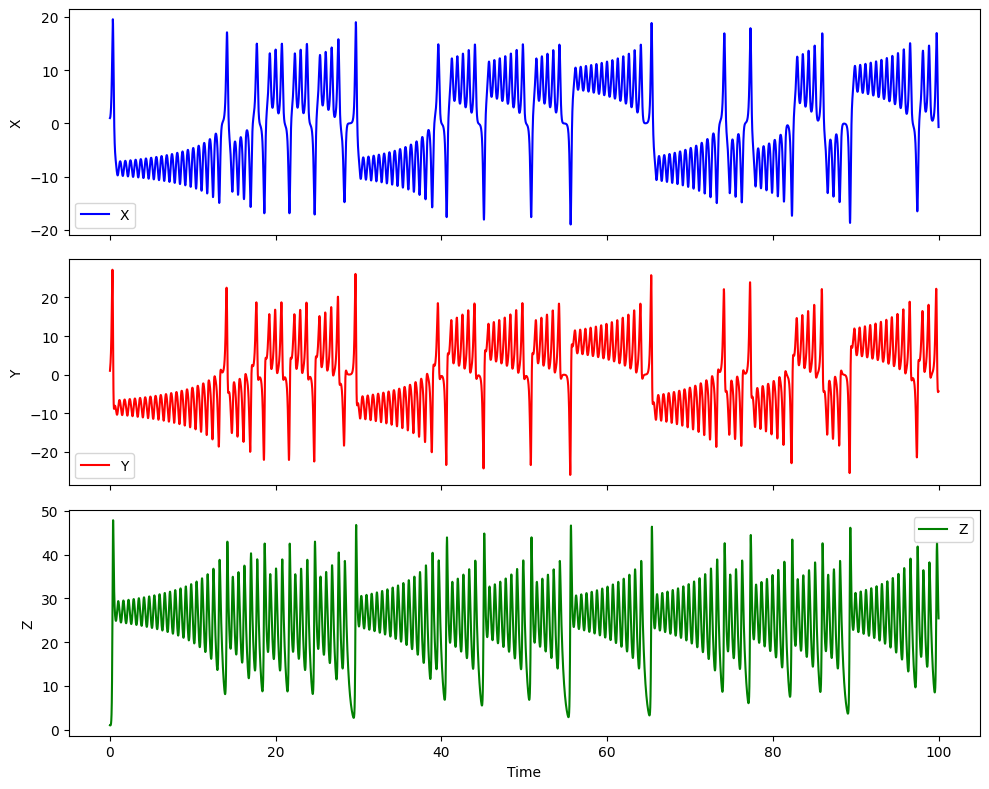
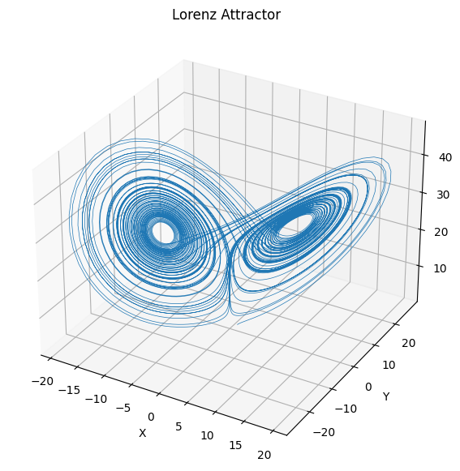
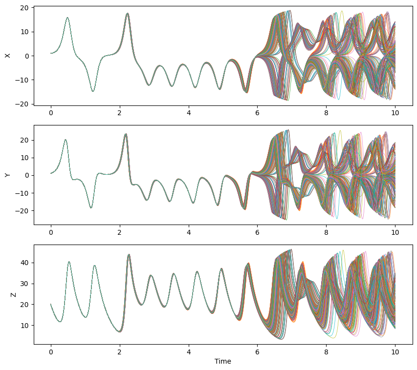
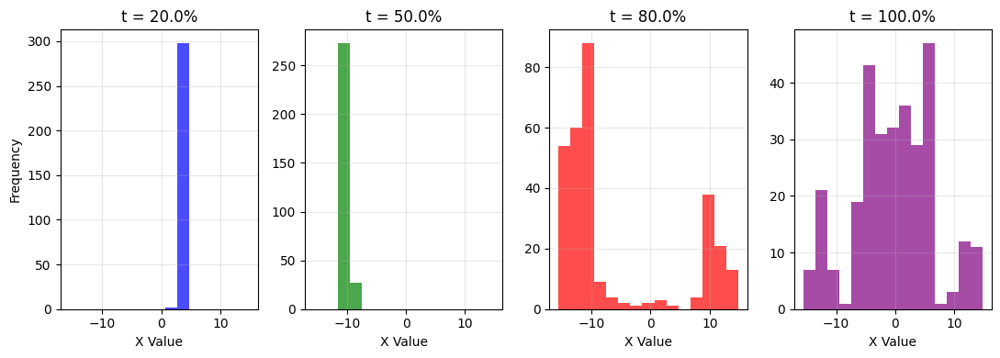
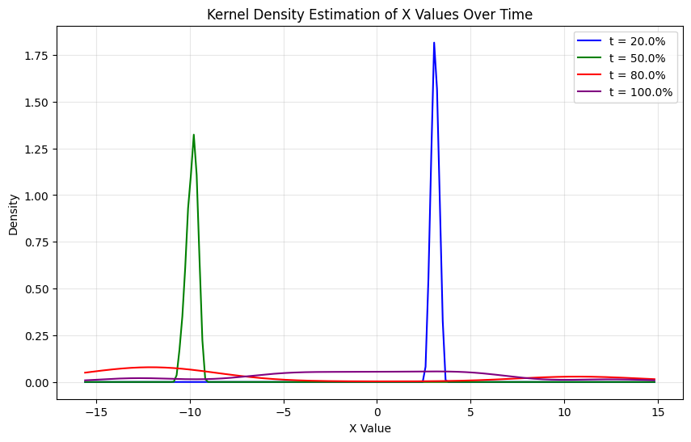

# The Lorenz System

The Lorenz system is a set of three coupled nonlinear differential equations
first studied by Edward Lorenz in 1963 while modeling atmospheric convection.
The system is given by:

$$\begin{align*}
\frac{dx}{dt} &= \sigma(y-x) \\
\frac{dy}{dt} &= x(\rho-z) - y \\
\frac{dz}{dt} &= xy - \beta z
\end{align*}$$

where $$\sigma$$, $$\rho$$, and $$\beta$$ are parameters. The system exhibits
chaotic behavior for certain parameter values, most famously when $$\sigma=10$$,
$$\rho=28$$, and $$\beta=8/3$$.

The Lorenz system is one of the foundational examples in chaos theory. It
demonstrates how simple deterministic systems can produce complex, unpredictable
behavior - a phenomenon known as deterministic chaos. The system's sensitivity
to initial conditions became popularly known as the "butterfly effect", where
small changes in initial conditions can lead to vastly different outcomes over
time.

Beyond meteorology, the Lorenz equations are used to model lasers, dynamos,
electric circuits, chemical reactions, and population dynamics. The system
continues to be an important testbed for studying nonlinear dynamics and chaos
theory. Here are some useful references:
- [Analysis on the Lorenz system](https://www.youtube.com/watch?v=0Rpy-xSsAo8&ab_channel=JasonBramburger).
- [Chaotic Systems - The Butterfly Effect by Veritasium](https://www.youtube.com/watch?v=fDek6cYijxI&ab_channel=Veritasium)
- [Another introduction to Chaotic Systems](https://www.youtube.com/watch?v=uzJXeluCKMs&ab_channel=Gonkee)


```python
import numpy as np
from scipy.integrate import odeint
import matplotlib.pyplot as plt

# Define the Lorenz system
def lorenz(state, t, sigma=10, rho=28, beta=8/3):
    x, y, z = state
    dx = sigma * (y - x)
    dy = x * (rho - z) - y 
    dz = x * y - beta * z
    return [dx, dy, dz]

# Initial conditions
state0 = [1.0, 1.0, 1.0]
t = np.linspace(0, 100, 10000)

# Solve ODE
solution = odeint(lorenz, state0, t)

```


```python
%matplotlib inline 

# Plot time series
fig, (ax1, ax2, ax3) = plt.subplots(3, 1, figsize=(10, 8), sharex=True)

ax1.plot(t, solution[:, 0], 'b-', label='X')
ax1.set_ylabel('X')
ax1.legend()

ax2.plot(t, solution[:, 1], 'r-', label='Y') 
ax2.set_ylabel('Y')
ax2.legend()

ax3.plot(t, solution[:, 2], 'g-', label='Z')
ax3.set_xlabel('Time')
ax3.set_ylabel('Z')
ax3.legend()

plt.tight_layout()
plt.show()

```


    

    


While we can often plot a time series as a function of time, using a phase
portrait we can visualize the behavior of the system in the $$(x,y,z)$$ space.
This is useful to understand the long term behavior of the system, and the
correlations between the variables.

As a side note, thinking about properties of systems in phase spaces is very
useful.

For example, for systems with many particles or high dimensions (e.g. N
particles each with position and momentum in 3D), 
the phase space becomes a 6N-dimensional space that tracks the complete state
of the system. Each point
in this phase space represents a possible configuration of all particles.

An important result in statistical mechanics is Liouville's theorem, which
states that the volume
occupied by a collection of initial conditions in phase space is preserved as
the system evolves
according to Hamilton's equations (the equivalent of Newton's laws for systems
with many particles). 
In other words, the volume of a region in phase space is conserved over time.
This is like an incompressible fluid flowing; but in phase space!

The theorem has important implications:
1. It explains why we can treat certain statistical quantities as conserved
2. It underlies the foundations of statistical mechanics and ergodic theory
3. It helps us understand how uncertainty propagates in dynamical systems

While we can't easily visualize high-dimensional phase spaces, we can project
them onto lower
dimensions or track statistical properties of the phase space volume over time. 


```python

# Plot the results
fig = plt.figure(figsize=(7, 7))
ax = fig.add_subplot(111, projection='3d')
ax.plot(solution[:, 0], solution[:, 1], solution[:, 2], lw=0.5)
ax.set_xlabel('X')
ax.set_ylabel('Y')
ax.set_zlabel('Z')
ax.set_title('Lorenz Attractor')
plt.show()

```


    

    


For chaotic systems like this, we need to be careful about how we make
predictions. 
That's also true for machine learning models that attempt to describe and
predict chaotic systems.
Simply increasing numerical precision isn't enough, since errors grow
exponentially with time due to the system's 
sensitivity to initial conditions. 
Instead, we need to account for how uncertainty propagates through the system.

One way to visualize this is to look at how a small distribution of initial
conditions evolves over 
time. Even if we start with very similar initial states (differing only by tiny
amounts), their 
trajectories will diverge exponentially. 
This divergence can be quantified by measuring the variance of the ensemble of
trajectories at each time point.

In the plots below, we'll see this effect directly - a tight cluster of initial
conditions spreads 
out over time, demonstrating why point predictions become increasingly
unreliable. This growing 
variance is a fundamental feature of chaotic systems and must be accounted for
in any forecasting 
attempt.


```python
# Create a range of initial conditions
# Generate random initial conditions within ranges
n_samples = 300  # Total number of initial conditions
x0_range = np.random.uniform(1, 1.01, n_samples)
y0_range = np.random.uniform(1, 1.01, n_samples)
z0_range = np.random.uniform(20, 20.01, n_samples)

# Create initial conditions with random combinations
inits = []
for i in range(n_samples):
    inits.append([x0_range[i], y0_range[i], z0_range[i]])

# Store all initial conditions in a list
x_inits = inits[:5]    # First 5 for x variation
y_inits = inits[5:10]  # Next 5 for y variation
z_inits = inits[10:]   # Last 5 for z variation
# Solve for each initial condition
solutions = []

# Solve for varying x
t_multi = np.linspace(0, 10, 1000)
for state0 in inits:
    sol = odeint(lorenz, state0, t_multi)
    solutions.append(sol)
fig, (ax1, ax2, ax3) = plt.subplots(3, 1, figsize=(10, 9))

for sol in solutions:
    ax1.plot(t_multi, sol[:, 0], lw=0.5)
    ax2.plot(t_multi, sol[:, 1], lw=0.5)
    ax3.plot(t_multi, sol[:, 2], lw=0.5)

ax1.set_ylabel('X')
ax2.set_ylabel('Y') 
ax3.set_ylabel('Z')
ax3.set_xlabel('Time')

ax.set_xlabel('Time')
ax.set_ylabel('Value')
ax.set_title('Multiple Lorenz Solutions Over Time')
ax.legend()
plt.show()

```

    No artists with labels found to put in legend.  Note that artists whose label start with an underscore are ignored when legend() is called with no argument.


    

    


Now we can plot a historgram for the values of x at different times; since
$$x$$ can take on many values at a given time. It's now a random variable.


```python
# Get indices for different time points
time_percentages = [0.2, 0.5, 0.8, 1.0]
time_indices = [int(p * (len(t_multi) - 1)) for p in time_percentages]

# Create lists to store x values at each time point
x_values = [[] for _ in range(len(time_percentages))]

# Collect x values from all solutions at specified times
for sol in solutions:
    for i, t_idx in enumerate(time_indices):
        x_values[i].append(sol[t_idx, 0])

```


```python

# Create histograms side by side
fig, axes = plt.subplots(1, 4, figsize=(11, 4))
colors = ['blue', 'green', 'red', 'purple']
labels = [f't = {p*100}%' for p in time_percentages]

# Find global min and max for consistent bins
all_x = np.concatenate(x_values)
x_min, x_max = np.min(all_x), np.max(all_x)
bins = np.linspace(x_min, x_max, 16)  # 15 bins

for i in range(len(time_percentages)):
    axes[i].hist(x_values[i], bins=bins, color=colors[i], alpha=0.7)
    axes[i].set_title(labels[i])
    axes[i].set_xlabel('X Value')
    axes[i].grid(True, alpha=0.3)
    
axes[0].set_ylabel('Frequency')
plt.tight_layout()
plt.show()

```


    

    


The continuous version of this is the kernel density estimation. That's a sum
of Gaussians for each of the points at a given point in time. A kernel density
estimator for a set of points $$x_1, x_2, \ldots, x_n$$ is given by:

$$
p(x) = \frac{1}{n} \sum_{i=1}^n \frac{1}{\sqrt{2\pi\sigma^2}}
e^{-\frac{(x-x_i)^2}{2\sigma^2}}
$$


```python
from scipy.stats import gaussian_kde

# Create KDE plot
fig, ax = plt.subplots(figsize=(10, 6))

for i in range(len(time_percentages)):
    # Use gaussian_kde to estimate the density
    kde = gaussian_kde(x_values[i], bw_method=.3)
    x_range = np.linspace(x_min, x_max, 200)
    density = kde(x_range)
    
    # Plot the density with same colors as histograms
    ax.plot(x_range, density, color=colors[i], label=labels[i])

ax.set_xlabel('X Value')
ax.set_ylabel('Density')
ax.set_title('Kernel Density Estimation of X Values Over Time')
ax.grid(True, alpha=0.3)
ax.legend()
plt.show()


```


    

    

